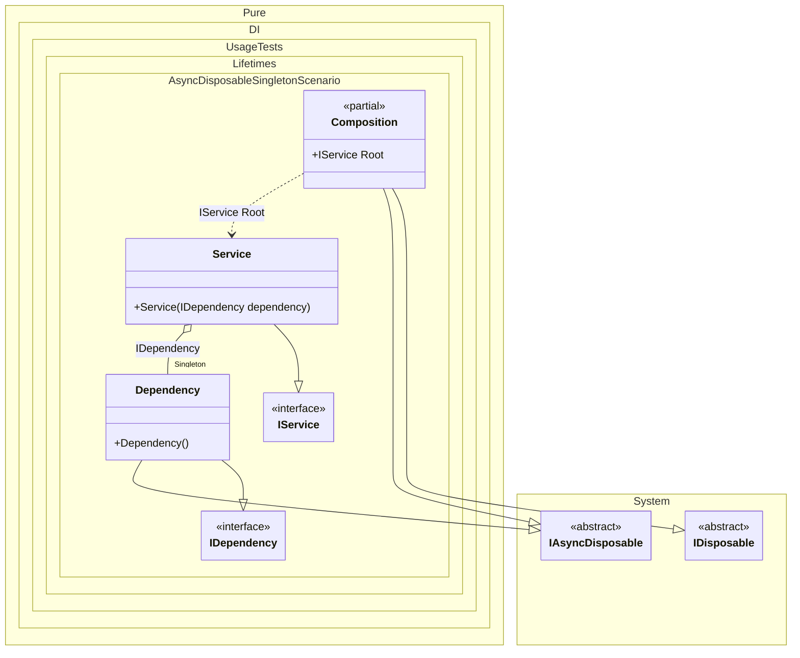

#### Async disposable singleton

[](../tests/Pure.DI.UsageTests/Lifetimes/AsyncDisposableSingletonScenario.cs)

If at least one of these objects implements the `IAsyncDisposable` interface, then the composition implements `IAsyncDisposable` as well. To dispose of all created singleton instances in an asynchronous manner, simply dispose of the composition instance in an asynchronous manner:


```c#
using Pure.DI;
using Shouldly;
using static Pure.DI.Lifetime;

DI.Setup(nameof(Composition))
    // This hint indicates to not generate methods such as Resolve
    .Hint(Hint.Resolve, "Off")
    .Bind().As(Singleton).To<Dependency>()
    .Bind().To<Service>()
    .Root<IService>("Root");

IDependency dependency;
await using (var composition = new Composition())
{
    var service = composition.Root;
    dependency = service.Dependency;
}

dependency.IsDisposed.ShouldBeTrue();

interface IDependency
{
    bool IsDisposed { get; }
}

class Dependency : IDependency, IAsyncDisposable
{
    public bool IsDisposed { get; private set; }

    public ValueTask DisposeAsync()
    {
        IsDisposed = true;
        return ValueTask.CompletedTask;
    }
}

interface IService
{
    public IDependency Dependency { get; }
}

class Service(IDependency dependency) : IService
{
    public IDependency Dependency { get; } = dependency;
}
```


Class diagram:



