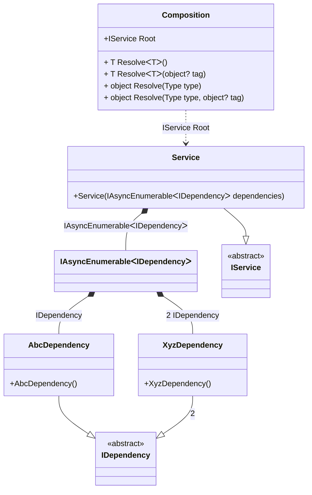

#### Async Enumerable

[](../tests/Pure.DI.UsageTests/BaseClassLibrary/AsyncEnumerableScenario.cs)

Specifying `IAsyncEnumerable<T>` as the injection type allows instances of all bindings implementing type `T` to be injected in an asynchronous-lazy manner - the instances will be provided one at a time, in an order corresponding to the sequence of the bindings.

```c#
interface IDependency;

class AbcDependency : IDependency;

class XyzDependency : IDependency;

interface IService
{
    Task<IReadOnlyList<IDependency>> GetDependenciesAsync();
}

class Service(IAsyncEnumerable<IDependency> dependencies) : IService
{
    public async Task<IReadOnlyList<IDependency>> GetDependenciesAsync()
    {
        var deps = new List<IDependency>();
        await foreach (var dependency in dependencies)
        {
            deps.Add(dependency);
        }

        return deps;
    }
}

DI.Setup(nameof(Composition))
    .Bind<IDependency>().To<AbcDependency>()
    .Bind<IDependency>(2).To<XyzDependency>()
    .Bind<IService>().To<Service>().Root<IService>("Root");

var composition = new Composition();
var service = composition.Root;
var dependencies = await service.GetDependenciesAsync();
dependencies[0].ShouldBeOfType<AbcDependency>();
dependencies[1].ShouldBeOfType<XyzDependency>();
```

<details open>
<summary>Class Diagram</summary>



</details>

<details>
<summary>Pure.DI-generated partial class Composition</summary><blockquote>

```c#
/// <para>
/// <b>Composition roots</b><br/>
/// <list type="table">
/// <listheader>
/// <term>Root</term>
/// <description>Description</description>
/// </listheader>
/// <item>
/// <term>
/// <see cref="Pure.DI.UsageTests.BCL.AsyncEnumerableScenario.IService"/> <see cref="Root"/><br/>or using <see cref="Resolve{T}()"/> method: <c>Resolve&lt;Pure.DI.UsageTests.BCL.AsyncEnumerableScenario.IService&gt;()</c>
/// </term>
/// <description>
/// Provides a composition root of type <see cref="Pure.DI.UsageTests.BCL.AsyncEnumerableScenario.Service"/>.
/// </description>
/// </item>
/// </list>
/// </para>
/// </summary>
/// <example>
/// This shows how to get an instance of type <see cref="Pure.DI.UsageTests.BCL.AsyncEnumerableScenario.Service"/> using the composition root <see cref="Root"/>:
/// <code>
/// var composition = new Composition();
/// var instance = composition.Root;
/// </code>
/// </example>
/// <a href="https://mermaid.live/view#pako:eNqdVEtugzAQvYrldRcRLNJmRyCV2KYsuvDGmFFKEzDCTiQa5Q65Sze9Tm5SYyfC_BKUzcjM582b58FHzHgCeIHZjgoRpHRT0oyUJNffyOdZwUUqU54jsp_N5ss6Vp-cZfgB5SFlgNacy8aNIrQGwXcHuJz_osv5V7tftX17mMbjb2CyPrvvSNJNr8wk3GpNUVQVgKQyT2T76H7LedCoEXqiytkq32dQ0nhXMw8DKCBPIGdVPYNK9WLW-LRoTtDYua8brVDYSXI91DTqY9jCt6JD6hrOn9XPk0Qci0ofxabSio5TuW3KOAk7oyWFHbA7X_2m58OLQcntKwVx54JHR3UNU5_GQpb0ui6rqx1CGuY9HebxSHoMz5YUDSyOEtOqex65vwd6UbrgrZvuQExrXBOe8p91nyZHy2is2qjOQvUeK_yCFXpG00Q9fkeC5RdkQPCC4ISWW4JP-PQPZWfLDw">Class diagram</a><br/>
/// This class was created by <a href="https://github.com/DevTeam/Pure.DI">Pure.DI</a> source code generator.
/// <seealso cref="Pure.DI.DI.Setup"/>
/// <seealso cref="Pure.DI.IConfiguration.Bind(object[])"/>
/// <seealso cref="Pure.DI.IConfiguration.Bind{T}(object[])"/>
[global::System.Diagnostics.CodeAnalysis.ExcludeFromCodeCoverage]
partial class Composition
{
  private readonly Composition _rootM03D15di;
  
  /// <summary>
  /// This constructor creates a new instance of <see cref="Composition"/>.
  /// </summary>
  public Composition()
  {
    _rootM03D15di = this;
  }
  
  /// <summary>
  /// This constructor creates a new instance of <see cref="Composition"/> scope based on <paramref name="baseComposition"/>. This allows the <see cref="Lifetime.Scoped"/> life time to be applied.
  /// </summary>
  /// <param name="baseComposition">Base composition.</param>
  internal Composition(Composition baseComposition)
  {
    _rootM03D15di = baseComposition._rootM03D15di;
  }
  
  #region Composition Roots
  /// <summary>
  /// Provides a composition root of type <see cref="Pure.DI.UsageTests.BCL.AsyncEnumerableScenario.Service"/>.
  /// </summary>
  /// <example>
  /// This shows how to get an instance of type <see cref="Pure.DI.UsageTests.BCL.AsyncEnumerableScenario.Service"/>:
  /// <code>
  /// var composition = new Composition();
  /// var instance = composition.Root;
  /// </code>
  /// </example>
  public Pure.DI.UsageTests.BCL.AsyncEnumerableScenario.IService Root
  {
    #if NETSTANDARD2_0_OR_GREATER || NETCOREAPP || NET40_OR_GREATER || NET
    [global::System.Diagnostics.Contracts.Pure]
    #endif
    get
    {
      [global::System.Runtime.CompilerServices.MethodImpl((global::System.Runtime.CompilerServices.MethodImplOptions)0x200)]
      async System.Collections.Generic.IAsyncEnumerable<Pure.DI.UsageTests.BCL.AsyncEnumerableScenario.IDependency> LocaltransientM03D15di1_IAsyncEnumerable()
      {
          yield return new Pure.DI.UsageTests.BCL.AsyncEnumerableScenario.AbcDependency();
          yield return new Pure.DI.UsageTests.BCL.AsyncEnumerableScenario.XyzDependency();
      }
      var transientM03D15di1_IAsyncEnumerable = LocaltransientM03D15di1_IAsyncEnumerable();
      return new Pure.DI.UsageTests.BCL.AsyncEnumerableScenario.Service(transientM03D15di1_IAsyncEnumerable);
    }
  }
  #endregion
  
  #region API
  /// <summary>
  /// Resolves the composition root.
  /// </summary>
  /// <typeparam name="T">The type of the composition root.</typeparam>
  /// <returns>A composition root.</returns>
  #if NETSTANDARD2_0_OR_GREATER || NETCOREAPP || NET40_OR_GREATER || NET
  [global::System.Diagnostics.Contracts.Pure]
  #endif
  public T Resolve<T>()
  {
    return ResolverM03D15di<T>.Value.Resolve(this);
  }
  
  /// <summary>
  /// Resolves the composition root by tag.
  /// </summary>
  /// <typeparam name="T">The type of the composition root.</typeparam>
  /// <param name="tag">The tag of a composition root.</param>
  /// <returns>A composition root.</returns>
  #if NETSTANDARD2_0_OR_GREATER || NETCOREAPP || NET40_OR_GREATER || NET
  [global::System.Diagnostics.Contracts.Pure]
  #endif
  public T Resolve<T>(object? tag)
  {
    return ResolverM03D15di<T>.Value.ResolveByTag(this, tag);
  }
  
  /// <summary>
  /// Resolves the composition root.
  /// </summary>
  /// <param name="type">The type of the composition root.</param>
  /// <returns>A composition root.</returns>
  #if NETSTANDARD2_0_OR_GREATER || NETCOREAPP || NET40_OR_GREATER || NET
  [global::System.Diagnostics.Contracts.Pure]
  #endif
  public object Resolve(global::System.Type type)
  {
    var index = (int)(_bucketSizeM03D15di * ((uint)global::System.Runtime.CompilerServices.RuntimeHelpers.GetHashCode(type) % 1));
    var finish = index + _bucketSizeM03D15di;
    do {
      ref var pair = ref _bucketsM03D15di[index];
      if (ReferenceEquals(pair.Key, type))
      {
        return pair.Value.Resolve(this);
      }
    } while (++index < finish);
    
    throw new global::System.InvalidOperationException($"Cannot resolve composition root of type {type}.");
  }
  
  /// <summary>
  /// Resolves the composition root by tag.
  /// </summary>
  /// <param name="type">The type of the composition root.</param>
  /// <param name="tag">The tag of a composition root.</param>
  /// <returns>A composition root.</returns>
  #if NETSTANDARD2_0_OR_GREATER || NETCOREAPP || NET40_OR_GREATER || NET
  [global::System.Diagnostics.Contracts.Pure]
  #endif
  public object Resolve(global::System.Type type, object? tag)
  {
    var index = (int)(_bucketSizeM03D15di * ((uint)global::System.Runtime.CompilerServices.RuntimeHelpers.GetHashCode(type) % 1));
    var finish = index + _bucketSizeM03D15di;
    do {
      ref var pair = ref _bucketsM03D15di[index];
      if (ReferenceEquals(pair.Key, type))
      {
        return pair.Value.ResolveByTag(this, tag);
      }
    } while (++index < finish);
    
    throw new global::System.InvalidOperationException($"Cannot resolve composition root \"{tag}\" of type {type}.");
  }
  #endregion
  
  /// <summary>
  /// This method provides a class diagram in mermaid format. To see this diagram, simply call the method and copy the text to this site https://mermaid.live/.
  /// </summary>
  public override string ToString()
  {
    return
      "classDiagram\n" +
        "  class Composition {\n" +
          "    +IService Root\n" +
          "    + T ResolveᐸTᐳ()\n" +
          "    + T ResolveᐸTᐳ(object? tag)\n" +
          "    + object Resolve(Type type)\n" +
          "    + object Resolve(Type type, object? tag)\n" +
        "  }\n" +
        "  class IAsyncEnumerableᐸIDependencyᐳ\n" +
        "  AbcDependency --|> IDependency : \n" +
        "  class AbcDependency {\n" +
          "    +AbcDependency()\n" +
        "  }\n" +
        "  XyzDependency --|> IDependency : 2 \n" +
        "  class XyzDependency {\n" +
          "    +XyzDependency()\n" +
        "  }\n" +
        "  Service --|> IService : \n" +
        "  class Service {\n" +
          "    +Service(IAsyncEnumerableᐸIDependencyᐳ dependencies)\n" +
        "  }\n" +
        "  class IDependency {\n" +
          "    <<abstract>>\n" +
        "  }\n" +
        "  class IService {\n" +
          "    <<abstract>>\n" +
        "  }\n" +
        "  IAsyncEnumerableᐸIDependencyᐳ *--  AbcDependency : IDependency\n" +
        "  IAsyncEnumerableᐸIDependencyᐳ *--  XyzDependency : 2  IDependency\n" +
        "  Service *--  IAsyncEnumerableᐸIDependencyᐳ : IAsyncEnumerableᐸIDependencyᐳ\n" +
        "  Composition ..> Service : IService Root";
  }
  
  private readonly static int _bucketSizeM03D15di;
  private readonly static global::Pure.DI.Pair<global::System.Type, global::Pure.DI.IResolver<Composition, object>>[] _bucketsM03D15di;
  
  static Composition()
  {
    var valResolverM03D15di_0000 = new ResolverM03D15di_0000();
    ResolverM03D15di<Pure.DI.UsageTests.BCL.AsyncEnumerableScenario.IService>.Value = valResolverM03D15di_0000;
    _bucketsM03D15di = global::Pure.DI.Buckets<global::System.Type, global::Pure.DI.IResolver<Composition, object>>.Create(
      1,
      out _bucketSizeM03D15di,
      new global::Pure.DI.Pair<global::System.Type, global::Pure.DI.IResolver<Composition, object>>[1]
      {
         new global::Pure.DI.Pair<global::System.Type, global::Pure.DI.IResolver<Composition, object>>(typeof(Pure.DI.UsageTests.BCL.AsyncEnumerableScenario.IService), valResolverM03D15di_0000)
      });
  }
  
  #region Resolvers
  private sealed class ResolverM03D15di<T>: global::Pure.DI.IResolver<Composition, T>
  {
    public static global::Pure.DI.IResolver<Composition, T> Value = new ResolverM03D15di<T>();
    
    public T Resolve(Composition composite)
    {
      throw new global::System.InvalidOperationException($"Cannot resolve composition root of type {typeof(T)}.");
    }
    
    public T ResolveByTag(Composition composite, object tag)
    {
      throw new global::System.InvalidOperationException($"Cannot resolve composition root \"{tag}\" of type {typeof(T)}.");
    }
  }
  
  private sealed class ResolverM03D15di_0000: global::Pure.DI.IResolver<Composition, Pure.DI.UsageTests.BCL.AsyncEnumerableScenario.IService>
  {
    public Pure.DI.UsageTests.BCL.AsyncEnumerableScenario.IService Resolve(Composition composition)
    {
      return composition.Root;
    }
    
    public Pure.DI.UsageTests.BCL.AsyncEnumerableScenario.IService ResolveByTag(Composition composition, object tag)
    {
      switch (tag)
      {
        case null:
          return composition.Root;
      }
      throw new global::System.InvalidOperationException($"Cannot resolve composition root \"{tag}\" of type Pure.DI.UsageTests.BCL.AsyncEnumerableScenario.IService.");
    }
  }
  #endregion
}
```

</blockquote></details>

