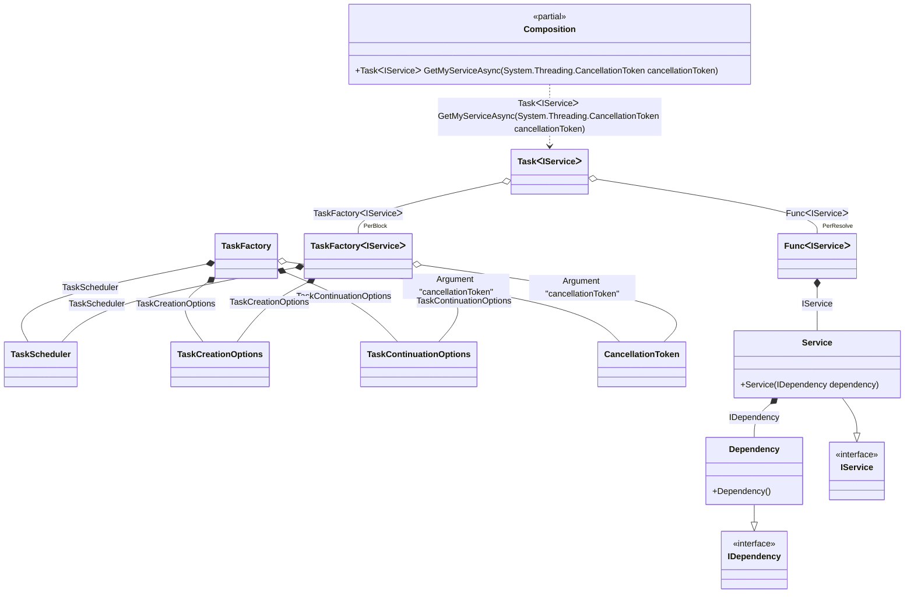

#### Async Root

[](../tests/Pure.DI.UsageTests/Basics/AsyncRootScenario.cs)


```c#
interface IDependency;

class Dependency : IDependency;

interface IService;

class Service(IDependency dependency) : IService;

DI.Setup(nameof(Composition))
    .Bind<IDependency>().To<Dependency>()
    .Bind<IService>().To<Service>()

    // Specifies to use CancellationToken from the argument
    // when resolving a composition root
    .RootArg<CancellationToken>("cancellationToken")

    // Composition root
    .Root<Task<IService>>("GetMyServiceAsync");

var composition = new Composition();
        
// Resolves composition roots asynchronously
var service = await composition.GetMyServiceAsync(CancellationToken.None);
```

The following partial class will be generated:

```c#
partial class Composition
{
  private readonly Composition _root;
  private readonly object _lock;

  public Composition()
  {
    _root = this;
    _lock = new object();
  }

  internal Composition(Composition parentScope)
  {
    _root = (parentScope ?? throw new ArgumentNullException(nameof(parentScope)))._root;
    _lock = _root._lock;
  }

  [MethodImpl(MethodImplOptions.AggressiveInlining)]
  public Task<IService> GetMyServiceAsync(CancellationToken cancellationToken)
  {
    var perResolveFunc41 = default(Func<IService>);
    TaskScheduler transientTaskScheduler4 = TaskScheduler.Default;
    TaskContinuationOptions transientTaskContinuationOptions3 = TaskContinuationOptions.None;
    TaskCreationOptions transientTaskCreationOptions2 = TaskCreationOptions.None;
    TaskFactory<IService> perBlockTaskFactory1;
    {
        var localCancellationToken10 = cancellationToken;
        var localTaskCreationOptions11 = transientTaskCreationOptions2;
        var localTaskContinuationOptions12 = transientTaskContinuationOptions3;
        var localTaskScheduler13 = transientTaskScheduler4;
        perBlockTaskFactory1 = new TaskFactory<IService>(localCancellationToken10, localTaskCreationOptions11, localTaskContinuationOptions12, localTaskScheduler13);
    }

    if (perResolveFunc41 == null)
    {
        lock (_lock)
        {
            if (perResolveFunc41 == null)
            {
                perResolveFunc41 = new Func<IService>(
                [MethodImpl(MethodImplOptions.AggressiveInlining)]
                () =>
                {
                    var localValue14 = new Service(new Dependency());
                    return localValue14;
                });
            }
        }
    }

    Task<IService> transientTask0;
    {
        var localFactory15 = perResolveFunc41!;
        var localTaskFactory16 = perBlockTaskFactory1;
        transientTask0 = localTaskFactory16.StartNew(localFactory15);
    }

    return transientTask0;
  }
}
```

Class diagram:



