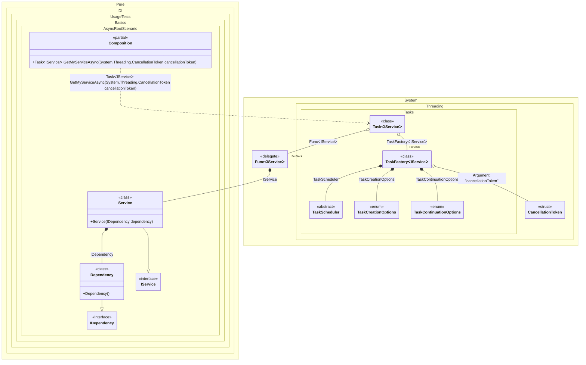

#### Async Root


```c#
using Pure.DI;

DI.Setup(nameof(Composition))
    .Bind<IDependency>().To<Dependency>()
    .Bind<IService>().To<Service>()

    // Specifies to use CancellationToken from the argument
    // when resolving a composition root
    .RootArg<CancellationToken>("cancellationToken")

    // Composition root
    .Root<Task<IService>>("GetMyServiceAsync");

var composition = new Composition();

// Resolves composition roots asynchronously
var service = await composition.GetMyServiceAsync(CancellationToken.None);

interface IDependency;

class Dependency : IDependency;

interface IService;

class Service(IDependency dependency) : IService;
```

<details>
<summary>Running this code sample locally</summary>

- Make sure you have the [.NET SDK 9.0](https://dotnet.microsoft.com/en-us/download/dotnet/9.0) or later is installed
```bash
dotnet --list-sdk
```
- Create a net9.0 (or later) console application
```bash
dotnet new console -n Sample
```
- Add reference to NuGet package
  - [Pure.DI](https://www.nuget.org/packages/Pure.DI)
```bash
dotnet add package Pure.DI
```
- Copy the example code into the _Program.cs_ file

You are ready to run the example 🚀
```bash
dotnet run
```

</details>

The following partial class will be generated:

```c#
partial class Composition
{
  private readonly Composition _root;

  [OrdinalAttribute(128)]
  public Composition()
  {
    _root = this;
  }

  internal Composition(Composition parentScope)
  {
    _root = (parentScope ?? throw new ArgumentNullException(nameof(parentScope)))._root;
  }

  [MethodImpl(MethodImplOptions.AggressiveInlining)]
  public Task<IService> GetMyServiceAsync(CancellationToken cancellationToken)
  {
    Func<IService> perBlockFunc1 = new Func<IService>(
    [MethodImpl(MethodImplOptions.AggressiveInlining)]
    () =>
    {
      IService localValue81 = new Service(new Dependency());
      return localValue81;
    });
    TaskCreationOptions transientTaskCreationOptions3 = TaskCreationOptions.None;
    TaskContinuationOptions transientTaskContinuationOptions4 = TaskContinuationOptions.None;
    TaskScheduler transientTaskScheduler5 = TaskScheduler.Default;
    TaskFactory<IService> perBlockTaskFactory2;
    CancellationToken localCancellationToken82 = cancellationToken;
    TaskCreationOptions localTaskCreationOptions83 = transientTaskCreationOptions3;
    TaskContinuationOptions localTaskContinuationOptions84 = transientTaskContinuationOptions4;
    TaskScheduler localTaskScheduler85 = transientTaskScheduler5;
    perBlockTaskFactory2 = new TaskFactory<IService>(localCancellationToken82, localTaskCreationOptions83, localTaskContinuationOptions84, localTaskScheduler85);
    Task<IService> transientTask0; // Injects an instance factory
    Func<IService> localFactory86 = perBlockFunc1;
    // Injects a task factory creating and scheduling task objects
    TaskFactory<IService> localTaskFactory87 = perBlockTaskFactory2;
    // Creates and starts a task using the instance factory
    transientTask0 = localTaskFactory87.StartNew(localFactory86);
    return transientTask0;
  }
}
```

Class diagram:



