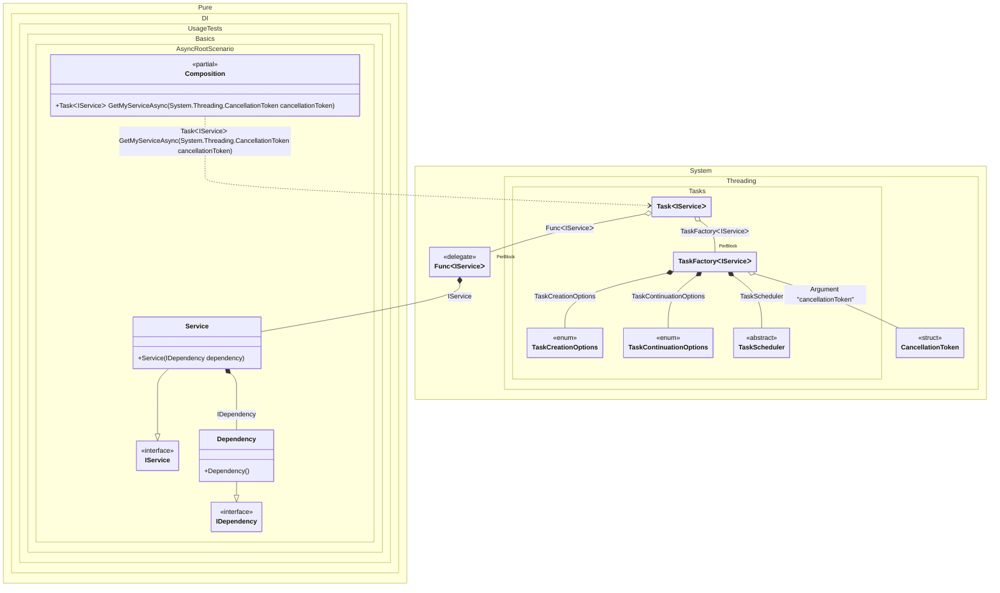

#### Async Root

[](../tests/Pure.DI.UsageTests/Basics/AsyncRootScenario.cs)


```c#
using Pure.DI;

DI.Setup(nameof(Composition))
    .Bind<IDependency>().To<Dependency>()
    .Bind<IService>().To<Service>()

    // Specifies to use CancellationToken from the argument
    // when resolving a composition root
    .RootArg<CancellationToken>("cancellationToken")

    // Composition root
    .Root<Task<IService>>("GetMyServiceAsync");

var composition = new Composition();

// Resolves composition roots asynchronously
var service = await composition.GetMyServiceAsync(CancellationToken.None);

interface IDependency;

class Dependency : IDependency;

interface IService;

class Service(IDependency dependency) : IService;
```

<details>
<summary>Running this code sample locally</summary>

- Make sure you have the [.NET SDK 9.0](https://dotnet.microsoft.com/en-us/download/dotnet/9.0) or later is installed
- Create a net9.0 (or later) console application
- Add reference to NuGet package
  - [Pure.DI](https://www.nuget.org/packages/Pure.DI)
- Copy the example code into the _Program.cs_ file

You are ready to run the example!

</details>


Class diagram:



