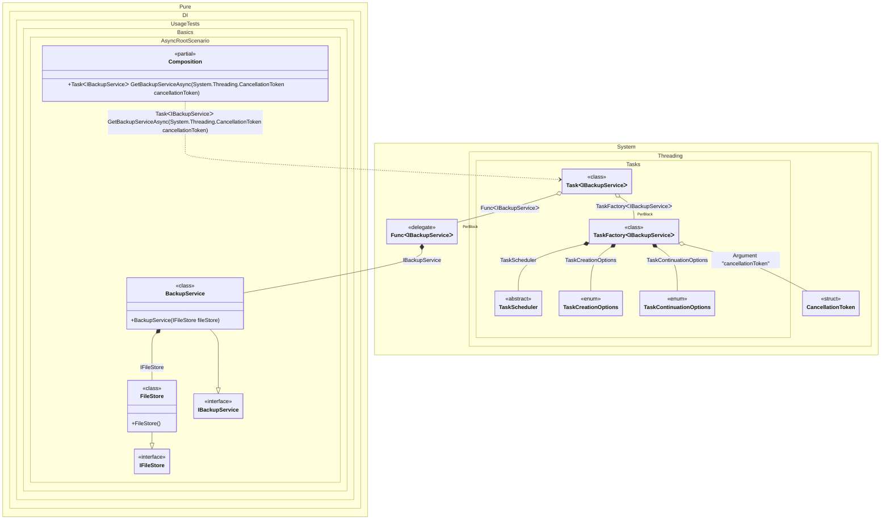

#### Async Root


```c#
using Pure.DI;

DI.Setup(nameof(Composition))
    .Bind<IFileStore>().To<FileStore>()
    .Bind<IBackupService>().To<BackupService>()

    // Specifies to use CancellationToken from the argument
    // when resolving a composition root
    .RootArg<CancellationToken>("cancellationToken")

    // Composition root
    .Root<Task<IBackupService>>("GetBackupServiceAsync");

var composition = new Composition();

// Resolves composition roots asynchronously
var service = await composition.GetBackupServiceAsync(CancellationToken.None);

interface IFileStore;

class FileStore : IFileStore;

interface IBackupService;

class BackupService(IFileStore fileStore) : IBackupService;
```

<details>
<summary>Running this code sample locally</summary>

- Make sure you have the [.NET SDK 10.0](https://dotnet.microsoft.com/en-us/download/dotnet/10.0) or later is installed
```bash
dotnet --list-sdk
```
- Create a net10.0 (or later) console application
```bash
dotnet new console -n Sample
```
- Add reference to NuGet package
  - [Pure.DI](https://www.nuget.org/packages/Pure.DI)
```bash
dotnet add package Pure.DI
```
- Copy the example code into the _Program.cs_ file

You are ready to run the example 🚀
```bash
dotnet run
```

</details>

The following partial class will be generated:

```c#
partial class Composition
{
#if NET9_0_OR_GREATER
  private readonly Lock _lock;
#else
  private readonly Object _lock;
#endif

  [OrdinalAttribute(256)]
  public Composition()
  {
#if NET9_0_OR_GREATER
    _lock = new Lock();
#else
    _lock = new Object();
#endif
  }

  internal Composition(Composition parentScope)
  {
    _lock = parentScope._lock;
  }

  [MethodImpl(MethodImplOptions.AggressiveInlining)]
  public Task<IBackupService> GetBackupServiceAsync(CancellationToken cancellationToken)
  {
    Task<IBackupService> transientTask;
    // Injects an instance factory
    Func<IBackupService> transientFunc1 = new Func<IBackupService>(
    [MethodImpl(MethodImplOptions.AggressiveInlining)]
    () =>
    {
      IBackupService localValue15 = new BackupService(new FileStore());
      return localValue15;
    });
    Func<IBackupService> localFactory = transientFunc1;
    // Injects a task factory creating and scheduling task objects
    TaskFactory<IBackupService> transientTaskFactory2;
    CancellationToken localCancellationToken = cancellationToken;
    TaskCreationOptions transientTaskCreationOptions6 = TaskCreationOptions.None;
    TaskCreationOptions localTaskCreationOptions = transientTaskCreationOptions6;
    TaskContinuationOptions transientTaskContinuationOptions7 = TaskContinuationOptions.None;
    TaskContinuationOptions localTaskContinuationOptions = transientTaskContinuationOptions7;
    TaskScheduler transientTaskScheduler8 = TaskScheduler.Default;
    TaskScheduler localTaskScheduler = transientTaskScheduler8;
    transientTaskFactory2 = new TaskFactory<IBackupService>(localCancellationToken, localTaskCreationOptions, localTaskContinuationOptions, localTaskScheduler);
    TaskFactory<IBackupService> localTaskFactory = transientTaskFactory2;
    // Creates and starts a task using the instance factory
    transientTask = localTaskFactory.StartNew(localFactory);
    return transientTask;
  }
}
```

Class diagram:



