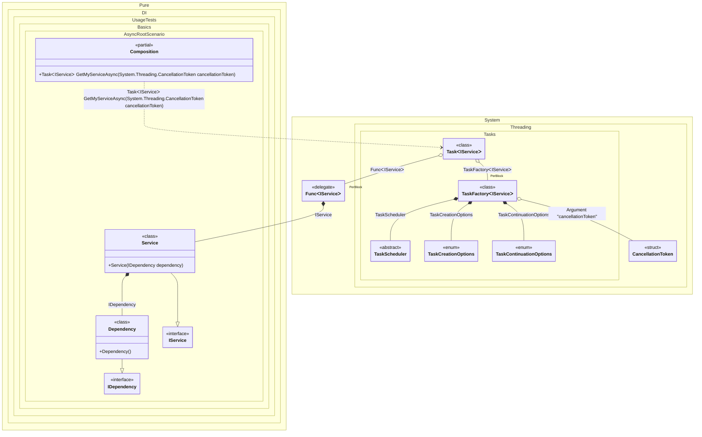

#### Async Root


```c#
using Pure.DI;

DI.Setup(nameof(Composition))
    .Bind<IDependency>().To<Dependency>()
    .Bind<IService>().To<Service>()

    // Specifies to use CancellationToken from the argument
    // when resolving a composition root
    .RootArg<CancellationToken>("cancellationToken")

    // Composition root
    .Root<Task<IService>>("GetMyServiceAsync");

var composition = new Composition();

// Resolves composition roots asynchronously
var service = await composition.GetMyServiceAsync(CancellationToken.None);

interface IDependency;

class Dependency : IDependency;

interface IService;

class Service(IDependency dependency) : IService;
```

<details>
<summary>Running this code sample locally</summary>

- Make sure you have the [.NET SDK 9.0](https://dotnet.microsoft.com/en-us/download/dotnet/9.0) or later is installed
```bash
dotnet --list-sdk
```
- Create a net9.0 (or later) console application
```bash
dotnet new console -n Sample
```
- Add reference to NuGet package
  - [Pure.DI](https://www.nuget.org/packages/Pure.DI)
```bash
dotnet add package Pure.DI
```
- Copy the example code into the _Program.cs_ file

You are ready to run the example 🚀
```bash
dotnet run
```

</details>

The following partial class will be generated:

```c#
partial class Composition
{
#if NET9_0_OR_GREATER
  private readonly Lock _lock;
#else
  private readonly Object _lock;
#endif

  [OrdinalAttribute(256)]
  public Composition()
  {
#if NET9_0_OR_GREATER
    _lock = new Lock();
#else
    _lock = new Object();
#endif
  }

  internal Composition(Composition parentScope)
  {
    _lock = parentScope._lock;
  }

  public Task<IService> GetMyServiceAsync(CancellationToken cancellationToken)
  {
    Task<IService> transientTask;
    // Injects an instance factory
    Func<IService> perBlockFunc1 = new Func<IService>(() =>
    {
      IService localValue15 = new Service(new Dependency());
      return localValue15;
    });
    Func<IService> localFactory = perBlockFunc1;
    // Injects a task factory creating and scheduling task objects
    TaskFactory<IService> perBlockTaskFactory2;
    CancellationToken localCancellationToken = cancellationToken;
    TaskCreationOptions transientTaskCreationOptions6 = TaskCreationOptions.None;
    TaskCreationOptions localTaskCreationOptions = transientTaskCreationOptions6;
    TaskContinuationOptions transientTaskContinuationOptions7 = TaskContinuationOptions.None;
    TaskContinuationOptions localTaskContinuationOptions = transientTaskContinuationOptions7;
    TaskScheduler transientTaskScheduler8 = TaskScheduler.Default;
    TaskScheduler localTaskScheduler = transientTaskScheduler8;
    perBlockTaskFactory2 = new TaskFactory<IService>(localCancellationToken, localTaskCreationOptions, localTaskContinuationOptions, localTaskScheduler);
    TaskFactory<IService> localTaskFactory = perBlockTaskFactory2;
    // Creates and starts a task using the instance factory
    transientTask = localTaskFactory.StartNew(localFactory);
    return transientTask;
  }
}
```

Class diagram:


```mermaid
---
 config:
  maxTextSize: 2147483647
  maxEdges: 2147483647
  class:
   hideEmptyMembersBox: true
---
classDiagram
	Dependency --|> IDependency
	Service --|> IService
	Composition ..> TaskᐸIServiceᐳ : TaskᐸIServiceᐳ GetMyServiceAsync(System.Threading.CancellationToken cancellationToken)
	Service *--  Dependency : IDependency
	TaskᐸIServiceᐳ o-- "PerBlock" FuncᐸIServiceᐳ : FuncᐸIServiceᐳ
	TaskᐸIServiceᐳ o-- "PerBlock" TaskFactoryᐸIServiceᐳ : TaskFactoryᐸIServiceᐳ
	FuncᐸIServiceᐳ *--  Service : IService
	TaskFactoryᐸIServiceᐳ *--  TaskScheduler : TaskScheduler
	TaskFactoryᐸIServiceᐳ *--  TaskCreationOptions : TaskCreationOptions
	TaskFactoryᐸIServiceᐳ *--  TaskContinuationOptions : TaskContinuationOptions
	TaskFactoryᐸIServiceᐳ o-- CancellationToken : Argument "cancellationToken"
	namespace Pure.DI.UsageTests.Basics.AsyncRootScenario {
		class Composition {
		<<partial>>
		+TaskᐸIServiceᐳ GetMyServiceAsync(System.Threading.CancellationToken cancellationToken)
		}
		class Dependency {
				<<class>>
			+Dependency()
		}
		class IDependency {
			<<interface>>
		}
		class IService {
			<<interface>>
		}
		class Service {
				<<class>>
			+Service(IDependency dependency)
		}
	}
	namespace System {
		class FuncᐸIServiceᐳ {
				<<delegate>>
		}
	}
	namespace System.Threading {
		class CancellationToken {
				<<struct>>
		}
	}
	namespace System.Threading.Tasks {
		class TaskContinuationOptions {
				<<enum>>
		}
		class TaskCreationOptions {
				<<enum>>
		}
		class TaskFactoryᐸIServiceᐳ {
				<<class>>
		}
		class TaskScheduler {
				<<abstract>>
		}
		class TaskᐸIServiceᐳ {
				<<class>>
		}
	}
```

