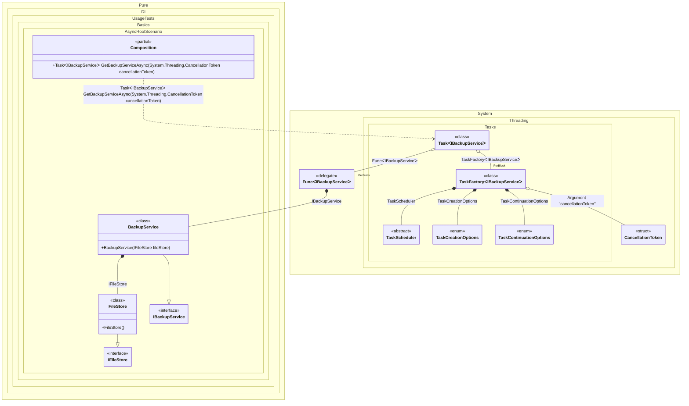

#### Async Root

A composition root can be asynchronous: declare it as `Root<Task<IService>>(...)` and _Pure.DI_ generates a root method you can `await`.
This is useful when building the object graph is costly and you don't want to block the caller.
Add `RootArg<CancellationToken>("cancellationToken")` to pass a cancellation token that is used when resolving the root.


```c#
using Shouldly;
using Pure.DI;

DI.Setup(nameof(Composition))
    .Bind<IFileStore>().To<FileStore>()
    .Bind<IBackupService>().To<BackupService>()

    // Specifies to use CancellationToken from the argument
    // when resolving a composition root
    .RootArg<CancellationToken>("cancellationToken")

    // Composition root
    .Root<Task<IBackupService>>("GetBackupServiceAsync");

var composition = new Composition();

// Resolves composition roots asynchronously
var service = await composition.GetBackupServiceAsync(CancellationToken.None);

interface IFileStore;

class FileStore : IFileStore;

interface IBackupService;

class BackupService(IFileStore fileStore) : IBackupService;
```

<details>
<summary>Running this code sample locally</summary>

- Make sure you have the [.NET SDK 10.0](https://dotnet.microsoft.com/en-us/download/dotnet/10.0) or later installed
```bash
dotnet --list-sdk
```
- Create a net10.0 (or later) console application
```bash
dotnet new console -n Sample
```
- Add references to the NuGet packages
  - [Pure.DI](https://www.nuget.org/packages/Pure.DI)
  - [Shouldly](https://www.nuget.org/packages/Shouldly)
```bash
dotnet add package Pure.DI
dotnet add package Shouldly
```
- Copy the example code into the _Program.cs_ file

You are ready to run the example 🚀
```bash
dotnet run
```

</details>

>[!NOTE]
>Async roots are useful when you need to perform asynchronous initialization or when your services require async creation.

<details>
<summary>The following partial class will be generated</summary>

```c#
partial class Composition
{
  [MethodImpl(MethodImplOptions.AggressiveInlining)]
  public Task<IBackupService> GetBackupServiceAsync(CancellationToken cancellationToken)
  {
    Task<IBackupService> transientTaskIBackupService;
    // Creates the task value factory
    Func<IBackupService> perBlockFuncIBackupService = new Func<IBackupService>(
    [MethodImpl(MethodImplOptions.AggressiveInlining)]
    () =>
    {
      // Creates a deferred value
      return new BackupService(new FileStore());
    });
    Func<IBackupService> localFactory = perBlockFuncIBackupService;
    // Creates the task factory
    TaskFactory<IBackupService> perBlockTaskFactoryIBackupService;
    CancellationToken localCancellationToken = cancellationToken;
    TaskCreationOptions transientTaskCreationOptions = TaskCreationOptions.None;
    TaskCreationOptions localTaskCreationOptions = transientTaskCreationOptions;
    TaskContinuationOptions transientTaskContinuationOptions = TaskContinuationOptions.None;
    TaskContinuationOptions localTaskContinuationOptions = transientTaskContinuationOptions;
    TaskScheduler transientTaskScheduler = TaskScheduler.Default;
    TaskScheduler localTaskScheduler = transientTaskScheduler;
    perBlockTaskFactoryIBackupService = new TaskFactory<IBackupService>(localCancellationToken, localTaskCreationOptions, localTaskContinuationOptions, localTaskScheduler);
    TaskFactory<IBackupService> localTaskFactory = perBlockTaskFactoryIBackupService;
    // Starts the task
    transientTaskIBackupService = localTaskFactory.StartNew(localFactory);
    return transientTaskIBackupService;
  }
}
```

</details>

Class diagram:


```mermaid
---
 config:
  class:
   hideEmptyMembersBox: true
---
classDiagram
	FileStore --|> IFileStore
	BackupService --|> IBackupService
	Composition ..> TaskᐸIBackupServiceᐳ : TaskᐸIBackupServiceᐳ GetBackupServiceAsync(System.Threading.CancellationToken cancellationToken)
	BackupService *-- FileStore : IFileStore
	TaskᐸIBackupServiceᐳ o-- "PerBlock" FuncᐸIBackupServiceᐳ : FuncᐸIBackupServiceᐳ
	TaskᐸIBackupServiceᐳ o-- "PerBlock" TaskFactoryᐸIBackupServiceᐳ : TaskFactoryᐸIBackupServiceᐳ
	FuncᐸIBackupServiceᐳ *-- BackupService : IBackupService
	TaskFactoryᐸIBackupServiceᐳ *-- TaskScheduler : TaskScheduler
	TaskFactoryᐸIBackupServiceᐳ *-- TaskCreationOptions : TaskCreationOptions
	TaskFactoryᐸIBackupServiceᐳ *-- TaskContinuationOptions : TaskContinuationOptions
	TaskFactoryᐸIBackupServiceᐳ o-- CancellationToken : Argument "cancellationToken"
	namespace Pure.DI.UsageTests.Basics.AsyncRootScenario {
		class BackupService {
				<<class>>
			+BackupService(IFileStore fileStore)
		}
		class Composition {
		<<partial>>
		+TaskᐸIBackupServiceᐳ GetBackupServiceAsync(System.Threading.CancellationToken cancellationToken)
		}
		class FileStore {
				<<class>>
			+FileStore()
		}
		class IBackupService {
			<<interface>>
		}
		class IFileStore {
			<<interface>>
		}
	}
	namespace System {
		class FuncᐸIBackupServiceᐳ {
				<<delegate>>
		}
	}
	namespace System.Threading {
		class CancellationToken {
				<<struct>>
		}
	}
	namespace System.Threading.Tasks {
		class TaskContinuationOptions {
				<<enum>>
		}
		class TaskCreationOptions {
				<<enum>>
		}
		class TaskFactoryᐸIBackupServiceᐳ {
				<<class>>
		}
		class TaskScheduler {
				<<abstract>>
		}
		class TaskᐸIBackupServiceᐳ {
				<<class>>
		}
	}
```

See also:

- [Task](task.md)

