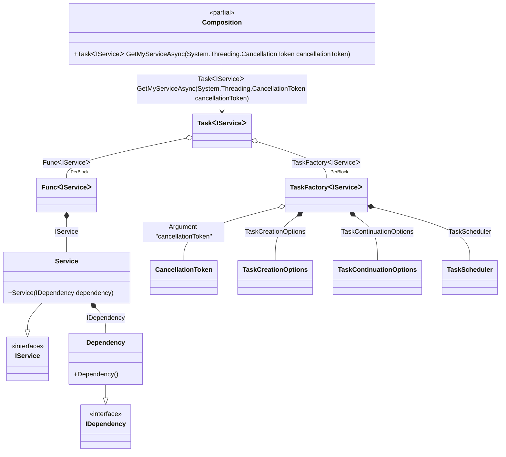

#### Async Root

[](../tests/Pure.DI.UsageTests/Basics/AsyncRootScenario.cs)


```c#
interface IDependency;

class Dependency : IDependency;

interface IService;

class Service(IDependency dependency) : IService;

DI.Setup(nameof(Composition))
    .Bind<IDependency>().To<Dependency>()
    .Bind<IService>().To<Service>()

    // Specifies to use CancellationToken from the argument
    // when resolving a composition root
    .RootArg<CancellationToken>("cancellationToken")

    // Composition root
    .Root<Task<IService>>("GetMyServiceAsync");

var composition = new Composition();

// Resolves composition roots asynchronously
var service = await composition.GetMyServiceAsync(CancellationToken.None);
```

The following partial class will be generated:

```c#
partial class Composition
{
  private readonly Composition _root;

  [OrdinalAttribute(10)]
  public Composition()
  {
    _root = this;
  }

  internal Composition(Composition parentScope)
  {
    _root = (parentScope ?? throw new ArgumentNullException(nameof(parentScope)))._root;
  }

  [MethodImpl(MethodImplOptions.AggressiveInlining)]
  public Task<IService> GetMyServiceAsync(CancellationToken cancellationToken)
  {
    TaskFactory<IService> perBlockTaskFactory2;
    CancellationToken localCancellationToken23 = cancellationToken;
    TaskCreationOptions transientTaskCreationOptions3 = TaskCreationOptions.None;
    TaskCreationOptions localTaskCreationOptions24 = transientTaskCreationOptions3;
    TaskContinuationOptions transientTaskContinuationOptions4 = TaskContinuationOptions.None;
    TaskContinuationOptions localTaskContinuationOptions25 = transientTaskContinuationOptions4;
    TaskScheduler transientTaskScheduler5 = TaskScheduler.Default;
    TaskScheduler localTaskScheduler26 = transientTaskScheduler5;
    perBlockTaskFactory2 = new TaskFactory<IService>(localCancellationToken23, localTaskCreationOptions24, localTaskContinuationOptions25, localTaskScheduler26);
    Func<IService> perBlockFunc1 = new Func<IService>([MethodImpl(MethodImplOptions.AggressiveInlining)] () =>
    {
      IService localValue27 = new Service(new Dependency());
      return localValue27;
    });
    Task<IService> transientTask0;
    // Injects an instance factory
    Func<IService> localFactory28 = perBlockFunc1;
    // Injects a task factory creating and scheduling task objects
    TaskFactory<IService> localTaskFactory29 = perBlockTaskFactory2;
    // Creates and starts a task using the instance factory
    transientTask0 = localTaskFactory29.StartNew(localFactory28);
    return transientTask0;
  }
}
```

Class diagram:



