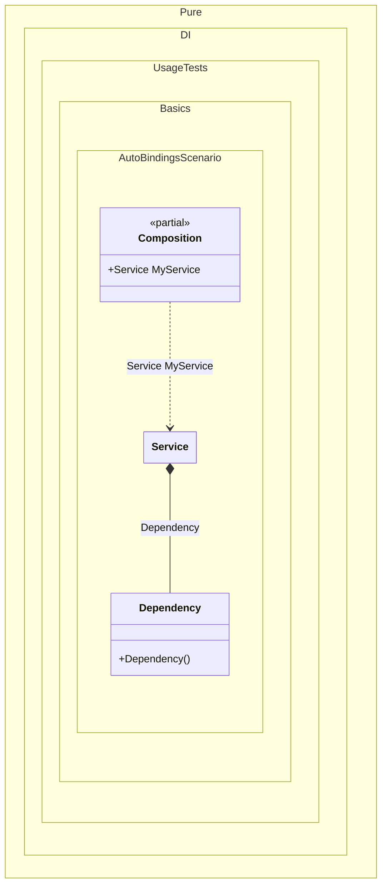

#### Auto-bindings

[](../tests/Pure.DI.UsageTests/Basics/AutoBindingsScenario.cs)

Injection of non-abstract types is possible without any additional effort.


```c#
using Pure.DI;

// Specifies to create a partial class with name "Composition"
DI.Setup("Composition")
    // with the root "MyService"
    .Root<Service>("MyService");

var composition = new Composition();

// service = new Service(new Dependency())
var service = composition.MyService;

class Dependency;

class Service(Dependency dependency);
```

> [!WARNING]
> But this approach cannot be recommended if you follow the dependency inversion principle and want your types to depend only on abstractions.

It is better to inject abstract dependencies, for example, in the form of interfaces. Use bindings to map abstract types to their implementations as in almost all [other examples](injections-of-abstractions.md).


Class diagram:



