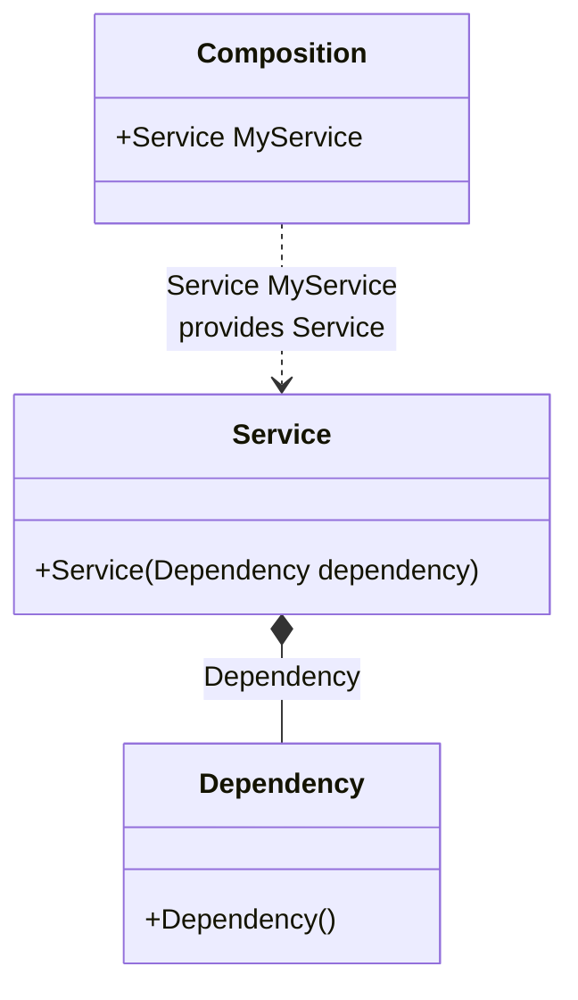

#### Auto-bindings

[](../tests/Pure.DI.UsageTests/Basics/AutoBindingsScenario.cs)

Injection of non-abstract types is possible without any additional effort.

```c#
class Dependency;

class Service(Dependency dependency);

// Specifies to create a partial class "Composition"
DI.Setup("Composition")
    // Specifies to create a property "MyService"
    .Root<Service>("MyService");
        
var composition = new Composition();

// service = new Service(new Dependency())
var service = composition.MyService;
```

:warning: But this approach cannot be recommended if you follow the dependency inversion principle and want your types to depend only on abstractions.

It is better to inject abstract dependencies, for example, in the form of interfaces. Use bindings to map abstract types to their implementations as in almost all [other examples](injections-of-abstractions.md).

<details open>
<summary>Class Diagram</summary>



</details>

<details>
<summary>Pure.DI-generated partial class Composition</summary><blockquote>

```c#
/// <para>
/// Specifies to create a partial class "Composition"
/// </para>
/// <para>
/// <b>Composition roots</b><br/>
/// <list type="table">
/// <listheader>
/// <term>Root</term>
/// <description>Description</description>
/// </listheader>
/// <item>
/// <term>
/// <see cref="Pure.DI.UsageTests.Basics.AutoBindingsScenario.Service"/> <see cref="MyService"/><br/>or using <see cref="Resolve{T}()"/> method: <c>Resolve&lt;Pure.DI.UsageTests.Basics.AutoBindingsScenario.Service&gt;()</c>
/// </term>
/// <description>
/// Specifies to create a property "MyService"
/// </description>
/// </item>
/// </list>
/// </para>
/// </summary>
/// <example>
/// This shows how to get an instance of type <see cref="Pure.DI.UsageTests.Basics.AutoBindingsScenario.Service"/> using the composition root <see cref="MyService"/>:
/// <code>
/// var composition = new Composition();
/// var instance = composition.MyService;
/// </code>
/// </example>
/// <a href="https://mermaid.live/view#pako:eNp1UbsOgjAU_RVyZxMJDCgbWEYn1y61vdFG25KCJITw71IQeelych85j942wI1AiIE_WVEQyW6WKWqp7nvvZFRuCllKoz368v0odTtXBekFbSU5euf6U42riEwCBHPUAjWvN_xp1feHHo-_REanPwkG-sxJLJVXmnO1IOmRDOit44bJbOK463sE2YRhtgjacbcXcvPT1dL9QMitqaTA7wudBexAoVVMiu5XGgrlHRVSiCkIZh8UWmjfeh2VZQ">Class diagram</a><br/>
/// This class was created by <a href="https://github.com/DevTeam/Pure.DI">Pure.DI</a> source code generator.
/// <seealso cref="Pure.DI.DI.Setup"/>
/// <seealso cref="Pure.DI.IConfiguration.Bind(object[])"/>
/// <seealso cref="Pure.DI.IConfiguration.Bind{T}(object[])"/>
[global::System.Diagnostics.CodeAnalysis.ExcludeFromCodeCoverage]
partial class Composition
{
  private readonly Composition _rootM03D13di;
  
  /// <summary>
  /// This constructor creates a new instance of <see cref="Composition"/>.
  /// </summary>
  public Composition()
  {
    _rootM03D13di = this;
  }
  
  /// <summary>
  /// This constructor creates a new instance of <see cref="Composition"/> scope based on <paramref name="baseComposition"/>. This allows the <see cref="Lifetime.Scoped"/> life time to be applied.
  /// </summary>
  /// <param name="baseComposition">Base composition.</param>
  internal Composition(Composition baseComposition)
  {
    _rootM03D13di = baseComposition._rootM03D13di;
  }
  
  #region Composition Roots
  /// <summary>
  /// Specifies to create a property "MyService"
  /// </summary>
  /// <example>
  /// This shows how to get an instance of type <see cref="Pure.DI.UsageTests.Basics.AutoBindingsScenario.Service"/>:
  /// <code>
  /// var composition = new Composition();
  /// var instance = composition.MyService;
  /// </code>
  /// </example>
  public Pure.DI.UsageTests.Basics.AutoBindingsScenario.Service MyService
  {
    #if NETSTANDARD2_0_OR_GREATER || NETCOREAPP || NET40_OR_GREATER || NET
    [global::System.Diagnostics.Contracts.Pure]
    #endif
    get
    {
      return new Pure.DI.UsageTests.Basics.AutoBindingsScenario.Service(new Pure.DI.UsageTests.Basics.AutoBindingsScenario.Dependency());
    }
  }
  #endregion
  
  /// <summary>
  /// This method provides a class diagram in mermaid format. To see this diagram, simply call the method and copy the text to this site https://mermaid.live/.
  /// </summary>
  public override string ToString()
  {
    return
      "classDiagram\n" +
        "  class Composition {\n" +
          "    +Service MyService\n" +
        "  }\n" +
        "  class Dependency {\n" +
          "    +Dependency()\n" +
        "  }\n" +
        "  class Service {\n" +
          "    +Service(Dependency dependency)\n" +
        "  }\n" +
        "  Service *--  Dependency : Dependency\n" +
        "  Composition ..> Service : Service MyService<br/>provides Service";
  }
}
```

</blockquote></details>

