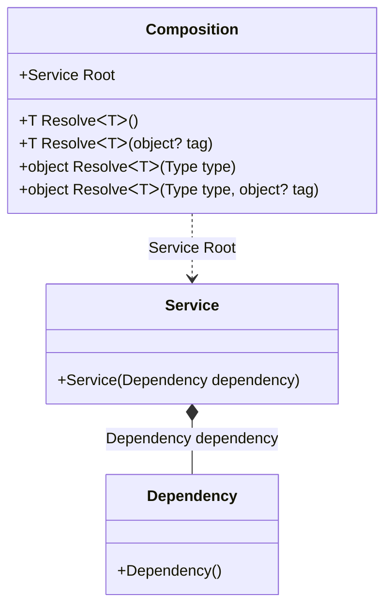

#### Auto-bindings

[](../tests/Pure.DI.UsageTests/Basics/AutoBindingScenario.cs)

This approach works great even if DI doesn't have the appropriate bindings. :warning: But it can't be recommended if you follow the dependency inversion principle and want to make sure your types only depend on abstractions.

```c#
internal class Dependency
{
}

internal class Service
{
    public Service(Dependency dependency)
    {
    }
}

DI.Setup("Composition")
    .Root<Service>("Root");

var composition = new Composition();
var service1 = composition.Root;
        
// Or this way
var service2 = composition.Resolve<Service>();
        
// Or this way
var service3 = composition.Resolve(typeof(Service));
```

<details open>
<summary>Class Diagram</summary>



</details>

<details>
<summary>Generated Code</summary>

```c#
partial class Composition
{
  public Composition()
  {
  }
  
  internal Composition(Composition parent)
  {
  }
  
  #region Composition Roots
  public Pure.DI.UsageTests.Basics.AutoBindingScenario.Service Root
  {
    [global::System.Runtime.CompilerServices.MethodImpl((global::System.Runtime.CompilerServices.MethodImplOptions)0x300)]
    get
    {
      Pure.DI.UsageTests.Basics.AutoBindingScenario.Dependency v53Local12CAAA = new Pure.DI.UsageTests.Basics.AutoBindingScenario.Dependency();
      Pure.DI.UsageTests.Basics.AutoBindingScenario.Service v52Local12CAAA = new Pure.DI.UsageTests.Basics.AutoBindingScenario.Service(v53Local12CAAA);
      return v52Local12CAAA;
    }
  }
  #endregion
  
  #region API
  #if NETSTANDARD2_0_OR_GREATER || NETCOREAPP || NET40_OR_GREATER
  [global::System.Diagnostics.Contracts.Pure]
  #endif
  [global::System.Runtime.CompilerServices.MethodImpl((global::System.Runtime.CompilerServices.MethodImplOptions)0x300)]
  public T Resolve<T>()
  {
    return Resolver12CAAA<T>.Value.Resolve(this);
  }
  
  #if NETSTANDARD2_0_OR_GREATER || NETCOREAPP || NET40_OR_GREATER
  [global::System.Diagnostics.Contracts.Pure]
  #endif
  [global::System.Runtime.CompilerServices.MethodImpl((global::System.Runtime.CompilerServices.MethodImplOptions)0x300)]
  public T Resolve<T>(object? tag)
  {
    return Resolver12CAAA<T>.Value.ResolveByTag(this, tag);
  }
  
  #if NETSTANDARD2_0_OR_GREATER || NETCOREAPP || NET40_OR_GREATER
  [global::System.Diagnostics.Contracts.Pure]
  #endif
  [global::System.Runtime.CompilerServices.MethodImpl((global::System.Runtime.CompilerServices.MethodImplOptions)0x300)]
  public object Resolve(global::System.Type type)
  {
    int index = (int)(_bucketSize12CAAA * ((uint)global::System.Runtime.CompilerServices.RuntimeHelpers.GetHashCode(type) % 1));
    ref var pair = ref _buckets12CAAA[index];
    if (ReferenceEquals(pair.Key, type))
    {
      return pair.Value.Resolve(this);
    }
    
    int maxIndex = index + _bucketSize12CAAA;
    for (int i = index + 1; i < maxIndex; i++)
    {
      pair = ref _buckets12CAAA[i];
      if (ReferenceEquals(pair.Key, type))
      {
        return pair.Value.Resolve(this);
      }
    }
    
    throw new global::System.InvalidOperationException($"Cannot resolve composition root of type {type}.");
  }
  
  #if NETSTANDARD2_0_OR_GREATER || NETCOREAPP || NET40_OR_GREATER
  [global::System.Diagnostics.Contracts.Pure]
  #endif
  [global::System.Runtime.CompilerServices.MethodImpl((global::System.Runtime.CompilerServices.MethodImplOptions)0x300)]
  public object Resolve(global::System.Type type, object? tag)
  {
    int index = (int)(_bucketSize12CAAA * ((uint)global::System.Runtime.CompilerServices.RuntimeHelpers.GetHashCode(type) % 1));
    ref var pair = ref _buckets12CAAA[index];
    if (ReferenceEquals(pair.Key, type))
    {
      return pair.Value.ResolveByTag(this, tag);
    }
    
    int maxIndex = index + _bucketSize12CAAA;
    for (int i = index + 1; i < maxIndex; i++)
    {
      pair = ref _buckets12CAAA[i];
      if (ReferenceEquals(pair.Key, type))
      {
        return pair.Value.ResolveByTag(this, tag);
      }
    }
    
    throw new global::System.InvalidOperationException($"Cannot resolve composition root of type {type}.");
  }
  
  #endregion
  
  public override string ToString()
  {
    return
      "classDiagram\n" +
        "  class Composition {\n" +
          "    +Service Root\n" +
          "    +T ResolveᐸTᐳ()\n" +
          "    +T ResolveᐸTᐳ(object? tag)\n" +
          "    +object ResolveᐸTᐳ(Type type)\n" +
          "    +object ResolveᐸTᐳ(Type type, object? tag)\n" +
        "  }\n" +
        "  class Dependency {\n" +
          "    +Dependency()\n" +
        "  }\n" +
        "  class Service {\n" +
          "    +Service(Dependency dependency)\n" +
        "  }\n" +
        "  Service *--  Dependency : Dependency dependency\n" +
        "  Composition ..> Service : Service Root";
  }
  
  private readonly static int _bucketSize12CAAA;
  private readonly static global::Pure.DI.Pair<global::System.Type, global::Pure.DI.IResolver<Composition, object>>[] _buckets12CAAA;
  
  static Composition()
  {
    Resolver12CAAA0 valResolver12CAAA0 = new Resolver12CAAA0();
    Resolver12CAAA<Pure.DI.UsageTests.Basics.AutoBindingScenario.Service>.Value = valResolver12CAAA0;
    _buckets12CAAA = global::Pure.DI.Buckets<global::System.Type, global::Pure.DI.IResolver<Composition, object>>.Create(
      1,
      out _bucketSize12CAAA,
      new global::Pure.DI.Pair<global::System.Type, global::Pure.DI.IResolver<Composition, object>>[1]
      {
         new global::Pure.DI.Pair<global::System.Type, global::Pure.DI.IResolver<Composition, object>>(typeof(Pure.DI.UsageTests.Basics.AutoBindingScenario.Service), valResolver12CAAA0)
      });
  }
  
  #region Resolvers
  private class Resolver12CAAA<T>
  {
    public static global::Pure.DI.IResolver<Composition, T> Value;
  }
  
  private sealed class Resolver12CAAA0: global::Pure.DI.IResolver<Composition, Pure.DI.UsageTests.Basics.AutoBindingScenario.Service>
  {
    [global::System.Runtime.CompilerServices.MethodImpl((global::System.Runtime.CompilerServices.MethodImplOptions)0x300)]
    public Pure.DI.UsageTests.Basics.AutoBindingScenario.Service Resolve(Composition composition)
    {
      return composition.Root;
    }
    
    [global::System.Runtime.CompilerServices.MethodImpl((global::System.Runtime.CompilerServices.MethodImplOptions)0x300)]
    public Pure.DI.UsageTests.Basics.AutoBindingScenario.Service ResolveByTag(Composition composition, object tag)
    {
      if (Equals(tag, null)) return composition.Root;
      throw new global::System.InvalidOperationException($"Cannot resolve composition root \"{tag}\" of type Pure.DI.UsageTests.Basics.AutoBindingScenario.Service.");
    }
  }
  #endregion
}
```

</details>

