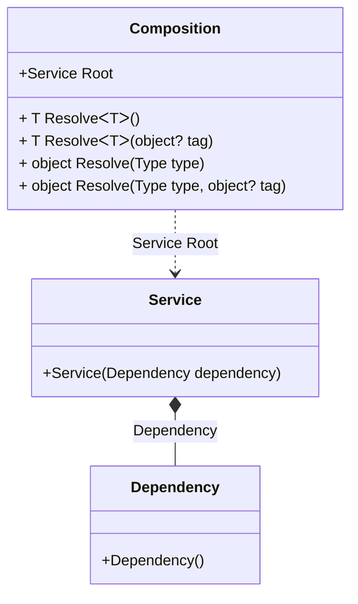

#### Auto-bindings

[](../tests/Pure.DI.UsageTests/Basics/AutoBindingScenario.cs)

This approach works great even if DI doesn't have the appropriate bindings. :warning: But it can't be recommended if you follow the dependency inversion principle and want to make sure your types only depend on abstractions.

```c#
class Dependency
{
}

class Service
{
    public Service(Dependency dependency)
    {
    }
}

DI.Setup("Composition")
    .Root<Service>("Root");

var composition = new Composition();
var service1 = composition.Root;
        
// Or this way
var service2 = composition.Resolve<Service>();
        
// Or this way
var service3 = composition.Resolve(typeof(Service));
```

<details open>
<summary>Class Diagram</summary>



</details>

<details>
<summary>Pure.DI-generated partial class Composition</summary><blockquote>

```c#
partial class Composition
{
  private readonly global::System.IDisposable[] _disposableSingletonsM12D18di;
  
  public Composition()
  {
    _disposableSingletonsM12D18di = new global::System.IDisposable[0];
  }
  
  internal Composition(Composition parent)
  {
    _disposableSingletonsM12D18di = new global::System.IDisposable[0];
  }
  
  #region Composition Roots
  public Pure.DI.UsageTests.Basics.AutoBindingScenario.Service Root
  {
    #if NETSTANDARD2_0_OR_GREATER || NETCOREAPP || NET40_OR_GREATER || NET
    [global::System.Diagnostics.Contracts.Pure]
    #endif
    get
    {
      return new Pure.DI.UsageTests.Basics.AutoBindingScenario.Service(new Pure.DI.UsageTests.Basics.AutoBindingScenario.Dependency());
    }
  }
  #endregion
  
  #region API
  #if NETSTANDARD2_0_OR_GREATER || NETCOREAPP || NET40_OR_GREATER || NET
  [global::System.Diagnostics.Contracts.Pure]
  #endif
  public T Resolve<T>()
  {
    return ResolverM12D18di<T>.Value.Resolve(this);
  }
  
  #if NETSTANDARD2_0_OR_GREATER || NETCOREAPP || NET40_OR_GREATER || NET
  [global::System.Diagnostics.Contracts.Pure]
  #endif
  public T Resolve<T>(object? tag)
  {
    return ResolverM12D18di<T>.Value.ResolveByTag(this, tag);
  }
  
  #if NETSTANDARD2_0_OR_GREATER || NETCOREAPP || NET40_OR_GREATER || NET
  [global::System.Diagnostics.Contracts.Pure]
  #endif
  public object Resolve(global::System.Type type)
  {
    var index = (int)(_bucketSizeM12D18di * ((uint)global::System.Runtime.CompilerServices.RuntimeHelpers.GetHashCode(type) % 1));
    var finish = index + _bucketSizeM12D18di;
    do {
      ref var pair = ref _bucketsM12D18di[index];
      if (ReferenceEquals(pair.Key, type))
      {
        return pair.Value.Resolve(this);
      }
    } while (++index < finish);
    
    throw new global::System.InvalidOperationException($"Cannot resolve composition root of type {type}.");
  }
  
  #if NETSTANDARD2_0_OR_GREATER || NETCOREAPP || NET40_OR_GREATER || NET
  [global::System.Diagnostics.Contracts.Pure]
  #endif
  public object Resolve(global::System.Type type, object? tag)
  {
    var index = (int)(_bucketSizeM12D18di * ((uint)global::System.Runtime.CompilerServices.RuntimeHelpers.GetHashCode(type) % 1));
    var finish = index + _bucketSizeM12D18di;
    do {
      ref var pair = ref _bucketsM12D18di[index];
      if (ReferenceEquals(pair.Key, type))
      {
        return pair.Value.ResolveByTag(this, tag);
      }
    } while (++index < finish);
    
    throw new global::System.InvalidOperationException($"Cannot resolve composition root \"{tag}\" of type {type}.");
  }
  #endregion
  
  public override string ToString()
  {
    return
      "classDiagram\n" +
        "  class Composition {\n" +
          "    +Service Root\n" +
          "    + T ResolveᐸTᐳ()\n" +
          "    + T ResolveᐸTᐳ(object? tag)\n" +
          "    + object Resolve(Type type)\n" +
          "    + object Resolve(Type type, object? tag)\n" +
        "  }\n" +
        "  class Dependency {\n" +
          "    +Dependency()\n" +
        "  }\n" +
        "  class Service {\n" +
          "    +Service(Dependency dependency)\n" +
        "  }\n" +
        "  Service *--  Dependency : Dependency\n" +
        "  Composition ..> Service : Service Root";
  }
  
  private readonly static int _bucketSizeM12D18di;
  private readonly static global::Pure.DI.Pair<global::System.Type, global::Pure.DI.IResolver<Composition, object>>[] _bucketsM12D18di;
  
  
  static Composition()
  {
    var valResolverM12D18di_0000 = new ResolverM12D18di_0000();
    ResolverM12D18di<Pure.DI.UsageTests.Basics.AutoBindingScenario.Service>.Value = valResolverM12D18di_0000;
    _bucketsM12D18di = global::Pure.DI.Buckets<global::System.Type, global::Pure.DI.IResolver<Composition, object>>.Create(
      1,
      out _bucketSizeM12D18di,
      new global::Pure.DI.Pair<global::System.Type, global::Pure.DI.IResolver<Composition, object>>[1]
      {
         new global::Pure.DI.Pair<global::System.Type, global::Pure.DI.IResolver<Composition, object>>(typeof(Pure.DI.UsageTests.Basics.AutoBindingScenario.Service), valResolverM12D18di_0000)
      });
  }
  
  #region Resolvers
  private sealed class ResolverM12D18di<T>: global::Pure.DI.IResolver<Composition, T>
  {
    public static global::Pure.DI.IResolver<Composition, T> Value = new ResolverM12D18di<T>();
    
    public T Resolve(Composition composite)
    {
      throw new global::System.InvalidOperationException($"Cannot resolve composition root of type {typeof(T)}.");
    }
    
    public T ResolveByTag(Composition composite, object tag)
    {
      throw new global::System.InvalidOperationException($"Cannot resolve composition root \"{tag}\" of type {typeof(T)}.");
    }
  }
  
  private sealed class ResolverM12D18di_0000: global::Pure.DI.IResolver<Composition, Pure.DI.UsageTests.Basics.AutoBindingScenario.Service>
  {
    public Pure.DI.UsageTests.Basics.AutoBindingScenario.Service Resolve(Composition composition)
    {
      return composition.Root;
    }
    
    public Pure.DI.UsageTests.Basics.AutoBindingScenario.Service ResolveByTag(Composition composition, object tag)
    {
      if (Equals(tag, null)) return composition.Root;;
      throw new global::System.InvalidOperationException($"Cannot resolve composition root \"{tag}\" of type Pure.DI.UsageTests.Basics.AutoBindingScenario.Service.");
    }
  }
  #endregion
}
```

</blockquote></details>

