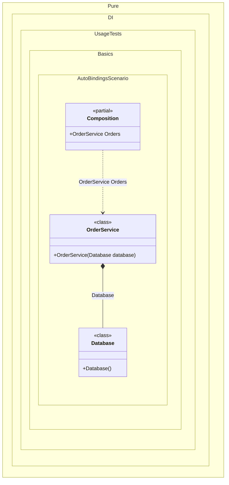

#### Auto-bindings

Injection of non-abstract types is possible without any additional effort.


```c#
using Pure.DI;

// Specifies to create a partial class with name "Composition"
DI.Setup("Composition")
    // with the root "Orders"
    .Root<OrderService>("Orders");

var composition = new Composition();

// service = new OrderService(new Database())
var orders = composition.Orders;

class Database;

class OrderService(Database database);
```

<details>
<summary>Running this code sample locally</summary>

- Make sure you have the [.NET SDK 10.0](https://dotnet.microsoft.com/en-us/download/dotnet/10.0) or later is installed
```bash
dotnet --list-sdk
```
- Create a net10.0 (or later) console application
```bash
dotnet new console -n Sample
```
- Add reference to NuGet package
  - [Pure.DI](https://www.nuget.org/packages/Pure.DI)
```bash
dotnet add package Pure.DI
```
- Copy the example code into the _Program.cs_ file

You are ready to run the example 🚀
```bash
dotnet run
```

</details>

> [!WARNING]
> But this approach cannot be recommended if you follow the dependency inversion principle and want your types to depend only on abstractions. Or you want to precisely control the lifetime of a dependency.

It is better to inject abstract dependencies, for example, in the form of interfaces. Use bindings to map abstract types to their implementations as in almost all [other examples](injections-of-abstractions.md).

The following partial class will be generated:

```c#
partial class Composition
{
  [OrdinalAttribute(256)]
  public Composition()
  {
  }

  internal Composition(Composition parentScope)
  {
  }

  public OrderService Orders
  {
    [MethodImpl(MethodImplOptions.AggressiveInlining)]
    get
    {
      return new OrderService(new Database());
    }
  }
}
```

Class diagram:



