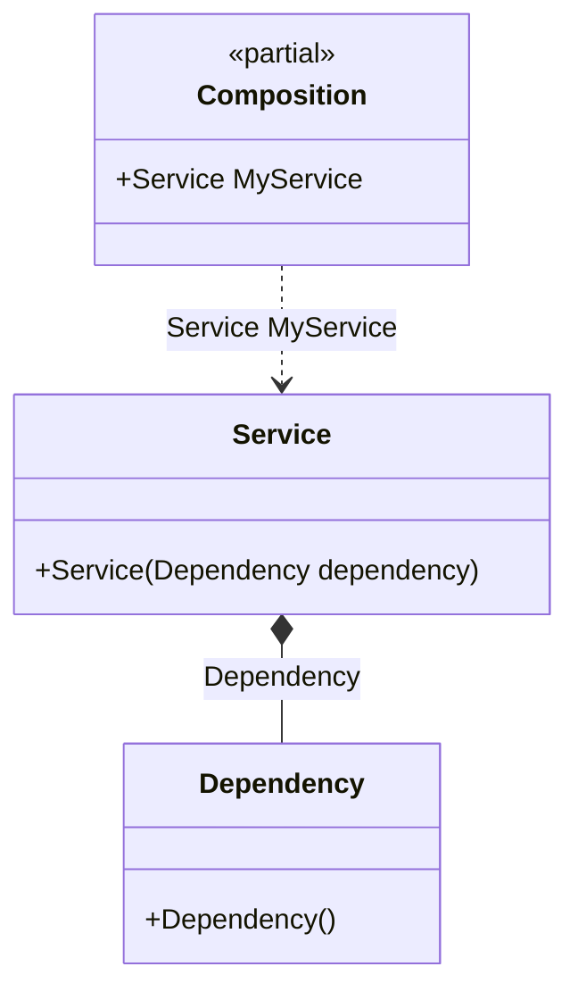

#### Auto-bindings

[](../tests/Pure.DI.UsageTests/Basics/AutoBindingsScenario.cs)

Injection of non-abstract types is possible without any additional effort.


```c#
class Dependency;

class Service(Dependency dependency);

// Specifies to create a partial class "Composition"
DI.Setup("Composition")
    // Specifies to create a property "MyService"
    .Root<Service>("MyService");
        
var composition = new Composition();

// service = new Service(new Dependency())
var service = composition.MyService;
```

> [!WARNING]
> But this approach cannot be recommended if you follow the dependency inversion principle and want your types to depend only on abstractions.

It is better to inject abstract dependencies, for example, in the form of interfaces. Use bindings to map abstract types to their implementations as in almost all [other examples](injections-of-abstractions.md).

The following partial class will be generated:

```c#
partial class Composition
{
  private readonly Composition _root;

  public Composition()
  {
    _root = this;
  }

  internal Composition(Composition parentScope)
  {
    _root = (parentScope ?? throw new ArgumentNullException(nameof(parentScope)))._root;
  }

  public Service MyService
  {
    [MethodImpl(MethodImplOptions.AggressiveInlining)]
    get
    {
      return new Service(new Dependency());
    }
  }
}
```

Class diagram:



