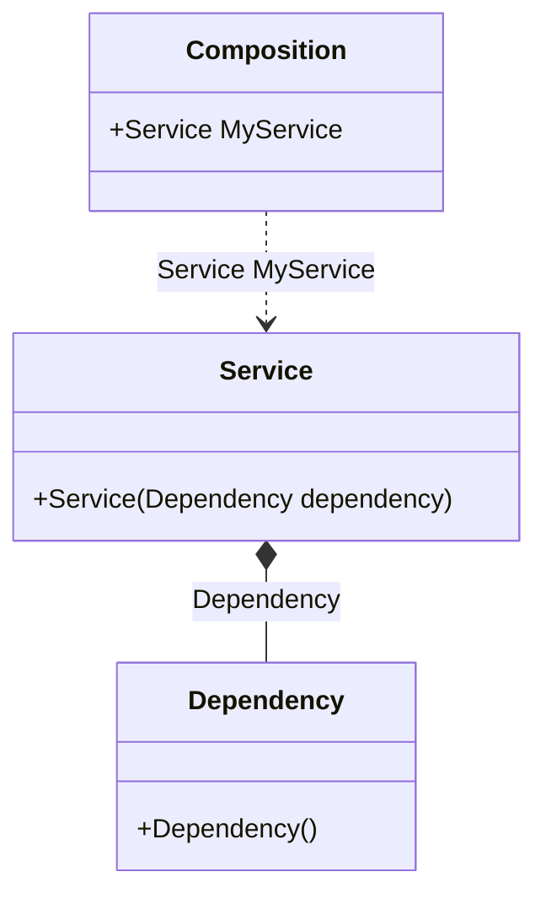

#### Auto-bindings

[](../tests/Pure.DI.UsageTests/Basics/AutoBindingsScenario.cs)

Injection of non-abstract types is possible without any additional effort.

```c#
class Dependency;

class Service(Dependency dependency);

// Specifies to create a partial class "Composition":
DI.Setup("Composition")
    // Specifies to create a property "MyService":
    .Root<Service>("MyService");
        
var composition = new Composition();

// service = new Service(new Dependency());
var service = composition.MyService;
```

:warning: But this approach cannot be recommended if you follow the dependency inversion principle and want your types to depend only on abstractions.

It is better to inject abstract dependencies, for example, in the form of interfaces. Use bindings to map abstract types to their implementations as in almost all [other examples](injections-of-abstractions.md).

<details open>
<summary>Class Diagram</summary>



</details>

<details>
<summary>Pure.DI-generated partial class Composition</summary><blockquote>

```c#
partial class Composition
{
  private readonly global::System.IDisposable[] _disposableSingletonsM02D06di;
  
  public Composition()
  {
    _disposableSingletonsM02D06di = new global::System.IDisposable[0];
  }
  
  internal Composition(Composition parent)
  {
    _disposableSingletonsM02D06di = new global::System.IDisposable[0];
  }
  
  #region Composition Roots
  public Pure.DI.UsageTests.Basics.AutoBindingsScenario.Service MyService
  {
    #if NETSTANDARD2_0_OR_GREATER || NETCOREAPP || NET40_OR_GREATER || NET
    [global::System.Diagnostics.Contracts.Pure]
    #endif
    get
    {
      return new Pure.DI.UsageTests.Basics.AutoBindingsScenario.Service(new Pure.DI.UsageTests.Basics.AutoBindingsScenario.Dependency());
    }
  }
  #endregion
  
  
  public override string ToString()
  {
    return
      "classDiagram\n" +
        "  class Composition {\n" +
          "    +Service MyService\n" +
        "  }\n" +
        "  class Dependency {\n" +
          "    +Dependency()\n" +
        "  }\n" +
        "  class Service {\n" +
          "    +Service(Dependency dependency)\n" +
        "  }\n" +
        "  Service *--  Dependency : Dependency\n" +
        "  Composition ..> Service : Service MyService";
  }
}
```

</blockquote></details>

