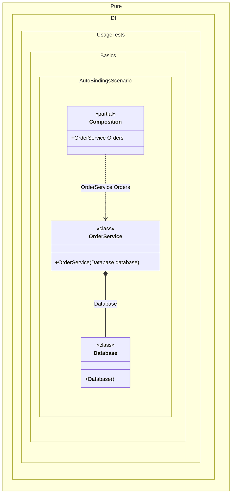

#### Auto-bindings

Pure.DI can create non-abstract types without explicit bindings, which makes quick prototypes and small demos concise.
The generator still validates the graph at compile time and produces regular C# object creation code.


```c#
using Pure.DI;

// Specifies to create a partial class named "Composition"
DI.Setup("Composition")
    // with the root "Orders"
    .Root<OrderService>("Orders");

var composition = new Composition();

// service = new OrderService(new Database())
var orders = composition.Orders;

class Database;

class OrderService(Database database);
```

<details>
<summary>Running this code sample locally</summary>

- Make sure you have the [.NET SDK 10.0](https://dotnet.microsoft.com/en-us/download/dotnet/10.0) or later installed
```bash
dotnet --list-sdk
```
- Create a net10.0 (or later) console application
```bash
dotnet new console -n Sample
```
- Add a reference to the NuGet package
  - [Pure.DI](https://www.nuget.org/packages/Pure.DI)
```bash
dotnet add package Pure.DI
```
- Copy the example code into the _Program.cs_ file

You are ready to run the example 🚀
```bash
dotnet run
```

</details>

Auto-bindings are convenient for utilities and sample code where dependency choices are obvious.
In larger applications they can hide architectural intent, because consumers start depending on concrete classes.
If you need interchangeable implementations and explicit lifetime control, prefer bindings of abstractions to implementations.
>[!WARNING]
>This approach is not recommended if you follow the dependency inversion principle or need precise lifetime control.

Prefer injecting abstractions (for example, interfaces) and map them to implementations as in most [other examples](injections-of-abstractions.md).
Limitations: auto-bindings scale poorly when several implementations, decorators, or strict lifetime rules are required.
Common pitfalls:
- Relying on concrete classes in domain code instead of abstractions.
- Losing explicit control over lifetime choices during refactoring.
See also: [Injections of abstractions](injections-of-abstractions.md), [Simplified binding](simplified-binding.md).

The following partial class will be generated:

```c#
partial class Composition
{
  public OrderService Orders
  {
    [MethodImpl(MethodImplOptions.AggressiveInlining)]
    get
    {
      return new OrderService(new Database());
    }
  }
}
```

Class diagram:


```mermaid
---
 config:
  maxTextSize: 2147483647
  maxEdges: 2147483647
  class:
   hideEmptyMembersBox: true
---
classDiagram
	Composition ..> OrderService : OrderService Orders
	OrderService *--  Database : Database
	namespace Pure.DI.UsageTests.Basics.AutoBindingsScenario {
		class Composition {
		<<partial>>
		+OrderService Orders
		}
		class Database {
				<<class>>
			+Database()
		}
		class OrderService {
				<<class>>
			+OrderService(Database database)
		}
	}
```

