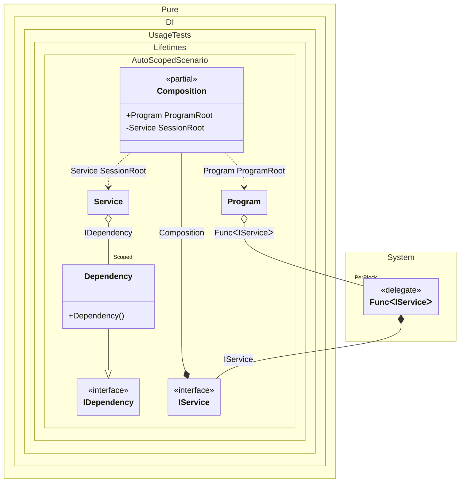

#### Auto scoped

[](../tests/Pure.DI.UsageTests/Lifetimes/AutoScopedScenario.cs)

You can use the following example to automatically create a session when creating instances of a particular type:


```c#
using Shouldly;
using Pure.DI;
using static Pure.DI.Lifetime;

var composition = new Composition();
var program = composition.ProgramRoot;

// Creates service in session #1
var service1 = program.CreateService();

// Creates service in session #2
var service2 = program.CreateService();

// Checks that the scoped instances are not identical in different sessions
service1.Dependency.ShouldNotBe(service2.Dependency);

interface IDependency;

class Dependency : IDependency;

interface IService
{
    IDependency Dependency { get; }
}

class Service(IDependency dependency) : IService
{
    public IDependency Dependency => dependency;
}

// Implements a session
partial class Program(Func<IService> serviceFactory)
{
    public IService CreateService() => serviceFactory();
}

partial class Composition
{
    static void Setup() =>
        DI.Setup()
            // This hint indicates to not generate methods such as Resolve
            .Hint(Hint.Resolve, "Off")
            .Bind().As(Scoped).To<Dependency>()
            // Session composition root
            .Root<Service>("SessionRoot", kind: RootKinds.Private)
            // Auto scoped
            .Bind().To(IService (Composition baseComposition) =>
            {
                // Creates a session
                var session = new Composition(baseComposition);
                // Provides a root
                return session.SessionRoot;
            })

            // Program composition root
            .Root<Program>("ProgramRoot");
}
```

<details>
<summary>Running this code sample locally</summary>

- Make sure you have the [.NET SDK 9.0](https://dotnet.microsoft.com/en-us/download/dotnet/9.0) or later is installed
```bash
dotnet --list-sdk
```
- Create a net9.0 (or later) console application
```bash
dotnet new console -n Sample
```
- Add references to NuGet packages
  - [Pure.DI](https://www.nuget.org/packages/Pure.DI)
  - [Shouldly](https://www.nuget.org/packages/Shouldly)
```bash
dotnet add package Pure.DI
dotnet add package Shouldly
```
- Copy the example code into the _Program.cs_ file

You are ready to run the example 🚀
```bash
dotnet run
```

</details>

> [!IMPORTANT]
> The method `Inject()`cannot be used outside of the binding setup.

The following partial class will be generated:

```c#
partial class Composition
{
  private readonly Composition _root;
  private readonly Lock _lock;

  private Dependency? _scopedDependency43;

  [OrdinalAttribute(256)]
  public Composition()
  {
    _root = this;
    _lock = new Lock();
  }

  internal Composition(Composition parentScope)
  {
    _root = (parentScope ?? throw new ArgumentNullException(nameof(parentScope)))._root;
    _lock = _root._lock;
  }

  public Program ProgramRoot
  {
    [MethodImpl(MethodImplOptions.AggressiveInlining)]
    get
    {
      Func<IService> perBlockFunc1 = new Func<IService>(
      [MethodImpl(MethodImplOptions.AggressiveInlining)]
      () =>
      {
        Composition transientComposition3 = this;
        IService transientIService2;
        Composition localBaseComposition95 = transientComposition3;
        // Creates a session
        var localSession96 = new Composition(localBaseComposition95);
        // Provides a root
        transientIService2 = localSession96.SessionRoot;
        IService localValue94 = transientIService2;
        return localValue94;
      });
      return new Program(perBlockFunc1);
    }
  }

  private Service SessionRoot
  {
    [MethodImpl(MethodImplOptions.AggressiveInlining)]
    get
    {
      if (_scopedDependency43 is null)
      {
        using (_lock.EnterScope())
        {
          if (_scopedDependency43 is null)
          {
            _scopedDependency43 = new Dependency();
          }
        }
      }

      return new Service(_scopedDependency43);
    }
  }
}
```

Class diagram:



