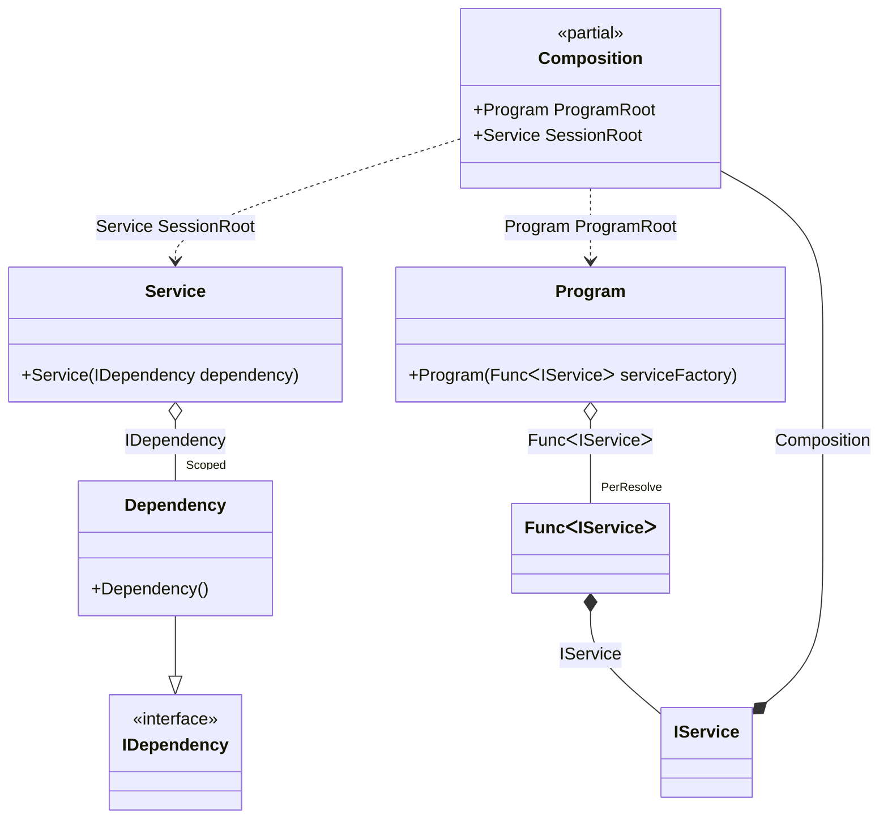

#### Auto scoped

[](../tests/Pure.DI.UsageTests/Lifetimes/AutoScopedScenario.cs)

You can use the following example to automatically create a session when creating instances of a particular type:


```c#
interface IDependency;

class Dependency : IDependency;

interface IService
{
    IDependency Dependency { get; }
}

class Service(IDependency dependency) : IService
{
    public IDependency Dependency => dependency;
}

// Implements a session
class Program(Func<IService> serviceFactory)
{
    public IService CreateService() => serviceFactory();
}

partial class Composition
{
    void Setup() =>
        DI.Setup(nameof(Composition))
            // This hint indicates to not generate methods such as Resolve
            .Hint(Hint.Resolve, "Off")
            .Bind().As(Scoped).To<Dependency>()
            // Session composition root
            .Root<Service>("SessionRoot", kind: RootKinds.Private)
            // Auto scoped
            .Bind().To<IService>(ctx =>
            {
                // Injects a base composition
                ctx.Inject(out Composition baseComposition);

                // Creates a session
                var session = new Composition(baseComposition);

                return session.SessionRoot;
            })

            // Program composition root
            .Root<Program>("ProgramRoot");
}

var composition = new Composition();
var program = composition.ProgramRoot;
        
// Creates service in session #1
var service1 = program.CreateService();
        
// Creates service in session #2
var service2 = program.CreateService();
        
// Checks that the scoped instances are not identical in different sessions
service1.Dependency.ShouldNotBe(service2.Dependency);
```

The following partial class will be generated:

```c#
partial class Composition
{
  private readonly Composition _root;
  private readonly object _lock;
  private Dependency? _scoped36_Dependency;

  public Composition()
  {
    _root = this;
    _lock = new object();
  }

  internal Composition(Composition parentScope)
  {
    _root = (parentScope ?? throw new ArgumentNullException(nameof(parentScope)))._root;
    _lock = _root._lock;
  }

  private Service SessionRoot
  {
    [MethodImpl(MethodImplOptions.AggressiveInlining)]
    get
    {
      if (_scoped36_Dependency == null)
      {
          lock (_lock)
          {
              if (_scoped36_Dependency == null)
              {
                  _scoped36_Dependency = new Dependency();
              }
          }
      }
      return new Service(_scoped36_Dependency!);
    }
  }

  public Program ProgramRoot
  {
    [MethodImpl(MethodImplOptions.AggressiveInlining)]
    get
    {
      var perResolve43_Func = default(Func<IService>);
      perResolve43_Func = new Func<IService>(
      [MethodImpl(MethodImplOptions.AggressiveInlining)]
      () =>
      {
          Composition transient2_Composition = this;
          IService transient1_IService;
          {
              var baseComposition_2 = transient2_Composition;
              // Creates a session
              var session_3 = new Composition(baseComposition_2);
              transient1_IService = session_3.SessionRoot;
          }
          var value_1 = transient1_IService;
          return value_1;
      });
      return new Program(perResolve43_Func!);
    }
  }
}
```

Class diagram:



