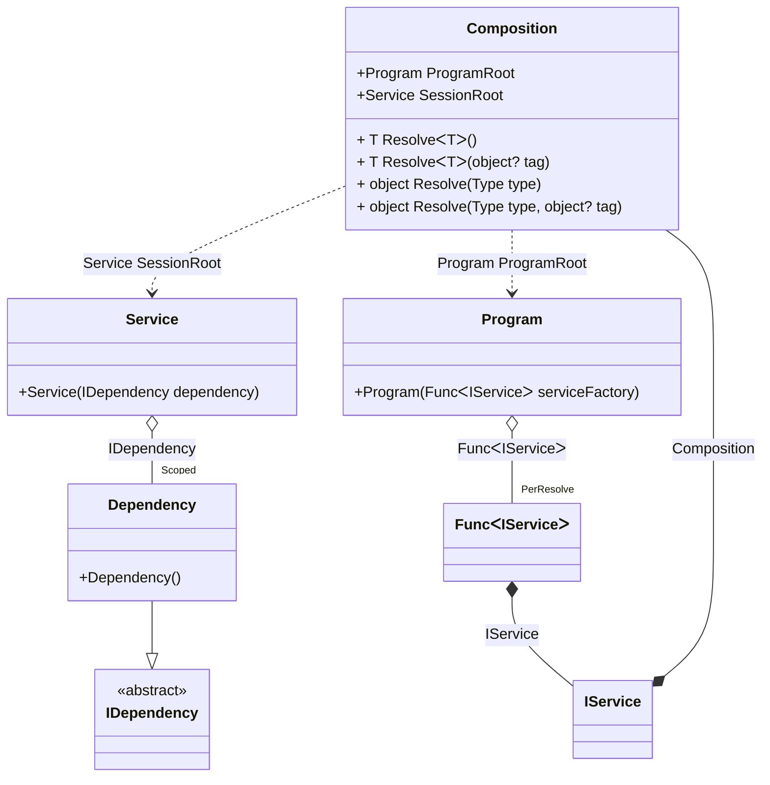

#### Auto scoped

[](../tests/Pure.DI.UsageTests/Lifetimes/AutoScopedScenario.cs)

You can use the following example to automatically create a session when creating instances of a particular type:

```c#
interface IDependency;

class Dependency : IDependency;

interface IService
{
    IDependency Dependency { get; }
}

class Service(IDependency dependency) : IService
{
    public IDependency Dependency => dependency;
}

// Implements a session
class Program(Func<IService> serviceFactory)
{
    public IService CreateService() => serviceFactory();
}

partial class Composition
{
    private static void Setup() =>
        DI.Setup(nameof(Composition))
            .Bind<IDependency>().As(Scoped).To<Dependency>()
            // Session composition root
            .Root<Service>("SessionRoot", kind: RootKinds.Private)
            // Auto scoped
            .Bind<IService>().To<IService>(ctx =>
            {
                // Injects a base composition
                ctx.Inject(out Composition baseComposition);

                // Creates a session
                var session = new Composition(baseComposition);

                return session.SessionRoot;
            })
            // Program composition root
            .Root<Program>("ProgramRoot");
}

var composition = new Composition();
var program = composition.ProgramRoot;
        
// Creates service in session #1
var service1 = program.CreateService();
        
// Creates service in session #2
var service2 = program.CreateService();
        
// Checks that the scoped instances are not identical in different sessions
service1.Dependency.ShouldNotBe(service2.Dependency);
```

<details open>
<summary>Class Diagram</summary>



</details>

<details>
<summary>Pure.DI-generated partial class Composition</summary><blockquote>

```c#
/// <para>
/// Composition roots:<br/>
/// <list type="table">
/// <listheader>
/// <term>Root</term>
/// <description>Description</description>
/// </listheader>
/// <item>
/// <term>
/// <see cref="Pure.DI.UsageTests.Lifetimes.AutoScopedScenario.Program"/> ProgramRoot
/// </term>
/// <description>
/// Program composition root
/// </description>
/// </item>
/// <item>
/// <term>
/// <see cref="Pure.DI.UsageTests.Lifetimes.AutoScopedScenario.Service"/> SessionRoot
/// </term>
/// <description>
/// Session composition root
/// </description>
/// </item>
/// </list>
/// </para>
/// <example>
/// This shows how to get an instance of type <see cref="Pure.DI.UsageTests.Lifetimes.AutoScopedScenario.Program"/> using the composition root <see cref="ProgramRoot"/>:
/// <code>
/// var composition = new Composition();
/// var instance = composition.ProgramRoot;
/// </code>
/// </example>
/// <a href="https://mermaid.live/view#pako:eNqdVEtuwjAQvcrI6y4QLGjZQVIkdghYZmOcEU0hcWQbJIS4A3fpptfhJvUnbpyEFKmbiTOfNzNvxr4QxlMkE8IOVMo4oztB80Qkhf2HiOcll5nKeAHJcTAYz4zNnIazpeDGGarvinNVG9coThlDWKOUOrhphA2sUPLDCe-378399mXVr1a-PXXj209kypxHc1B01wlzDj7WBW3OJYLS4h_eEfydchzXhHlSeshy8PNjwXRLi4ok3RlId5xTprg49-N7Xtv4ld7hL2IssUixYGdIf4_9oMGUa6WvzmgCPIsS13IcWVreIUxqVVOowVq2sPLa9GgLwjK7tAXV9mYYuQIjupVKaHpduZVsZPGz42GPAAlZovDrQR5U4dt9XJ-fWAd1zXiJqUbsEhd0YyA8oiN_2gRqX1Ed3ppn22Nou3dSDy4E18E9N_cJSLj3GqTnbejhrt1So19DR7CK5IXkKHKapfrRuiREfWCuxzJJSErFPiFXcv0BhmW0Fw">Class diagram</a><br/>
/// This class was created by <a href="https://github.com/DevTeam/Pure.DI">Pure.DI</a> source code generator.
/// </summary>
/// <seealso cref="Pure.DI.DI.Setup"/>
[global::System.Diagnostics.CodeAnalysis.ExcludeFromCodeCoverage]
partial class Composition
{
  private readonly Composition _rootM02D16di;
  private readonly object _lockM02D16di;
  private Pure.DI.UsageTests.Lifetimes.AutoScopedScenario.Dependency _scopedM02D16di34_Dependency;
  
  /// <summary>
  /// This constructor creates a new instance of <see cref="Composition"/>.
  /// </summary>
  public Composition()
  {
    _rootM02D16di = this;
    _lockM02D16di = new object();
  }
  
  /// <summary>
  /// This constructor creates a new instance of <see cref="Composition"/> scope based on <paramref name="baseComposition"/>. This allows the <see cref="Lifetime.Scoped"/> life time to be applied.
  /// </summary>
  /// <param name="baseComposition">Base composition.</param>
  internal Composition(Composition baseComposition)
  {
    _rootM02D16di = baseComposition._rootM02D16di;
    _lockM02D16di = _rootM02D16di._lockM02D16di;
  }
  
  #region Composition Roots
  /// <summary>
  /// Session composition root
  /// </summary>
  private Pure.DI.UsageTests.Lifetimes.AutoScopedScenario.Service SessionRoot
  {
    #if NETSTANDARD2_0_OR_GREATER || NETCOREAPP || NET40_OR_GREATER || NET
    [global::System.Diagnostics.Contracts.Pure]
    #endif
    get
    {
      if (ReferenceEquals(_scopedM02D16di34_Dependency, null))
      {
          lock (_lockM02D16di)
          {
              if (ReferenceEquals(_scopedM02D16di34_Dependency, null))
              {
                  _scopedM02D16di34_Dependency = new Pure.DI.UsageTests.Lifetimes.AutoScopedScenario.Dependency();
              }
          }
      }
      return new Pure.DI.UsageTests.Lifetimes.AutoScopedScenario.Service(_scopedM02D16di34_Dependency);
    }
  }
  
  /// <summary>
  /// Program composition root
  /// </summary>
  public Pure.DI.UsageTests.Lifetimes.AutoScopedScenario.Program ProgramRoot
  {
    #if NETSTANDARD2_0_OR_GREATER || NETCOREAPP || NET40_OR_GREATER || NET
    [global::System.Diagnostics.Contracts.Pure]
    #endif
    get
    {
      var perResolveM02D16di39_Func = default(System.Func<Pure.DI.UsageTests.Lifetimes.AutoScopedScenario.IService>);
      perResolveM02D16di39_Func = new global::System.Func<Pure.DI.UsageTests.Lifetimes.AutoScopedScenario.IService>(
      [global::System.Runtime.CompilerServices.MethodImpl((global::System.Runtime.CompilerServices.MethodImplOptions)768)]
      () =>
      {
          var transientM02D16di2_Composition = this;
          Pure.DI.UsageTests.Lifetimes.AutoScopedScenario.IService transientM02D16di1_IService;
          {
              var baseComposition_M02D16di2 = transientM02D16di2_Composition;
              // Creates a session
              var session_M02D16di3 = new Composition(baseComposition_M02D16di2);
              transientM02D16di1_IService = session_M02D16di3.SessionRoot;
          }
          var factory_M02D16di1 = transientM02D16di1_IService;
          return factory_M02D16di1;
      });
      return new Pure.DI.UsageTests.Lifetimes.AutoScopedScenario.Program(perResolveM02D16di39_Func);
    }
  }
  #endregion
  
  #region API
  /// <summary>
  /// Resolves the composition root.
  /// </summary>
  /// <typeparam name="T">The type of the composition root.</typeparam>
  /// <returns>A composition root.</returns>
  #if NETSTANDARD2_0_OR_GREATER || NETCOREAPP || NET40_OR_GREATER || NET
  [global::System.Diagnostics.Contracts.Pure]
  #endif
  public T Resolve<T>()
  {
    return ResolverM02D16di<T>.Value.Resolve(this);
  }
  
  /// <summary>
  /// Resolves the composition root by tag.
  /// </summary>
  /// <typeparam name="T">The type of the composition root.</typeparam>
  /// <param name="tag">The tag of a composition root.</param>
  /// <returns>A composition root.</returns>
  #if NETSTANDARD2_0_OR_GREATER || NETCOREAPP || NET40_OR_GREATER || NET
  [global::System.Diagnostics.Contracts.Pure]
  #endif
  public T Resolve<T>(object? tag)
  {
    return ResolverM02D16di<T>.Value.ResolveByTag(this, tag);
  }
  
  /// <summary>
  /// Resolves the composition root.
  /// </summary>
  /// <param name="type">The type of the composition root.</param>
  /// <returns>A composition root.</returns>
  #if NETSTANDARD2_0_OR_GREATER || NETCOREAPP || NET40_OR_GREATER || NET
  [global::System.Diagnostics.Contracts.Pure]
  #endif
  public object Resolve(global::System.Type type)
  {
    var index = (int)(_bucketSizeM02D16di * ((uint)global::System.Runtime.CompilerServices.RuntimeHelpers.GetHashCode(type) % 4));
    var finish = index + _bucketSizeM02D16di;
    do {
      ref var pair = ref _bucketsM02D16di[index];
      if (ReferenceEquals(pair.Key, type))
      {
        return pair.Value.Resolve(this);
      }
    } while (++index < finish);
    
    throw new global::System.InvalidOperationException($"Cannot resolve composition root of type {type}.");
  }
  
  /// <summary>
  /// Resolves the composition root by tag.
  /// </summary>
  /// <param name="type">The type of the composition root.</param>
  /// <param name="tag">The tag of a composition root.</param>
  /// <returns>A composition root.</returns>
  #if NETSTANDARD2_0_OR_GREATER || NETCOREAPP || NET40_OR_GREATER || NET
  [global::System.Diagnostics.Contracts.Pure]
  #endif
  public object Resolve(global::System.Type type, object? tag)
  {
    var index = (int)(_bucketSizeM02D16di * ((uint)global::System.Runtime.CompilerServices.RuntimeHelpers.GetHashCode(type) % 4));
    var finish = index + _bucketSizeM02D16di;
    do {
      ref var pair = ref _bucketsM02D16di[index];
      if (ReferenceEquals(pair.Key, type))
      {
        return pair.Value.ResolveByTag(this, tag);
      }
    } while (++index < finish);
    
    throw new global::System.InvalidOperationException($"Cannot resolve composition root \"{tag}\" of type {type}.");
  }
  #endregion
  
  /// <summary>
  /// This method provides a class diagram in mermaid format. To see this diagram, simply call the method and copy the text to this site https://mermaid.live/.
  /// </summary>
  public override string ToString()
  {
    return
      "classDiagram\n" +
        "  class Composition {\n" +
          "    +Program ProgramRoot\n" +
          "    +Service SessionRoot\n" +
          "    + T ResolveᐸTᐳ()\n" +
          "    + T ResolveᐸTᐳ(object? tag)\n" +
          "    + object Resolve(Type type)\n" +
          "    + object Resolve(Type type, object? tag)\n" +
        "  }\n" +
        "  class Program {\n" +
          "    +Program(FuncᐸIServiceᐳ serviceFactory)\n" +
        "  }\n" +
        "  class Service {\n" +
          "    +Service(IDependency dependency)\n" +
        "  }\n" +
        "  class Composition\n" +
        "  class IService\n" +
        "  Dependency --|> IDependency : \n" +
        "  class Dependency {\n" +
          "    +Dependency()\n" +
        "  }\n" +
        "  class FuncᐸIServiceᐳ\n" +
        "  class IDependency {\n" +
          "    <<abstract>>\n" +
        "  }\n" +
        "  Program o--  \"PerResolve\" FuncᐸIServiceᐳ : FuncᐸIServiceᐳ\n" +
        "  Service o--  \"Scoped\" Dependency : IDependency\n" +
        "  IService *--  Composition : Composition\n" +
        "  Composition ..> Service : Service SessionRoot\n" +
        "  Composition ..> Program : Program ProgramRoot\n" +
        "  FuncᐸIServiceᐳ *--  IService : IService";
  }
  
  private readonly static int _bucketSizeM02D16di;
  private readonly static global::Pure.DI.Pair<global::System.Type, global::Pure.DI.IResolver<Composition, object>>[] _bucketsM02D16di;
  
  static Composition()
  {
    var valResolverM02D16di_0000 = new ResolverM02D16di_0000();
    ResolverM02D16di<Pure.DI.UsageTests.Lifetimes.AutoScopedScenario.Service>.Value = valResolverM02D16di_0000;
    var valResolverM02D16di_0001 = new ResolverM02D16di_0001();
    ResolverM02D16di<Pure.DI.UsageTests.Lifetimes.AutoScopedScenario.Program>.Value = valResolverM02D16di_0001;
    _bucketsM02D16di = global::Pure.DI.Buckets<global::System.Type, global::Pure.DI.IResolver<Composition, object>>.Create(
      4,
      out _bucketSizeM02D16di,
      new global::Pure.DI.Pair<global::System.Type, global::Pure.DI.IResolver<Composition, object>>[2]
      {
         new global::Pure.DI.Pair<global::System.Type, global::Pure.DI.IResolver<Composition, object>>(typeof(Pure.DI.UsageTests.Lifetimes.AutoScopedScenario.Service), valResolverM02D16di_0000)
        ,new global::Pure.DI.Pair<global::System.Type, global::Pure.DI.IResolver<Composition, object>>(typeof(Pure.DI.UsageTests.Lifetimes.AutoScopedScenario.Program), valResolverM02D16di_0001)
      });
  }
  
  #region Resolvers
  private sealed class ResolverM02D16di<T>: global::Pure.DI.IResolver<Composition, T>
  {
    public static global::Pure.DI.IResolver<Composition, T> Value = new ResolverM02D16di<T>();
    
    public T Resolve(Composition composite)
    {
      throw new global::System.InvalidOperationException($"Cannot resolve composition root of type {typeof(T)}.");
    }
    
    public T ResolveByTag(Composition composite, object tag)
    {
      throw new global::System.InvalidOperationException($"Cannot resolve composition root \"{tag}\" of type {typeof(T)}.");
    }
  }
  
  private sealed class ResolverM02D16di_0000: global::Pure.DI.IResolver<Composition, Pure.DI.UsageTests.Lifetimes.AutoScopedScenario.Service>
  {
    public Pure.DI.UsageTests.Lifetimes.AutoScopedScenario.Service Resolve(Composition composition)
    {
      return composition.SessionRoot;
    }
    
    public Pure.DI.UsageTests.Lifetimes.AutoScopedScenario.Service ResolveByTag(Composition composition, object tag)
    {
      switch (tag)
      {
        case null:
          return composition.SessionRoot;
      }
      throw new global::System.InvalidOperationException($"Cannot resolve composition root \"{tag}\" of type Pure.DI.UsageTests.Lifetimes.AutoScopedScenario.Service.");
    }
  }
  
  private sealed class ResolverM02D16di_0001: global::Pure.DI.IResolver<Composition, Pure.DI.UsageTests.Lifetimes.AutoScopedScenario.Program>
  {
    public Pure.DI.UsageTests.Lifetimes.AutoScopedScenario.Program Resolve(Composition composition)
    {
      return composition.ProgramRoot;
    }
    
    public Pure.DI.UsageTests.Lifetimes.AutoScopedScenario.Program ResolveByTag(Composition composition, object tag)
    {
      switch (tag)
      {
        case null:
          return composition.ProgramRoot;
      }
      throw new global::System.InvalidOperationException($"Cannot resolve composition root \"{tag}\" of type Pure.DI.UsageTests.Lifetimes.AutoScopedScenario.Program.");
    }
  }
  #endregion
}
```

</blockquote></details>

