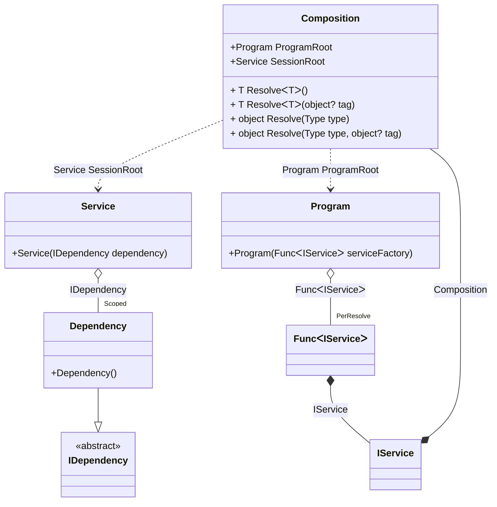

#### Auto scoped

[](../tests/Pure.DI.UsageTests/Lifetimes/AutoScopedScenario.cs)

You can use the following example to automatically create a session when creating instances of a particular type:

```c#
interface IDependency;

class Dependency : IDependency;

interface IService
{
    IDependency Dependency { get; }
}

class Service(IDependency dependency) : IService
{
    public IDependency Dependency => dependency;
}

// Implements a session
class Program(Func<IService> serviceFactory)
{
    public IService CreateService() => serviceFactory();
}

partial class Composition
{
    void Setup() =>
        DI.Setup(nameof(Composition))
            .Bind().As(Scoped).To<Dependency>()
            // Session composition root
            .Root<Service>("SessionRoot", kind: RootKinds.Private)
            // Auto scoped
            .Bind().To<IService>(ctx =>
            {
                // Injects a base composition
                ctx.Inject(out Composition baseComposition);

                // Creates a session
                var session = new Composition(baseComposition);

                return session.SessionRoot;
            })

            // Program composition root
            .Root<Program>("ProgramRoot");
}

var composition = new Composition();
var program = composition.ProgramRoot;
        
// Creates service in session #1
var service1 = program.CreateService();
        
// Creates service in session #2
var service2 = program.CreateService();
        
// Checks that the scoped instances are not identical in different sessions
service1.Dependency.ShouldNotBe(service2.Dependency);
```

<details open>
<summary>Class Diagram</summary>



</details>

<details>
<summary>Pure.DI-generated partial class Composition</summary><blockquote>

```c#
partial class Composition
{
  private readonly Composition _rootM04D13di;
  private readonly object _lockM04D13di;
  private Pure.DI.UsageTests.Lifetimes.AutoScopedScenario.Dependency _scopedM04D13di36_Dependency;
  
  public Composition()
  {
    _rootM04D13di = this;
    _lockM04D13di = new object();
  }
  
  internal Composition(Composition baseComposition)
  {
    _rootM04D13di = baseComposition._rootM04D13di;
    _lockM04D13di = _rootM04D13di._lockM04D13di;
  }
  
  private Pure.DI.UsageTests.Lifetimes.AutoScopedScenario.Service SessionRoot
  {
    [global::System.Runtime.CompilerServices.MethodImpl((global::System.Runtime.CompilerServices.MethodImplOptions)0x100)]
    get
    {
      if (_scopedM04D13di36_Dependency == null)
      {
          lock (_lockM04D13di)
          {
              if (_scopedM04D13di36_Dependency == null)
              {
                  _scopedM04D13di36_Dependency = new Pure.DI.UsageTests.Lifetimes.AutoScopedScenario.Dependency();
              }
          }
      }
      return new Pure.DI.UsageTests.Lifetimes.AutoScopedScenario.Service(_scopedM04D13di36_Dependency);
    }
  }
  
  public Pure.DI.UsageTests.Lifetimes.AutoScopedScenario.Program ProgramRoot
  {
    [global::System.Runtime.CompilerServices.MethodImpl((global::System.Runtime.CompilerServices.MethodImplOptions)0x100)]
    get
    {
      var perResolveM04D13di42_Func = default(System.Func<Pure.DI.UsageTests.Lifetimes.AutoScopedScenario.IService>);
      perResolveM04D13di42_Func = new global::System.Func<Pure.DI.UsageTests.Lifetimes.AutoScopedScenario.IService>(
      [global::System.Runtime.CompilerServices.MethodImpl((global::System.Runtime.CompilerServices.MethodImplOptions)768)]
      () =>
      {
          Pure.DI.UsageTests.Lifetimes.AutoScopedScenario.Composition transientM04D13di2_Composition = this;
          Pure.DI.UsageTests.Lifetimes.AutoScopedScenario.IService transientM04D13di1_IService;
          {
              var baseComposition_M04D13di2 = transientM04D13di2_Composition;
              // Creates a session
              var session_M04D13di3 = new Composition(baseComposition_M04D13di2);
              transientM04D13di1_IService = session_M04D13di3.SessionRoot;
          }
          var factory_M04D13di1 = transientM04D13di1_IService;
          return factory_M04D13di1;
      });
      return new Pure.DI.UsageTests.Lifetimes.AutoScopedScenario.Program(perResolveM04D13di42_Func);
    }
  }
  
  public T Resolve<T>()
  {
    return ResolverM04D13di<T>.Value.Resolve(this);
  }
  
  public T Resolve<T>(object? tag)
  {
    return ResolverM04D13di<T>.Value.ResolveByTag(this, tag);
  }
  
  [global::System.Runtime.CompilerServices.MethodImpl((global::System.Runtime.CompilerServices.MethodImplOptions)0x100)]
  public object Resolve(global::System.Type type)
  {
    var index = (int)(_bucketSizeM04D13di * ((uint)global::System.Runtime.CompilerServices.RuntimeHelpers.GetHashCode(type) % 4));
    ref var pair = ref _bucketsM04D13di[index];
    return pair.Key == type ? pair.Value.Resolve(this) : ResolveM04D13di(type, index);
  }
  
  [global::System.Runtime.CompilerServices.MethodImpl((global::System.Runtime.CompilerServices.MethodImplOptions)0x8)]
  private object ResolveM04D13di(global::System.Type type, int index)
  {
    var finish = index + _bucketSizeM04D13di;
    while (++index < finish)
    {
      ref var pair = ref _bucketsM04D13di[index];
      if (pair.Key == type)
      {
        return pair.Value.Resolve(this);
      }
    }
    
    throw new global::System.InvalidOperationException($"Cannot resolve composition root of type {type}.");
  }
  
  [global::System.Runtime.CompilerServices.MethodImpl((global::System.Runtime.CompilerServices.MethodImplOptions)0x100)]
  public object Resolve(global::System.Type type, object? tag)
  {
    var index = (int)(_bucketSizeM04D13di * ((uint)global::System.Runtime.CompilerServices.RuntimeHelpers.GetHashCode(type) % 4));
    ref var pair = ref _bucketsM04D13di[index];
    return pair.Key == type ? pair.Value.ResolveByTag(this, tag) : ResolveM04D13di(type, tag, index);
  }
  
  [global::System.Runtime.CompilerServices.MethodImpl((global::System.Runtime.CompilerServices.MethodImplOptions)0x8)]
  private object ResolveM04D13di(global::System.Type type, object? tag, int index)
  {
    var finish = index + _bucketSizeM04D13di;
    while (++index < finish)
    {
      ref var pair = ref _bucketsM04D13di[index];
      if (pair.Key == type)
      {
        return pair.Value.ResolveByTag(this, tag);
      }
    }
    
    throw new global::System.InvalidOperationException($"Cannot resolve composition root \"{tag}\" of type {type}.");
  }
  
  public override string ToString()
  {
    return
      "classDiagram\n" +
        "  class Composition {\n" +
          "    +Program ProgramRoot\n" +
          "    +Service SessionRoot\n" +
          "    + T ResolveᐸTᐳ()\n" +
          "    + T ResolveᐸTᐳ(object? tag)\n" +
          "    + object Resolve(Type type)\n" +
          "    + object Resolve(Type type, object? tag)\n" +
        "  }\n" +
        "  class Program {\n" +
          "    +Program(FuncᐸIServiceᐳ serviceFactory)\n" +
        "  }\n" +
        "  class Service {\n" +
          "    +Service(IDependency dependency)\n" +
        "  }\n" +
        "  class Composition\n" +
        "  class IService\n" +
        "  Dependency --|> IDependency : \n" +
        "  class Dependency {\n" +
          "    +Dependency()\n" +
        "  }\n" +
        "  class FuncᐸIServiceᐳ\n" +
        "  class IDependency {\n" +
          "    <<abstract>>\n" +
        "  }\n" +
        "  Program o--  \"PerResolve\" FuncᐸIServiceᐳ : FuncᐸIServiceᐳ\n" +
        "  Service o--  \"Scoped\" Dependency : IDependency\n" +
        "  IService *--  Composition : Composition\n" +
        "  Composition ..> Service : Service SessionRoot\n" +
        "  Composition ..> Program : Program ProgramRoot\n" +
        "  FuncᐸIServiceᐳ *--  IService : IService";
  }
  
  private readonly static int _bucketSizeM04D13di;
  private readonly static global::Pure.DI.Pair<global::System.Type, global::Pure.DI.IResolver<Composition, object>>[] _bucketsM04D13di;
  
  static Composition()
  {
    var valResolverM04D13di_0000 = new ResolverM04D13di_0000();
    ResolverM04D13di<Pure.DI.UsageTests.Lifetimes.AutoScopedScenario.Service>.Value = valResolverM04D13di_0000;
    var valResolverM04D13di_0001 = new ResolverM04D13di_0001();
    ResolverM04D13di<Pure.DI.UsageTests.Lifetimes.AutoScopedScenario.Program>.Value = valResolverM04D13di_0001;
    _bucketsM04D13di = global::Pure.DI.Buckets<global::System.Type, global::Pure.DI.IResolver<Composition, object>>.Create(
      4,
      out _bucketSizeM04D13di,
      new global::Pure.DI.Pair<global::System.Type, global::Pure.DI.IResolver<Composition, object>>[2]
      {
         new global::Pure.DI.Pair<global::System.Type, global::Pure.DI.IResolver<Composition, object>>(typeof(Pure.DI.UsageTests.Lifetimes.AutoScopedScenario.Service), valResolverM04D13di_0000)
        ,new global::Pure.DI.Pair<global::System.Type, global::Pure.DI.IResolver<Composition, object>>(typeof(Pure.DI.UsageTests.Lifetimes.AutoScopedScenario.Program), valResolverM04D13di_0001)
      });
  }
  
  private sealed class ResolverM04D13di<T>: global::Pure.DI.IResolver<Composition, T>
  {
    public static global::Pure.DI.IResolver<Composition, T> Value = new ResolverM04D13di<T>();
    
    public T Resolve(Composition composite)
    {
      throw new global::System.InvalidOperationException($"Cannot resolve composition root of type {typeof(T)}.");
    }
    
    public T ResolveByTag(Composition composite, object tag)
    {
      throw new global::System.InvalidOperationException($"Cannot resolve composition root \"{tag}\" of type {typeof(T)}.");
    }
  }
  
  private sealed class ResolverM04D13di_0000: global::Pure.DI.IResolver<Composition, Pure.DI.UsageTests.Lifetimes.AutoScopedScenario.Service>
  {
    public Pure.DI.UsageTests.Lifetimes.AutoScopedScenario.Service Resolve(Composition composition)
    {
      return composition.SessionRoot;
    }
    
    public Pure.DI.UsageTests.Lifetimes.AutoScopedScenario.Service ResolveByTag(Composition composition, object tag)
    {
      switch (tag)
      {
        case null:
          return composition.SessionRoot;
      }
      throw new global::System.InvalidOperationException($"Cannot resolve composition root \"{tag}\" of type Pure.DI.UsageTests.Lifetimes.AutoScopedScenario.Service.");
    }
  }
  
  private sealed class ResolverM04D13di_0001: global::Pure.DI.IResolver<Composition, Pure.DI.UsageTests.Lifetimes.AutoScopedScenario.Program>
  {
    public Pure.DI.UsageTests.Lifetimes.AutoScopedScenario.Program Resolve(Composition composition)
    {
      return composition.ProgramRoot;
    }
    
    public Pure.DI.UsageTests.Lifetimes.AutoScopedScenario.Program ResolveByTag(Composition composition, object tag)
    {
      switch (tag)
      {
        case null:
          return composition.ProgramRoot;
      }
      throw new global::System.InvalidOperationException($"Cannot resolve composition root \"{tag}\" of type Pure.DI.UsageTests.Lifetimes.AutoScopedScenario.Program.");
    }
  }
}
```

</blockquote></details>

