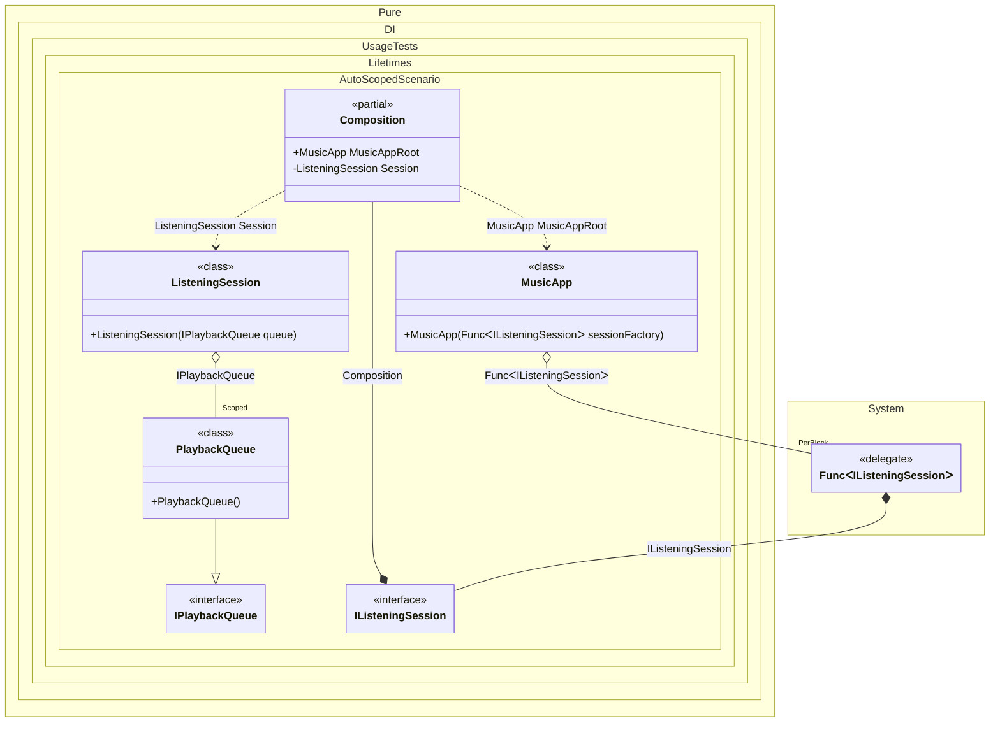

#### Auto scoped

You can use the following example to automatically create a session when creating instances of a particular type:


```c#
using Shouldly;
using Pure.DI;
using static Pure.DI.Lifetime;

var composition = new Composition();
var musicApp = composition.MusicAppRoot;

// Session #1: user starts listening on "Living Room Speaker"
var session1 = musicApp.StartListeningSession();
session1.Enqueue("Daft Punk - One More Time");
session1.Enqueue("Massive Attack - Teardrop");

// Session #2: user starts listening on "Headphones"
var session2 = musicApp.StartListeningSession();
session2.Enqueue("Radiohead - Weird Fishes/Arpeggi");

// Different sessions -> different scoped queue instances
session1.Queue.ShouldNotBe(session2.Queue);

// But inside one session, the same queue is used everywhere within that scope
session1.Queue.Items.Count.ShouldBe(2);
session2.Queue.Items.Count.ShouldBe(1);

// Domain abstractions

interface IPlaybackQueue
{
    IReadOnlyList<string> Items { get; }
    void Add(string trackTitle);
}

sealed class PlaybackQueue : IPlaybackQueue
{
    private readonly List<string> _items = [];

    public IReadOnlyList<string> Items => _items;

    public void Add(string trackTitle) => _items.Add(trackTitle);
}

interface IListeningSession
{
    IPlaybackQueue Queue { get; }

    void Enqueue(string trackTitle);
}

sealed class ListeningSession(IPlaybackQueue queue) : IListeningSession
{
    public IPlaybackQueue Queue => queue;

    public void Enqueue(string trackTitle) => queue.Add(trackTitle);
}

// Implements a "session boundary" for listening
class MusicApp(Func<IListeningSession> sessionFactory)
{
    // Each call creates a new DI scope under the hood (new "listening session").
    public IListeningSession StartListeningSession() => sessionFactory();
}

partial class Composition
{
    static void Setup() =>

        DI.Setup()
            // Scoped: one queue per listening session
            .Bind().As(Scoped).To<PlaybackQueue>()

            // Session composition root (private root used only to build sessions)
            .Root<ListeningSession>("Session", kind: RootKinds.Private)

            // Auto scoped factory: creates a new scope for each listening session
            .Bind().To(IListeningSession (Composition parentScope) => {
                // Create a child scope so scoped services (PlaybackQueue) are unique per session.
                var scope = new Composition(parentScope);
                return scope.Session;
            })

            // App-level root
            .Root<MusicApp>("MusicAppRoot");
}
```

<details>
<summary>Running this code sample locally</summary>

- Make sure you have the [.NET SDK 10.0](https://dotnet.microsoft.com/en-us/download/dotnet/10.0) or later is installed
```bash
dotnet --list-sdk
```
- Create a net10.0 (or later) console application
```bash
dotnet new console -n Sample
```
- Add references to NuGet packages
  - [Pure.DI](https://www.nuget.org/packages/Pure.DI)
  - [Shouldly](https://www.nuget.org/packages/Shouldly)
```bash
dotnet add package Pure.DI
dotnet add package Shouldly
```
- Copy the example code into the _Program.cs_ file

You are ready to run the example 🚀
```bash
dotnet run
```

</details>

> [!IMPORTANT]
> The method `Inject()`cannot be used outside of the binding setup.

The following partial class will be generated:

```c#
partial class Composition
{
  private readonly Composition _root;
#if NET9_0_OR_GREATER
  private readonly Lock _lock;
#else
  private readonly Object _lock;
#endif

  private PlaybackQueue? _scopedPlaybackQueue51;

  [OrdinalAttribute(256)]
  public Composition()
  {
    _root = this;
#if NET9_0_OR_GREATER
    _lock = new Lock();
#else
    _lock = new Object();
#endif
  }

  internal Composition(Composition parentScope)
  {
    _root = (parentScope ?? throw new ArgumentNullException(nameof(parentScope)))._root;
    _lock = parentScope._lock;
  }

  public MusicApp MusicAppRoot
  {
    [MethodImpl(MethodImplOptions.AggressiveInlining)]
    get
    {
      Func<IListeningSession> transientFunc1 = new Func<IListeningSession>(
      [MethodImpl(MethodImplOptions.AggressiveInlining)]
      () =>
      {
        IListeningSession transientIListeningSession2;
        Composition localParentScope = this;
        // Create a child scope so scoped services (PlaybackQueue) are unique per session.
        var localScope = new Composition(localParentScope);
        transientIListeningSession2 = localScope.Session;
        IListeningSession localValue32 = transientIListeningSession2;
        return localValue32;
      });
      return new MusicApp(transientFunc1);
    }
  }

  private ListeningSession Session
  {
    [MethodImpl(MethodImplOptions.AggressiveInlining)]
    get
    {
      if (_scopedPlaybackQueue51 is null)
        lock (_lock)
          if (_scopedPlaybackQueue51 is null)
          {
            _scopedPlaybackQueue51 = new PlaybackQueue();
          }

      return new ListeningSession(_scopedPlaybackQueue51);
    }
  }
}
```

Class diagram:



