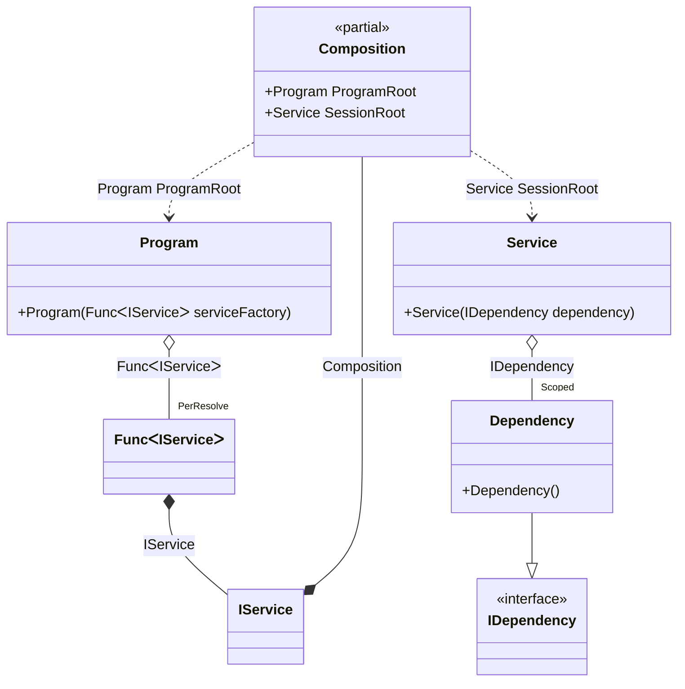

#### Auto scoped

[](../tests/Pure.DI.UsageTests/Lifetimes/AutoScopedScenario.cs)

You can use the following example to automatically create a session when creating instances of a particular type:


```c#
interface IDependency;

class Dependency : IDependency;

interface IService
{
    IDependency Dependency { get; }
}

class Service(IDependency dependency) : IService
{
    public IDependency Dependency => dependency;
}

// Implements a session
class Program(Func<IService> serviceFactory)
{
    public IService CreateService() => serviceFactory();
}

partial class Composition
{
    void Setup() =>
        DI.Setup()
            // This hint indicates to not generate methods such as Resolve
            .Hint(Hint.Resolve, "Off")
            .Bind().As(Scoped).To<Dependency>()
            // Session composition root
            .Root<Service>("SessionRoot", kind: RootKinds.Private)
            // Auto scoped
            .Bind().To<IService>(ctx =>
            {
                // Injects a base composition
                ctx.Inject(out Composition baseComposition);

                // Creates a session
                var session = new Composition(baseComposition);

                return session.SessionRoot;
            })

            // Program composition root
            .Root<Program>("ProgramRoot");
}

var composition = new Composition();
var program = composition.ProgramRoot;
        
// Creates service in session #1
var service1 = program.CreateService();
        
// Creates service in session #2
var service2 = program.CreateService();
        
// Checks that the scoped instances are not identical in different sessions
service1.Dependency.ShouldNotBe(service2.Dependency);
```

>[!IMPORTANT]
>The method `Inject()`cannot be used outside of the binding setup.

The following partial class will be generated:

```c#
partial class Composition
{
  private readonly Composition _root;
  private readonly object _lock;

  private Dependency? _scopedDependency39;

  public Composition()
  {
    _root = this;
    _lock = new object();
  }

  internal Composition(Composition parentScope)
  {
    _root = (parentScope ?? throw new ArgumentNullException(nameof(parentScope)))._root;
    _lock = _root._lock;
  }

  public Program ProgramRoot
  {
    [MethodImpl(MethodImplOptions.AggressiveInlining)]
    get
    {
      var perResolveFunc46 = default(Func<IService>);
      if (perResolveFunc46 == null)
      {
          lock (_lock)
          {
              if (perResolveFunc46 == null)
              {
                  perResolveFunc46 = new Func<IService>(
                  [MethodImpl(MethodImplOptions.AggressiveInlining)]
                  () =>
                  {
                      Composition transientComposition2 = this;
                      IService transientIService1;
                      {
                          Composition localBaseComposition53 = transientComposition2;
                          // Creates a session
                          var localSession54 = new Composition(localBaseComposition53);
                          transientIService1 = localSession54.SessionRoot;
                      }

                      IService localValue52 = transientIService1;
                      return localValue52;
                  });
              }
          }
      }

      return new Program(perResolveFunc46!);
    }
  }

  private Service SessionRoot
  {
    [MethodImpl(MethodImplOptions.AggressiveInlining)]
    get
    {
      if (_scopedDependency39 == null)
      {
          lock (_lock)
          {
              if (_scopedDependency39 == null)
              {
                  _scopedDependency39 = new Dependency();
              }
          }
      }

      return new Service(_scopedDependency39!);
    }
  }
}
```

Class diagram:



