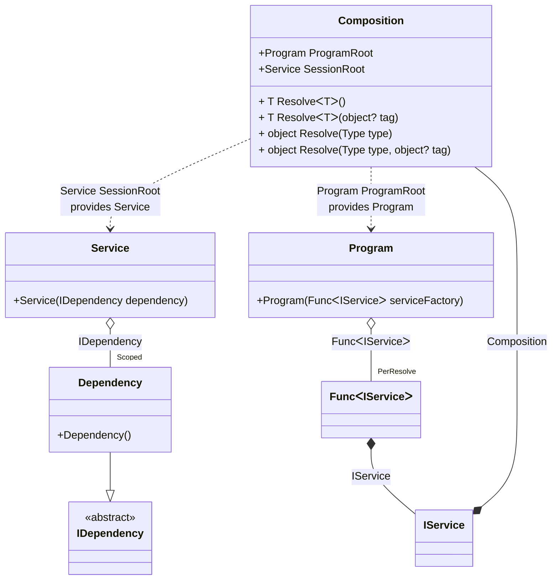

#### Auto scoped

[](../tests/Pure.DI.UsageTests/Lifetimes/AutoScopedScenario.cs)

You can use the following example to automatically create a session when creating instances of a particular type:

```c#
interface IDependency;

class Dependency : IDependency;

interface IService
{
    IDependency Dependency { get; }
}

class Service(IDependency dependency) : IService
{
    public IDependency Dependency => dependency;
}

// Implements a session
class Program(Func<IService> serviceFactory)
{
    public IService CreateService() => serviceFactory();
}

partial class Composition
{
    private static void Setup() =>
        DI.Setup(nameof(Composition))
            .Bind<IDependency>().As(Scoped).To<Dependency>()
            // Session composition root
            .Root<Service>("SessionRoot", kind: RootKinds.Private)
            // Auto scoped
            .Bind<IService>().To<IService>(ctx =>
            {
                // Injects a base composition
                ctx.Inject(out Composition baseComposition);

                // Creates a session
                var session = new Composition(baseComposition);

                return session.SessionRoot;
            })
            // Program composition root
            .Root<Program>("ProgramRoot");
}

var composition = new Composition();
var program = composition.ProgramRoot;
        
// Creates service in session #1
var service1 = program.CreateService();
        
// Creates service in session #2
var service2 = program.CreateService();
        
// Checks that the scoped instances are not identical in different sessions
service1.Dependency.ShouldNotBe(service2.Dependency);
```

<details open>
<summary>Class Diagram</summary>



</details>

<details>
<summary>Pure.DI-generated partial class Composition</summary><blockquote>

```c#
/// <para>
/// <b>Composition roots</b><br/>
/// <list type="table">
/// <listheader>
/// <term>Root</term>
/// <description>Description</description>
/// </listheader>
/// <item>
/// <term>
/// <see cref="Pure.DI.UsageTests.Lifetimes.AutoScopedScenario.Program"/> <see cref="ProgramRoot"/><br/>or using <see cref="Resolve{T}()"/> method: <c>Resolve&lt;Pure.DI.UsageTests.Lifetimes.AutoScopedScenario.Program&gt;()</c>
/// </term>
/// <description>
/// Program composition root
/// </description>
/// </item>
/// <item>
/// <term>
/// <see cref="Pure.DI.UsageTests.Lifetimes.AutoScopedScenario.Service"/> <see cref="SessionRoot"/><br/>or using <see cref="Resolve{T}()"/> method: <c>Resolve&lt;Pure.DI.UsageTests.Lifetimes.AutoScopedScenario.Service&gt;()</c>
/// </term>
/// <description>
/// Session composition root
/// </description>
/// </item>
/// </list>
/// </para>
/// </summary>
/// <example>
/// This shows how to get an instance of type <see cref="Pure.DI.UsageTests.Lifetimes.AutoScopedScenario.Program"/> using the composition root <see cref="ProgramRoot"/>:
/// <code>
/// var composition = new Composition();
/// var instance = composition.ProgramRoot;
/// </code>
/// </example>
/// <a href="https://mermaid.live/view#pako:eNqdVEtuwjAQvcrI60pFdEHLDpIisUPA0hvjjGhaEke2QUKIO3CXbnodblLHjokTkrbqZjDzefPmjZ0T4SJBMiZ8x5SKU7aVLKOS5vY_RCIrhEp1KnKg-8FgNC1j5Wk4XUhRJkP1uxRC18EVykPKEVaolCluBmENS1Rid8Dr5Wt9vXxa97O1L7-mic07cl2en2ag2fauzCX4Wle0PhYI2ph_ZEfwc8tRXAvmRekRy8HP9jk3I80rkcxkoNxxxrgW8tiP73Vt41d-hz-PscA8wZwfIbkd-0GDLddOz670BHgWJa7tKLKyvELY1LomUIO1YiHzOtR1C0Ka97IFbHs7PDmCEdsoLY28jm5lG1387kQ4IwAlC5T-epAOFn7cbn5-Y3eoKy4KTAzivXDBNCWER3TiT5pA7Sdqylv7bGcM7fTOmsWF4Ka46-VaATeSPrqSQopDmuDtNv6hSfguTJOub0dfE_90TJMe7duSNPQq5Qx4kgeSocxYmpiP3okS_YaZWeuYkoTJD0rO5PwNQUbKNg">Class diagram</a><br/>
/// This class was created by <a href="https://github.com/DevTeam/Pure.DI">Pure.DI</a> source code generator.
/// <seealso cref="Pure.DI.DI.Setup"/>
/// <seealso cref="Pure.DI.IConfiguration.Bind(object[])"/>
/// <seealso cref="Pure.DI.IConfiguration.Bind{T}(object[])"/>
[global::System.Diagnostics.CodeAnalysis.ExcludeFromCodeCoverage]
partial class Composition
{
  private readonly Composition _rootM03D14di;
  private readonly object _lockM03D14di;
  private Pure.DI.UsageTests.Lifetimes.AutoScopedScenario.Dependency _scopedM03D14di34_Dependency;
  
  /// <summary>
  /// This constructor creates a new instance of <see cref="Composition"/>.
  /// </summary>
  public Composition()
  {
    _rootM03D14di = this;
    _lockM03D14di = new object();
  }
  
  /// <summary>
  /// This constructor creates a new instance of <see cref="Composition"/> scope based on <paramref name="baseComposition"/>. This allows the <see cref="Lifetime.Scoped"/> life time to be applied.
  /// </summary>
  /// <param name="baseComposition">Base composition.</param>
  internal Composition(Composition baseComposition)
  {
    _rootM03D14di = baseComposition._rootM03D14di;
    _lockM03D14di = _rootM03D14di._lockM03D14di;
  }
  
  #region Composition Roots
  /// <summary>
  /// Session composition root
  /// </summary>
  /// <example>
  /// This shows how to get an instance of type <see cref="Pure.DI.UsageTests.Lifetimes.AutoScopedScenario.Service"/>:
  /// <code>
  /// var composition = new Composition();
  /// var instance = composition.SessionRoot;
  /// </code>
  /// </example>
  private Pure.DI.UsageTests.Lifetimes.AutoScopedScenario.Service SessionRoot
  {
    #if NETSTANDARD2_0_OR_GREATER || NETCOREAPP || NET40_OR_GREATER || NET
    [global::System.Diagnostics.Contracts.Pure]
    #endif
    get
    {
      if (ReferenceEquals(_scopedM03D14di34_Dependency, null))
      {
          lock (_lockM03D14di)
          {
              if (ReferenceEquals(_scopedM03D14di34_Dependency, null))
              {
                  _scopedM03D14di34_Dependency = new Pure.DI.UsageTests.Lifetimes.AutoScopedScenario.Dependency();
              }
          }
      }
      return new Pure.DI.UsageTests.Lifetimes.AutoScopedScenario.Service(_scopedM03D14di34_Dependency);
    }
  }
  
  /// <summary>
  /// Program composition root
  /// </summary>
  /// <example>
  /// This shows how to get an instance of type <see cref="Pure.DI.UsageTests.Lifetimes.AutoScopedScenario.Program"/>:
  /// <code>
  /// var composition = new Composition();
  /// var instance = composition.ProgramRoot;
  /// </code>
  /// </example>
  public Pure.DI.UsageTests.Lifetimes.AutoScopedScenario.Program ProgramRoot
  {
    #if NETSTANDARD2_0_OR_GREATER || NETCOREAPP || NET40_OR_GREATER || NET
    [global::System.Diagnostics.Contracts.Pure]
    #endif
    get
    {
      var perResolveM03D14di39_Func = default(System.Func<Pure.DI.UsageTests.Lifetimes.AutoScopedScenario.IService>);
      perResolveM03D14di39_Func = new global::System.Func<Pure.DI.UsageTests.Lifetimes.AutoScopedScenario.IService>(
      [global::System.Runtime.CompilerServices.MethodImpl((global::System.Runtime.CompilerServices.MethodImplOptions)768)]
      () =>
      {
          var transientM03D14di2_Composition = this;
          Pure.DI.UsageTests.Lifetimes.AutoScopedScenario.IService transientM03D14di1_IService;
          {
              var baseComposition_M03D14di2 = transientM03D14di2_Composition;
              // Creates a session
              var session_M03D14di3 = new Composition(baseComposition_M03D14di2);
              transientM03D14di1_IService = session_M03D14di3.SessionRoot;
          }
          var factory_M03D14di1 = transientM03D14di1_IService;
          return factory_M03D14di1;
      });
      return new Pure.DI.UsageTests.Lifetimes.AutoScopedScenario.Program(perResolveM03D14di39_Func);
    }
  }
  #endregion
  
  #region API
  /// <summary>
  /// Resolves the composition root.
  /// </summary>
  /// <typeparam name="T">The type of the composition root.</typeparam>
  /// <returns>A composition root.</returns>
  #if NETSTANDARD2_0_OR_GREATER || NETCOREAPP || NET40_OR_GREATER || NET
  [global::System.Diagnostics.Contracts.Pure]
  #endif
  public T Resolve<T>()
  {
    return ResolverM03D14di<T>.Value.Resolve(this);
  }
  
  /// <summary>
  /// Resolves the composition root by tag.
  /// </summary>
  /// <typeparam name="T">The type of the composition root.</typeparam>
  /// <param name="tag">The tag of a composition root.</param>
  /// <returns>A composition root.</returns>
  #if NETSTANDARD2_0_OR_GREATER || NETCOREAPP || NET40_OR_GREATER || NET
  [global::System.Diagnostics.Contracts.Pure]
  #endif
  public T Resolve<T>(object? tag)
  {
    return ResolverM03D14di<T>.Value.ResolveByTag(this, tag);
  }
  
  /// <summary>
  /// Resolves the composition root.
  /// </summary>
  /// <param name="type">The type of the composition root.</param>
  /// <returns>A composition root.</returns>
  #if NETSTANDARD2_0_OR_GREATER || NETCOREAPP || NET40_OR_GREATER || NET
  [global::System.Diagnostics.Contracts.Pure]
  #endif
  public object Resolve(global::System.Type type)
  {
    var index = (int)(_bucketSizeM03D14di * ((uint)global::System.Runtime.CompilerServices.RuntimeHelpers.GetHashCode(type) % 4));
    var finish = index + _bucketSizeM03D14di;
    do {
      ref var pair = ref _bucketsM03D14di[index];
      if (ReferenceEquals(pair.Key, type))
      {
        return pair.Value.Resolve(this);
      }
    } while (++index < finish);
    
    throw new global::System.InvalidOperationException($"Cannot resolve composition root of type {type}.");
  }
  
  /// <summary>
  /// Resolves the composition root by tag.
  /// </summary>
  /// <param name="type">The type of the composition root.</param>
  /// <param name="tag">The tag of a composition root.</param>
  /// <returns>A composition root.</returns>
  #if NETSTANDARD2_0_OR_GREATER || NETCOREAPP || NET40_OR_GREATER || NET
  [global::System.Diagnostics.Contracts.Pure]
  #endif
  public object Resolve(global::System.Type type, object? tag)
  {
    var index = (int)(_bucketSizeM03D14di * ((uint)global::System.Runtime.CompilerServices.RuntimeHelpers.GetHashCode(type) % 4));
    var finish = index + _bucketSizeM03D14di;
    do {
      ref var pair = ref _bucketsM03D14di[index];
      if (ReferenceEquals(pair.Key, type))
      {
        return pair.Value.ResolveByTag(this, tag);
      }
    } while (++index < finish);
    
    throw new global::System.InvalidOperationException($"Cannot resolve composition root \"{tag}\" of type {type}.");
  }
  #endregion
  
  /// <summary>
  /// This method provides a class diagram in mermaid format. To see this diagram, simply call the method and copy the text to this site https://mermaid.live/.
  /// </summary>
  public override string ToString()
  {
    return
      "classDiagram\n" +
        "  class Composition {\n" +
          "    +Program ProgramRoot\n" +
          "    +Service SessionRoot\n" +
          "    + T ResolveᐸTᐳ()\n" +
          "    + T ResolveᐸTᐳ(object? tag)\n" +
          "    + object Resolve(Type type)\n" +
          "    + object Resolve(Type type, object? tag)\n" +
        "  }\n" +
        "  class Program {\n" +
          "    +Program(FuncᐸIServiceᐳ serviceFactory)\n" +
        "  }\n" +
        "  class Service {\n" +
          "    +Service(IDependency dependency)\n" +
        "  }\n" +
        "  class Composition\n" +
        "  class IService\n" +
        "  Dependency --|> IDependency : \n" +
        "  class Dependency {\n" +
          "    +Dependency()\n" +
        "  }\n" +
        "  class FuncᐸIServiceᐳ\n" +
        "  class IDependency {\n" +
          "    <<abstract>>\n" +
        "  }\n" +
        "  Program o--  \"PerResolve\" FuncᐸIServiceᐳ : FuncᐸIServiceᐳ\n" +
        "  Service o--  \"Scoped\" Dependency : IDependency\n" +
        "  IService *--  Composition : Composition\n" +
        "  Composition ..> Service : Service SessionRoot<br/>provides Service\n" +
        "  Composition ..> Program : Program ProgramRoot<br/>provides Program\n" +
        "  FuncᐸIServiceᐳ *--  IService : IService";
  }
  
  private readonly static int _bucketSizeM03D14di;
  private readonly static global::Pure.DI.Pair<global::System.Type, global::Pure.DI.IResolver<Composition, object>>[] _bucketsM03D14di;
  
  static Composition()
  {
    var valResolverM03D14di_0000 = new ResolverM03D14di_0000();
    ResolverM03D14di<Pure.DI.UsageTests.Lifetimes.AutoScopedScenario.Service>.Value = valResolverM03D14di_0000;
    var valResolverM03D14di_0001 = new ResolverM03D14di_0001();
    ResolverM03D14di<Pure.DI.UsageTests.Lifetimes.AutoScopedScenario.Program>.Value = valResolverM03D14di_0001;
    _bucketsM03D14di = global::Pure.DI.Buckets<global::System.Type, global::Pure.DI.IResolver<Composition, object>>.Create(
      4,
      out _bucketSizeM03D14di,
      new global::Pure.DI.Pair<global::System.Type, global::Pure.DI.IResolver<Composition, object>>[2]
      {
         new global::Pure.DI.Pair<global::System.Type, global::Pure.DI.IResolver<Composition, object>>(typeof(Pure.DI.UsageTests.Lifetimes.AutoScopedScenario.Service), valResolverM03D14di_0000)
        ,new global::Pure.DI.Pair<global::System.Type, global::Pure.DI.IResolver<Composition, object>>(typeof(Pure.DI.UsageTests.Lifetimes.AutoScopedScenario.Program), valResolverM03D14di_0001)
      });
  }
  
  #region Resolvers
  private sealed class ResolverM03D14di<T>: global::Pure.DI.IResolver<Composition, T>
  {
    public static global::Pure.DI.IResolver<Composition, T> Value = new ResolverM03D14di<T>();
    
    public T Resolve(Composition composite)
    {
      throw new global::System.InvalidOperationException($"Cannot resolve composition root of type {typeof(T)}.");
    }
    
    public T ResolveByTag(Composition composite, object tag)
    {
      throw new global::System.InvalidOperationException($"Cannot resolve composition root \"{tag}\" of type {typeof(T)}.");
    }
  }
  
  private sealed class ResolverM03D14di_0000: global::Pure.DI.IResolver<Composition, Pure.DI.UsageTests.Lifetimes.AutoScopedScenario.Service>
  {
    public Pure.DI.UsageTests.Lifetimes.AutoScopedScenario.Service Resolve(Composition composition)
    {
      return composition.SessionRoot;
    }
    
    public Pure.DI.UsageTests.Lifetimes.AutoScopedScenario.Service ResolveByTag(Composition composition, object tag)
    {
      switch (tag)
      {
        case null:
          return composition.SessionRoot;
      }
      throw new global::System.InvalidOperationException($"Cannot resolve composition root \"{tag}\" of type Pure.DI.UsageTests.Lifetimes.AutoScopedScenario.Service.");
    }
  }
  
  private sealed class ResolverM03D14di_0001: global::Pure.DI.IResolver<Composition, Pure.DI.UsageTests.Lifetimes.AutoScopedScenario.Program>
  {
    public Pure.DI.UsageTests.Lifetimes.AutoScopedScenario.Program Resolve(Composition composition)
    {
      return composition.ProgramRoot;
    }
    
    public Pure.DI.UsageTests.Lifetimes.AutoScopedScenario.Program ResolveByTag(Composition composition, object tag)
    {
      switch (tag)
      {
        case null:
          return composition.ProgramRoot;
      }
      throw new global::System.InvalidOperationException($"Cannot resolve composition root \"{tag}\" of type Pure.DI.UsageTests.Lifetimes.AutoScopedScenario.Program.");
    }
  }
  #endregion
}
```

</blockquote></details>

