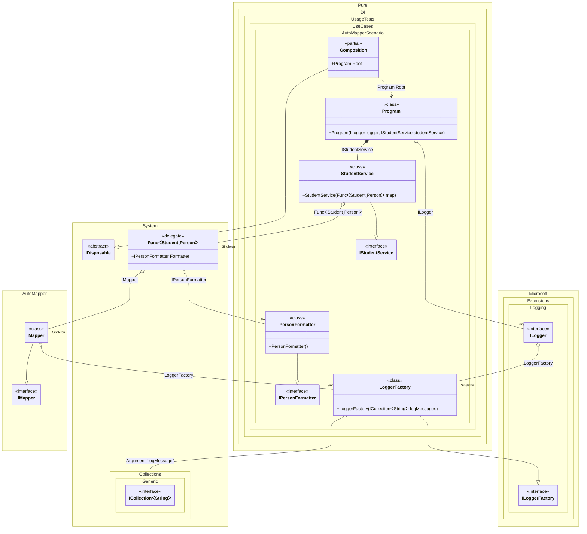

#### AutoMapper


```c#
using Shouldly;
using AutoMapper;
using Microsoft.Extensions.DependencyInjection;
using Pure.DI.Abstractions;
using Pure.DI;
using Pure.DI.Abstractions;
using AutoMapper;
using Microsoft.Extensions.Logging;
using static Pure.DI.Lifetime;
using static Pure.DI.Tag;

var logMessages = new List<string>();
using var composition = new Composition(logMessages);
var root = composition.Root;

root.Run();
logMessages.ShouldContain("John Smith");

class Person
{
    public string? FirstName { get; set; }

    public string? LastName { get; set; }

    public DateTime? BirthDate { get; set; }

    [Inject]
    public IPersonFormatter? Formatter { get; set; }
}

class Student
{
    public string? FirstName { get; set; }

    public string? LastName { get; set; }

    public DateTime? BirthDate { get; set; }

    public DateTime? AdmissionDate { get; set; }
}

interface IPersonFormatter
{
    string Format(Person person);
}

class PersonFormatter : IPersonFormatter
{
    public string Format(Person person) => $"{person.FirstName} {person.LastName}";
}

interface IStudentService
{
    string AsPersonText(Student student);
}

class StudentService(Func<Student, Person> map) : IStudentService
{
    public string AsPersonText(Student student)
    {
        var person = map(student);
        return person.Formatter?.Format(person) ?? "";
    }
}

partial class Program(ILogger logger, IStudentService studentService)
{
    public void Run()
    {
        var nik = new Student { FirstName = "John", LastName = "Smith" };
        var personText = studentService.AsPersonText(nik);
        logger.LogInformation(personText);
    }
}

partial class Composition
{
    private void Setup() =>

        DI.Setup(nameof(Composition))
            .Root<Program>(nameof(Root))
            .Arg<ICollection<string>>("logMessage")
            // Example dependency for Program
            .Bind().To<StudentService>()

            .DefaultLifetime(Singleton)
                // Example dependency for Person
                .Bind().To<PersonFormatter>()
                // Logger for AutoMapper
                .Bind().To<LoggerFactory>()
                .Bind().To((LoggerFactory loggerFactory) => loggerFactory.CreateLogger("info"))
                // Provides a mapper
                .Bind<IMapper>().To<LoggerFactory, Mapper>(loggerFactory => {
                    // Create the mapping configuration
                    var configuration = new MapperConfiguration(cfg => {
                            cfg.CreateMap<Student, Person>();
                        },
                        loggerFactory);
                    configuration.CompileMappings();
                    // Create the mapper
                    return new Mapper(configuration);
                })
                // Maps TT1 -> TT2
                .Bind().To<Func<TT1, TT2>>(ctx => source => {
                    ctx.Inject(out IMapper mapper);
                    // source -> target
                    var target = mapper.Map<TT1, TT2>(source);
                    // Building-up a mapped value with dependencies
                    ctx.BuildUp(target);
                    return target;
                });
}

class LoggerFactory(ICollection<string> logMessages)
    : ILoggerFactory
{
    public void AddProvider(ILoggerProvider provider) {}

    public ILogger CreateLogger(string categoryName) => new Logger(logMessages);

    public void Dispose() { }

    private class Logger(ICollection<string> logMessages): ILogger
    {
        public void Log<TState>(LogLevel logLevel, EventId eventId, TState state, Exception? exception, Func<TState, Exception?, string> formatter) =>
            logMessages.Add(formatter(state, exception));

        public bool IsEnabled(LogLevel logLevel) => true;

        public IDisposable? BeginScope<TState>(TState state) where TState : notnull => null;
    }
}
```

<details>
<summary>Running this code sample locally</summary>

- Make sure you have the [.NET SDK 9.0](https://dotnet.microsoft.com/en-us/download/dotnet/9.0) or later is installed
```bash
dotnet --list-sdk
```
- Create a net9.0 (or later) console application
```bash
dotnet new console -n Sample
```
- Add references to NuGet packages
  - [Pure.DI](https://www.nuget.org/packages/Pure.DI)
  - [Shouldly](https://www.nuget.org/packages/Shouldly)
  - [AutoMapper](https://www.nuget.org/packages/AutoMapper)
  - [Microsoft.Extensions.DependencyInjection](https://www.nuget.org/packages/Microsoft.Extensions.DependencyInjection)
  - [Pure.DI.Abstractions](https://www.nuget.org/packages/Pure.DI.Abstractions)
```bash
dotnet add package Pure.DI
dotnet add package Shouldly
dotnet add package AutoMapper
dotnet add package Microsoft.Extensions.DependencyInjection
dotnet add package Pure.DI.Abstractions
```
- Copy the example code into the _Program.cs_ file

You are ready to run the example 🚀
```bash
dotnet run
```

</details>

The following partial class will be generated:

```c#
partial class Composition: IDisposable
{
  private readonly Composition _root;
#if NET9_0_OR_GREATER
  private readonly Lock _lock;
#else
  private readonly Object _lock;
#endif
  private object[] _disposables;
  private int _disposeIndex;

  private Microsoft.Extensions.Logging.ILogger? _singleILogger56;
  private Func<Student, Person>? _singleFunc60;
  private AutoMapper.Mapper? _singleMapper57;
  private PersonFormatter? _singlePersonFormatter54;
  private LoggerFactory? _singleLoggerFactory55;

  private readonly ICollection<string> _argLogMessage;

  [OrdinalAttribute(128)]
  public Composition(ICollection<string> logMessage)
  {
    _argLogMessage = logMessage ?? throw new ArgumentNullException(nameof(logMessage));
    _root = this;
#if NET9_0_OR_GREATER
    _lock = new Lock();
#else
    _lock = new Object();
#endif
    _disposables = new object[1];
  }

  internal Composition(Composition parentScope)
  {
    _root = (parentScope ?? throw new ArgumentNullException(nameof(parentScope)))._root;
    _argLogMessage = parentScope._argLogMessage;
    _lock = parentScope._lock;
    _disposables = parentScope._disposables;
  }

  public Program Root
  {
    [MethodImpl(MethodImplOptions.AggressiveInlining)]
    get
    {
      if (_root._singleFunc60 is null)
        lock (_lock)
          if (_root._singleFunc60 is null)
          {
            _root._singleFunc60 = source =>
            {
              if (_root._singleMapper57 is null)
              {
                EnsureLoggerFactoryExists();
                LoggerFactory localLoggerFactory = _root._singleLoggerFactory55;
                // Create the mapping configuration
                var localConfiguration = new MapperConfiguration(cfg =>
                {
                  cfg.CreateMap<Student, Person>();
                }, localLoggerFactory);
                localConfiguration.CompileMappings();
                // Create the mapper
                _root._singleMapper57 = new Mapper(localConfiguration);
              }

              AutoMapper.IMapper localMapper = _root._singleMapper57;
              // source -> target
              Person localTarget = localMapper.Map<Student, Person>(source);
              // Building-up a mapped value with dependencies
              if (_root._singlePersonFormatter54 is null)
              {
                _root._singlePersonFormatter54 = new PersonFormatter();
              }

              localTarget.Formatter = _root._singlePersonFormatter54;
              return localTarget;
            };
          }

      if (_root._singleILogger56 is null)
        lock (_lock)
          if (_root._singleILogger56 is null)
          {
            EnsureLoggerFactoryExists();
            LoggerFactory localLoggerFactory1 = _root._singleLoggerFactory55;
            _root._singleILogger56 = localLoggerFactory1.CreateLogger("info");
          }

      return new Program(_root._singleILogger56, new StudentService(_root._singleFunc60));
      [MethodImpl(MethodImplOptions.AggressiveInlining)]
      void EnsureLoggerFactoryExists()
      {
        if (_root._singleLoggerFactory55 is null)
          lock (_lock)
            if (_root._singleLoggerFactory55 is null)
            {
              _root._singleLoggerFactory55 = new LoggerFactory(_argLogMessage);
              _root._disposables[_root._disposeIndex++] = _root._singleLoggerFactory55;
            }
      }
    }
  }

  public void Dispose()
  {
    int disposeIndex;
    object[] disposables;
    lock (_lock)
    {
      disposeIndex = _disposeIndex;
      _disposeIndex = 0;
      disposables = _disposables;
      _disposables = new object[1];
      _singleILogger56 = null;
      _singleFunc60 = null;
      _singleMapper57 = null;
      _singlePersonFormatter54 = null;
      _singleLoggerFactory55 = null;
    }

    while (disposeIndex-- > 0)
    {
      switch (disposables[disposeIndex])
      {
        case IDisposable disposableInstance:
          try
          {
            disposableInstance.Dispose();
          }
          catch (Exception exception)
          {
            OnDisposeException(disposableInstance, exception);
          }
          break;
      }
    }
  }

  partial void OnDisposeException<T>(T disposableInstance, Exception exception) where T : IDisposable;
}
```

Class diagram:



