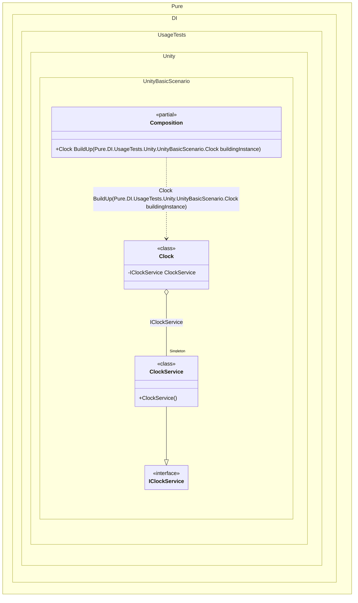

#### Basic Unity use case


```c#
using Pure.DI;
using UnityEngine;

public class Clock : MonoBehaviour
{
    private const float HoursToDegrees = -30f, MinutesToDegrees = -6f, SecondsToDegrees = -6f;

    [SerializeField]
    private Transform hoursPivot;

    [SerializeField]
    private Transform minutesPivot;

    [SerializeField]
    private Transform secondsPivot;

    [Dependency]
    public IClockService ClockService { private get; set; }

    public void Start()
    {
        // Injects dependencies
        Composition.Shared.BuildUp(this);
    }

    public void Update()
    {
        var now = ClockService.Now.TimeOfDay;

        hoursPivot.localRotation = Quaternion
            .Euler(0f, 0f, HoursToDegrees * (float)now.TotalHours);

        minutesPivot.localRotation = Quaternion
            .Euler(0f, 0f, MinutesToDegrees * (float)now.TotalMinutes);

        secondsPivot.localRotation = Quaternion
            .Euler(0f, 0f, SecondsToDegrees * (float)now.TotalSeconds);
    }
}

public interface IClockService
{
    DateTime Now { get; }
}

public class ClockService : IClockService
{
    public DateTime Now => DateTime.Now;
}

internal partial class Composition
{
    public static readonly Composition Shared = new();

    private static void Setup() =>

        DI.Setup()
            .Bind().As(Lifetime.Singleton).To<ClockService>()
            .Builder<Clock>();
}
```

<details>
<summary>Running this code sample locally</summary>

- Make sure you have the [.NET SDK 9.0](https://dotnet.microsoft.com/en-us/download/dotnet/9.0) or later is installed
```bash
dotnet --list-sdk
```
- Create a net9.0 (or later) console application
```bash
dotnet new console -n Sample
```
- Add reference to NuGet package
  - [Pure.DI](https://www.nuget.org/packages/Pure.DI)
```bash
dotnet add package Pure.DI
```
- Copy the example code into the _Program.cs_ file

You are ready to run the example 🚀
```bash
dotnet run
```

</details>

The following partial class will be generated:

```c#
partial class Composition
{
  private readonly Composition _root;
#if NET9_0_OR_GREATER
  private readonly Lock _lock;
#else
  private readonly Object _lock;
#endif

  private ClockService? _singleClockService52;

  [OrdinalAttribute(256)]
  public Composition()
  {
    _root = this;
#if NET9_0_OR_GREATER
    _lock = new Lock();
#else
    _lock = new Object();
#endif
  }

  internal Composition(Composition parentScope)
  {
    _root = (parentScope ?? throw new ArgumentNullException(nameof(parentScope)))._root;
    _lock = parentScope._lock;
  }

  [MethodImpl(MethodImplOptions.AggressiveInlining)]
  public Clock BuildUp(Clock buildingInstance)
  {
    if (buildingInstance is null) throw new ArgumentNullException(nameof(buildingInstance));
    Clock transClock;
    Clock localBuildingInstance161 = buildingInstance;
    if (_root._singleClockService52 is null)
    {
      lock (_lock)
      {
        _root._singleClockService52 = new ClockService();
      }
    }

    localBuildingInstance161.ClockService = _root._singleClockService52;
    transClock = localBuildingInstance161;
    return transClock;
  }
}
```

Class diagram:



