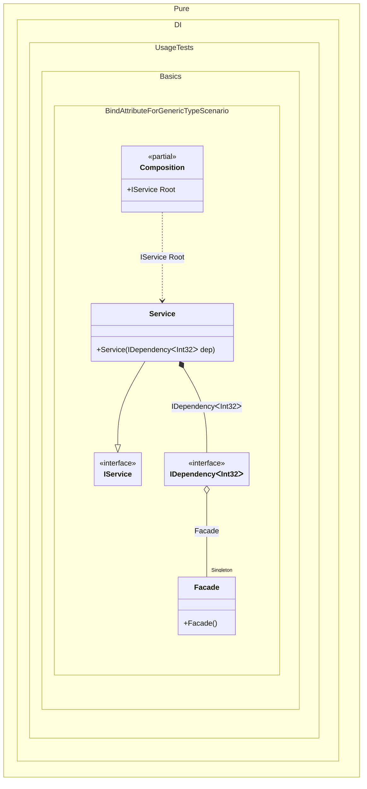

#### Bind attribute for a generic type

[](../tests/Pure.DI.UsageTests/Attributes/BindAttributeForGenericTypeScenario.cs)


```c#
using Pure.DI;
using Shouldly;

DI.Setup(nameof(Composition))
    .Bind().As(Lifetime.Singleton).To<Facade>()
    .Bind().To<Service>()

    // Composition root
    .Root<IService>("Root");

var composition = new Composition();
var service = composition.Root;
service.DoSomething();

interface IDependency<T>
{
    public void DoSomething();
}

class Dependency<T> : IDependency<T>
{
    public void DoSomething()
    {
    }
}

class Facade
{
    [Bind(typeof(IDependency<TT>))]
    public IDependency<T> GetDependency<T>() => new Dependency<T>();
}

interface IService
{
    public void DoSomething();
}

class Service(IDependency<int> dep) : IService
{
    public void DoSomething() => dep.DoSomething();
}
```


Class diagram:



