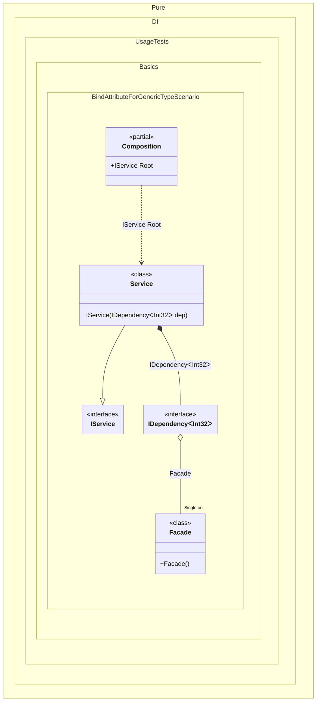

#### Bind attribute for a generic type


```c#
using Shouldly;
using Pure.DI;

DI.Setup(nameof(Composition))
    .Bind().As(Lifetime.Singleton).To<Facade>()
    .Bind().To<Service>()

    // Composition root
    .Root<IService>("Root");

var composition = new Composition();
var service = composition.Root;
service.DoSomething();

interface IDependency<T>
{
    public void DoSomething();
}

class Dependency<T> : IDependency<T>
{
    public void DoSomething()
    {
    }
}

class Facade
{
    [Bind(typeof(IDependency<TT>))]
    public IDependency<T> GetDependency<T>() => new Dependency<T>();
}

interface IService
{
    public void DoSomething();
}

class Service(IDependency<int> dep) : IService
{
    public void DoSomething() => dep.DoSomething();
}
```

<details>
<summary>Running this code sample locally</summary>

- Make sure you have the [.NET SDK 9.0](https://dotnet.microsoft.com/en-us/download/dotnet/9.0) or later is installed
```bash
dotnet --list-sdk
```
- Create a net9.0 (or later) console application
```bash
dotnet new console -n Sample
```
- Add references to NuGet packages
  - [Pure.DI](https://www.nuget.org/packages/Pure.DI)
  - [Shouldly](https://www.nuget.org/packages/Shouldly)
```bash
dotnet add package Pure.DI
dotnet add package Shouldly
```
- Copy the example code into the _Program.cs_ file

You are ready to run the example 🚀
```bash
dotnet run
```

</details>

The following partial class will be generated:

```c#
partial class Composition
{
  private readonly Composition _root;
#if NET9_0_OR_GREATER
  private readonly Lock _lock;
#else
  private readonly Object _lock;
#endif

  private Facade? _singletonFacade52;

  [OrdinalAttribute(256)]
  public Composition()
  {
    _root = this;
#if NET9_0_OR_GREATER
    _lock = new Lock();
#else
    _lock = new Object();
#endif
  }

  internal Composition(Composition parentScope)
  {
    _root = (parentScope ?? throw new ArgumentNullException(nameof(parentScope)))._root;
    _lock = _root._lock;
  }

  public IService Root
  {
    [MethodImpl(MethodImplOptions.AggressiveInlining)]
    get
    {
      IDependency<int> transientIDependency1;
      if (_root._singletonFacade52 is null)
      {
        lock (_lock)
        {
          if (_root._singletonFacade52 is null)
          {
            _root._singletonFacade52 = new Facade();
          }
        }
      }

      Facade localInstance_1182D12788 = _root._singletonFacade52;
      transientIDependency1 = localInstance_1182D12788.GetDependency<int>();
      return new Service(transientIDependency1);
    }
  }
}
```

Class diagram:



