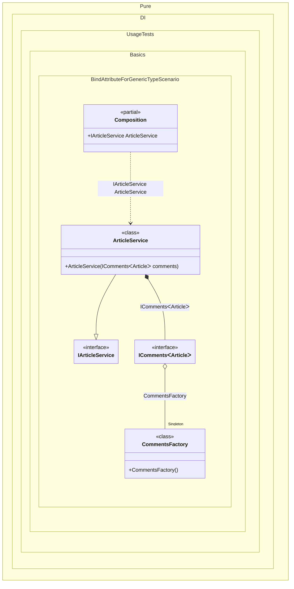

#### Bind attribute for a generic type


```c#
using Shouldly;
using Pure.DI;

DI.Setup(nameof(Composition))
    .Bind().As(Lifetime.Singleton).To<CommentsFactory>()
    .Bind().To<ArticleService>()

    // Composition root
    .Root<IArticleService>("ArticleService");

var composition = new Composition();
var articleService = composition.ArticleService;
articleService.DisplayComments();

interface IComments<T>
{
    void Load();
}

class Comments<T> : IComments<T>
{
    public void Load()
    {
    }
}

class CommentsFactory
{
    // The 'TT' type marker in the attribute indicates that this method
    // can produce 'IComments<T>' for any generic type 'T'.
    // This allows the factory to handle all requests for IComments<T>.
    [Bind(typeof(IComments<TT>))]
    public IComments<T> Create<T>() => new Comments<T>();
}

interface IArticleService
{
    void DisplayComments();
}

class ArticleService(IComments<Article> comments) : IArticleService
{
    public void DisplayComments() => comments.Load();
}

class Article;
```

<details>
<summary>Running this code sample locally</summary>

- Make sure you have the [.NET SDK 10.0](https://dotnet.microsoft.com/en-us/download/dotnet/10.0) or later is installed
```bash
dotnet --list-sdk
```
- Create a net10.0 (or later) console application
```bash
dotnet new console -n Sample
```
- Add references to NuGet packages
  - [Pure.DI](https://www.nuget.org/packages/Pure.DI)
  - [Shouldly](https://www.nuget.org/packages/Shouldly)
```bash
dotnet add package Pure.DI
dotnet add package Shouldly
```
- Copy the example code into the _Program.cs_ file

You are ready to run the example 🚀
```bash
dotnet run
```

</details>

The following partial class will be generated:

```c#
partial class Composition
{
#if NET9_0_OR_GREATER
  private readonly Lock _lock = new Lock();
#else
  private readonly Object _lock = new Object();
#endif

  private CommentsFactory? _singletonCommentsFactory51;

  public IArticleService ArticleService
  {
    [MethodImpl(MethodImplOptions.AggressiveInlining)]
    get
    {
      IComments<Article> transientIComments1;
      if (_singletonCommentsFactory51 is null)
        lock (_lock)
          if (_singletonCommentsFactory51 is null)
          {
            _singletonCommentsFactory51 = new CommentsFactory();
          }

      CommentsFactory localInstance_1182D1276 = _singletonCommentsFactory51;
      transientIComments1 = localInstance_1182D1276.Create<Article>();
      return new ArticleService(transientIComments1);
    }
  }
}
```

Class diagram:



