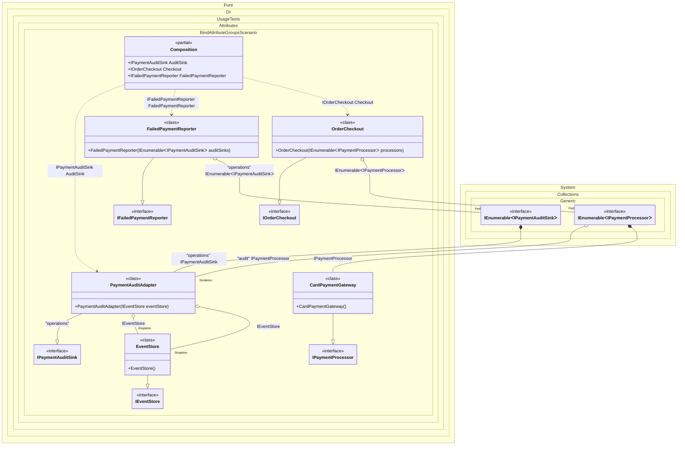

#### Bind attribute groups

Shows how separate `BindAttribute` groups let one implementation participate in several independent bindings.


```c#
using Shouldly;
using Pure.DI;
using System.Collections.Immutable;
using System.Linq;

DI.Setup(nameof(Composition))
    // Composition roots
    .Root<IOrderCheckout>("Checkout")
    .Root<IFailedPaymentReporter>("FailedPaymentReporter")
    .Root<IPaymentAuditSink>("AuditSink", "operations");

var composition = new Composition();
var checkout = composition.Checkout;
var failedPaymentReporter = composition.FailedPaymentReporter;

checkout.Processors.Length.ShouldBe(2);
checkout.Processors.OfType<CardPaymentGateway>().Count().ShouldBe(1);

var checkoutAudit = checkout.Processors.OfType<PaymentAuditAdapter>().Single();
checkoutAudit.ShouldBeSameAs(composition.Checkout.Processors.OfType<PaymentAuditAdapter>().Single());

failedPaymentReporter.AuditSinks.Length.ShouldBe(1);
failedPaymentReporter.AuditSinks[0].ShouldBeOfType<PaymentAuditAdapter>();
failedPaymentReporter.AuditSinks[0].ShouldNotBeSameAs(composition.AuditSink);

interface IPaymentProcessor
{
    void Process(Payment payment);
}

interface IPaymentAuditSink
{
    void Record(Payment payment);
}

[Bind(typeof(IPaymentProcessor))]
class CardPaymentGateway : IPaymentProcessor
{
    public void Process(Payment payment)
    {
        // Calling an external card payment provider...
    }
}

interface IEventStore
{
    void Append(Payment payment);
}

[Bind(typeof(IEventStore), Lifetime.Singleton)]
class EventStore : IEventStore
{
    public void Append(Payment payment)
    {
        // Persisting an audit event...
    }
}

interface IOrderCheckout
{
    ImmutableArray<IPaymentProcessor> Processors { get; }
}

[Bind(typeof(IOrderCheckout))]
class OrderCheckout(IEnumerable<IPaymentProcessor> processors) : IOrderCheckout
{
    public ImmutableArray<IPaymentProcessor> Processors { get; } = [..processors];
}

interface IFailedPaymentReporter
{
    ImmutableArray<IPaymentAuditSink> AuditSinks { get; }
}

[Bind(typeof(IFailedPaymentReporter))]
class FailedPaymentReporter(
    [Tag("operations")] IEnumerable<IPaymentAuditSink> auditSinks)
    : IFailedPaymentReporter
{
    public ImmutableArray<IPaymentAuditSink> AuditSinks { get; } = [..auditSinks];
}

// Binding group #1:
// add this adapter to the main checkout pipeline as a tagged payment processor.
[Bind(typeof(IPaymentProcessor), Lifetime.Singleton, "audit")]

// Binding group #2:
// expose the same adapter as an operational audit sink with its own lifetime.
[Bind(typeof(IPaymentAuditSink), Lifetime.Transient, "operations")]
class PaymentAuditAdapter(IEventStore eventStore) :
    IPaymentProcessor,
    IPaymentAuditSink
{
    public void Process(Payment payment) => Record(payment);

    public void Record(Payment payment) => eventStore.Append(payment);
}

record Payment(decimal Amount);
```

<details>
<summary>Running this code sample locally</summary>

- Make sure you have the [.NET SDK 10.0](https://dotnet.microsoft.com/en-us/download/dotnet/10.0) or later installed
```bash
dotnet --list-sdk
```
- Create a net10.0 (or later) console application
```bash
dotnet new console -n Sample
```
- Add references to the NuGet packages
  - [Pure.DI](https://www.nuget.org/packages/Pure.DI)
  - [Shouldly](https://www.nuget.org/packages/Shouldly)
```bash
dotnet add package Pure.DI
dotnet add package Shouldly
```
- Copy the example code into the _Program.cs_ file

You are ready to run the example 🚀
```bash
dotnet run
```

</details>

>[!NOTE]
>Attributes inside one square-bracket group are merged into one binding. To create several bindings for the same implementation type, place `Bind` attributes in separate square-bracket groups.
This is useful when one adapter has several roles: for example, it can be part of a normal processing pipeline and also be exposed through a tagged operational pipeline with another lifetime or contract.
In this scenario, all bindings are declared with attributes, and the setup keeps only composition roots.

<details>
<summary>The following partial class will be generated</summary>

```c#
partial class Composition
{
#if NET9_0_OR_GREATER
  private readonly Lock _lock = new Lock();
#else
  private readonly Object _lock = new Object();
#endif

  private EventStore? _singletonEventStore;
  private PaymentAuditAdapter? _singletonPaymentAuditAdapter;

  public IPaymentAuditSink AuditSink
  {
    [MethodImpl(MethodImplOptions.AggressiveInlining)]
    get
    {
      if (_singletonEventStore is null)
        lock (_lock)
          if (_singletonEventStore is null)
          {
            _singletonEventStore = new EventStore();
          }

      return new PaymentAuditAdapter(_singletonEventStore);
    }
  }

  public IFailedPaymentReporter FailedPaymentReporter
  {
    [MethodImpl(MethodImplOptions.AggressiveInlining)]
    get
    {
      [MethodImpl(MethodImplOptions.AggressiveInlining)]
      IEnumerable<IPaymentAuditSink> EnumerationOf_perBlockIEnumerableIPaymentAuditSink()
      {
        if (_singletonEventStore is null)
          lock (_lock)
            if (_singletonEventStore is null)
            {
              _singletonEventStore = new EventStore();
            }

        yield return new PaymentAuditAdapter(_singletonEventStore);
      }

      return new FailedPaymentReporter(EnumerationOf_perBlockIEnumerableIPaymentAuditSink());
    }
  }

  public IOrderCheckout Checkout
  {
    [MethodImpl(MethodImplOptions.AggressiveInlining)]
    get
    {
      [MethodImpl(MethodImplOptions.AggressiveInlining)]
      IEnumerable<IPaymentProcessor> EnumerationOf_perBlockIEnumerableIPaymentProcessor()
      {
        if (_singletonPaymentAuditAdapter is null)
          lock (_lock)
            if (_singletonPaymentAuditAdapter is null)
            {
              if (_singletonEventStore is null)
              {
                _singletonEventStore = new EventStore();
              }

              _singletonPaymentAuditAdapter = new PaymentAuditAdapter(_singletonEventStore);
            }

        yield return _singletonPaymentAuditAdapter;
        yield return new CardPaymentGateway();
      }

      return new OrderCheckout(EnumerationOf_perBlockIEnumerableIPaymentProcessor());
    }
  }
}
```

</details>

Class diagram:



See also:

- [Bind metadata merge](bind-metadata-merge.md)

