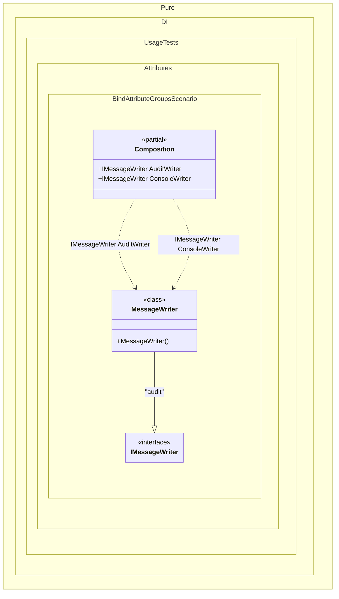

#### Bind attribute groups

Shows how separate `BindAttribute` groups on one implementation type create separate bindings.


```c#
using Shouldly;
using Pure.DI;

DI.Setup(nameof(Composition))

    // Composition roots
    .Root<IMessageWriter>("ConsoleWriter", "console")
    .Root<IMessageWriter>("AuditWriter", "audit");

var composition = new Composition();
var consoleWriter = composition.ConsoleWriter;
var auditWriter = composition.AuditWriter;

consoleWriter.ShouldBeOfType<MessageWriter>();
auditWriter.ShouldBeOfType<MessageWriter>();
auditWriter.ShouldNotBeSameAs(consoleWriter);

interface IMessageWriter
{
    void Write(string message);
}

[Bind(typeof(IMessageWriter), Lifetime.Singleton, "console")]
[Bind(typeof(IMessageWriter), Lifetime.Transient, "audit")]
class MessageWriter : IMessageWriter
{
    public void Write(string message) => Console.WriteLine(message);
}
```

<details>
<summary>Running this code sample locally</summary>

- Make sure you have the [.NET SDK 10.0](https://dotnet.microsoft.com/en-us/download/dotnet/10.0) or later installed
```bash
dotnet --list-sdk
```
- Create a net10.0 (or later) console application
```bash
dotnet new console -n Sample
```
- Add references to the NuGet packages
  - [Pure.DI](https://www.nuget.org/packages/Pure.DI)
  - [Shouldly](https://www.nuget.org/packages/Shouldly)
```bash
dotnet add package Pure.DI
dotnet add package Shouldly
```
- Copy the example code into the _Program.cs_ file

You are ready to run the example 🚀
```bash
dotnet run
```

</details>

>[!NOTE]
>Attributes inside one square-bracket group are merged into one binding. To create several bindings for the same implementation type, place `Bind` attributes in separate square-bracket groups.

<details>
<summary>The following partial class will be generated</summary>

```c#
partial class Composition
{
#if NET9_0_OR_GREATER
  private readonly Lock _lock = new Lock();
#else
  private readonly Object _lock = new Object();
#endif

  private MessageWriter? _singletonMessageWriter2147482639;

  public IMessageWriter AuditWriter
  {
    [MethodImpl(MethodImplOptions.AggressiveInlining)]
    get
    {
      return new MessageWriter();
    }
  }

  public IMessageWriter ConsoleWriter
  {
    [MethodImpl(MethodImplOptions.AggressiveInlining)]
    get
    {
      if (_singletonMessageWriter2147482639 is null)
        lock (_lock)
          if (_singletonMessageWriter2147482639 is null)
          {
            _singletonMessageWriter2147482639 = new MessageWriter();
          }

      return _singletonMessageWriter2147482639;
    }
  }
}
```

</details>

Class diagram:



See also:

- [Bind metadata merge](bind-metadata-merge.md)

