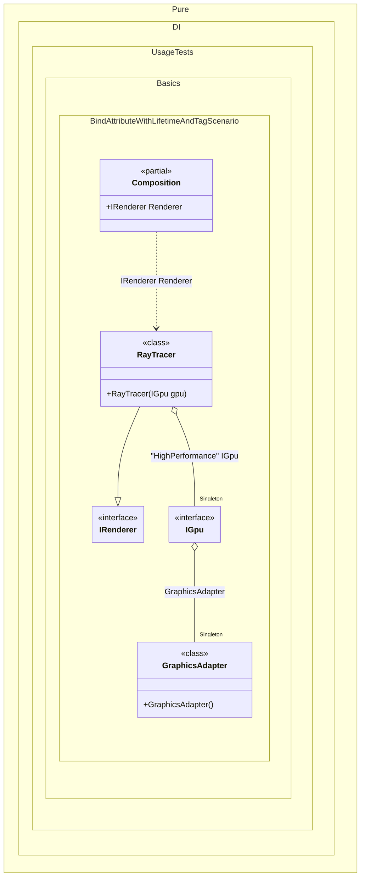

#### Bind attribute with lifetime and tag


```c#
using Pure.DI;

DI.Setup(nameof(Composition))
    .Bind().As(Lifetime.Singleton).To<GraphicsAdapter>()
    .Bind().To<RayTracer>()

    // Composition root
    .Root<IRenderer>("Renderer");

var composition = new Composition();
var renderer = composition.Renderer;
renderer.Render();

interface IGpu
{
    void RenderFrame();
}

class DiscreteGpu : IGpu
{
    public void RenderFrame() => Console.WriteLine("Rendering with Discrete GPU");
}

class GraphicsAdapter
{
    // Binds the property to the container with the specified
    // lifetime and tag. This allows the "HighPerformance" GPU
    // to be injected into other components.
    [Bind(lifetime: Lifetime.Singleton, tags: ["HighPerformance"])]
    public IGpu HighPerfGpu { get; } = new DiscreteGpu();
}

interface IRenderer
{
    void Render();
}

class RayTracer([Tag("HighPerformance")] IGpu gpu) : IRenderer
{
    public void Render() => gpu.RenderFrame();
}
```

<details>
<summary>Running this code sample locally</summary>

- Make sure you have the [.NET SDK 10.0](https://dotnet.microsoft.com/en-us/download/dotnet/10.0) or later is installed
```bash
dotnet --list-sdk
```
- Create a net10.0 (or later) console application
```bash
dotnet new console -n Sample
```
- Add reference to NuGet package
  - [Pure.DI](https://www.nuget.org/packages/Pure.DI)
```bash
dotnet add package Pure.DI
```
- Copy the example code into the _Program.cs_ file

You are ready to run the example 🚀
```bash
dotnet run
```

</details>

The following partial class will be generated:

```c#
partial class Composition
{
#if NET9_0_OR_GREATER
  private readonly Lock _lock = new Lock();
#else
  private readonly Object _lock = new Object();
#endif

  private IGpu? _singletonIGpu2147483214;
  private GraphicsAdapter? _singletonGraphicsAdapter51;

  public IRenderer Renderer
  {
    [MethodImpl(MethodImplOptions.AggressiveInlining)]
    get
    {
      if (_singletonIGpu2147483214 is null)
        lock (_lock)
          if (_singletonIGpu2147483214 is null)
          {
            if (_singletonGraphicsAdapter51 is null)
            {
              _singletonGraphicsAdapter51 = new GraphicsAdapter();
            }

            GraphicsAdapter localInstance_1182D1279 = _singletonGraphicsAdapter51;
            _singletonIGpu2147483214 = localInstance_1182D1279.HighPerfGpu;
          }

      return new RayTracer(_singletonIGpu2147483214);
    }
  }
}
```

Class diagram:



