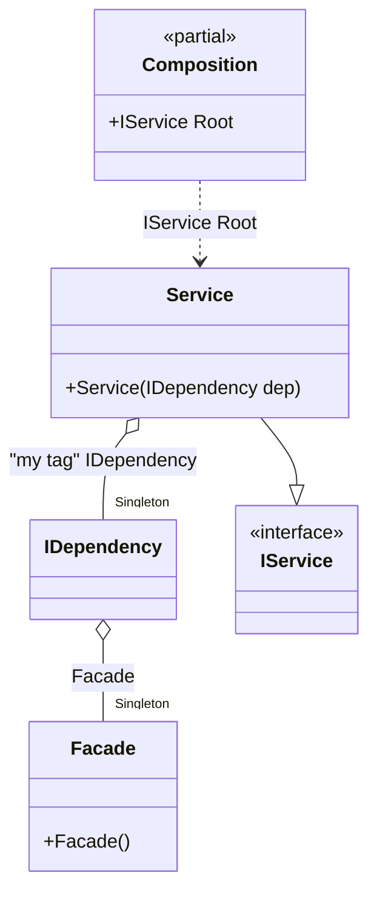

#### Bind attribute with lifetime and tag

[](../tests/Pure.DI.UsageTests/Attributes/BindAttributeWithLifetimeAndTagScenario.cs)


```c#
interface IDependency
{
    public void DoSomething();
}

class Dependency : IDependency
{
    public void DoSomething() { }
}

class Facade
{
    [Bind(lifetime: Lifetime.Singleton, tags: ["my tag"])]
    public IDependency Dependency { get; }= new Dependency();
}

interface IService
{
    public void DoSomething();
}

class Service([Tag("my tag")] IDependency dep) : IService
{
    public void DoSomething() => dep.DoSomething();
}

DI.Setup(nameof(Composition))
    .Bind().As(Lifetime.Singleton).To<Facade>()
    .Bind().To<Service>()

    // Composition root
    .Root<IService>("Root");

var composition = new Composition();
var service = composition.Root;
service.DoSomething();
```

The following partial class will be generated:

```c#
partial class Composition
{
  private readonly Composition _root;
  private readonly object _lock;

  private IDependency? _singletonIDependency0;
  private Facade? _singletonFacade39;

  [OrdinalAttribute(20)]
  public Composition()
  {
    _root = this;
    _lock = new object();
  }

  internal Composition(Composition parentScope)
  {
    _root = (parentScope ?? throw new ArgumentNullException(nameof(parentScope)))._root;
    _lock = _root._lock;
  }

  public IService Root
  {
    [MethodImpl(MethodImplOptions.AggressiveInlining)]
    get
    {
      if (_root._singletonIDependency0 == null)
      {
          lock (_lock)
          {
              if (_root._singletonIDependency0 == null)
              {
                  if (_root._singletonFacade39 == null)
                  {
                      _root._singletonFacade39 = new Facade();
                  }

                  {
                      Facade localValue26 = _root._singletonFacade39!;
                      _root._singletonIDependency0 = localValue26.Dependency;
                  }
              }
          }
      }

      return new Service(_root._singletonIDependency0!);
    }
  }
}
```

Class diagram:



