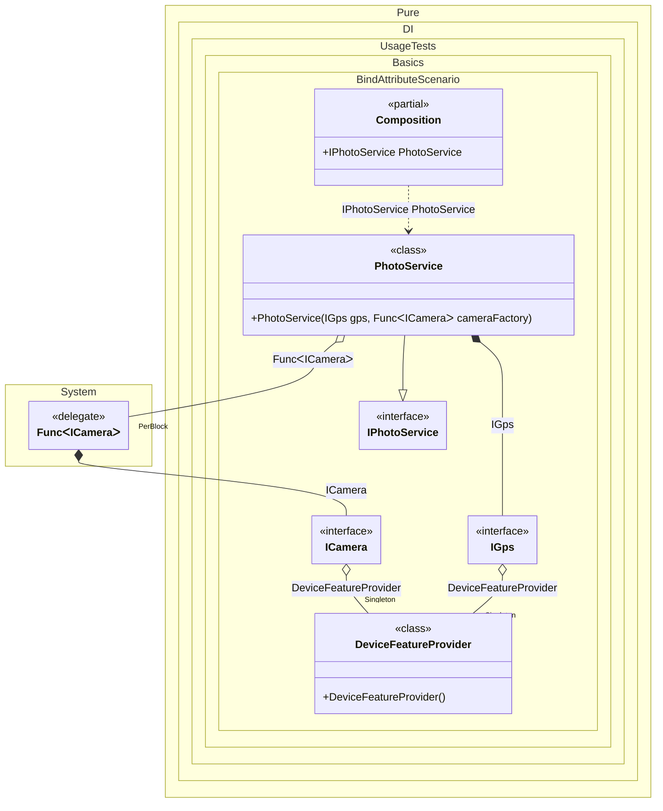

#### Bind attribute

`BindAttribute` allows you to perform automatic binding to properties, fields or methods that belong to the type of the binding involved.


```c#
using Pure.DI;

DI.Setup(nameof(Composition))
    .Bind().As(Lifetime.Singleton).To<DeviceFeatureProvider>()
    .Bind().To<PhotoService>()

    // Composition root
    .Root<IPhotoService>("PhotoService");

var composition = new Composition();
var photoService = composition.PhotoService;
photoService.TakePhotoWithLocation();

interface IGps
{
    void GetLocation();
}

class Gps : IGps
{
    public void GetLocation() => Console.WriteLine("Coordinates: 123, 456");
}

interface ICamera
{
    void Capture();
}

class Camera : ICamera
{
    public void Capture() => Console.WriteLine("Photo captured");
}

class DeviceFeatureProvider
{
    // The [Bind] attribute specifies that the property is a source of dependency
    [Bind] public IGps Gps { get; } = new Gps();

    [Bind] public ICamera Camera { get; } = new Camera();
}

interface IPhotoService
{
    void TakePhotoWithLocation();
}

class PhotoService(IGps gps, Func<ICamera> cameraFactory) : IPhotoService
{
    public void TakePhotoWithLocation()
    {
        gps.GetLocation();
        cameraFactory().Capture();
    }
}
```

<details>
<summary>Running this code sample locally</summary>

- Make sure you have the [.NET SDK 10.0](https://dotnet.microsoft.com/en-us/download/dotnet/10.0) or later is installed
```bash
dotnet --list-sdk
```
- Create a net10.0 (or later) console application
```bash
dotnet new console -n Sample
```
- Add reference to NuGet package
  - [Pure.DI](https://www.nuget.org/packages/Pure.DI)
```bash
dotnet add package Pure.DI
```
- Copy the example code into the _Program.cs_ file

You are ready to run the example 🚀
```bash
dotnet run
```

</details>

This attribute `BindAttribute` applies to field properties and methods, to regular, static, and even returning generalized types.

The following partial class will be generated:

```c#
partial class Composition
{
  private readonly Composition _root;
#if NET9_0_OR_GREATER
  private readonly Lock _lock;
#else
  private readonly Object _lock;
#endif

  private DeviceFeatureProvider? _singletonDeviceFeatureProvider51;

  [OrdinalAttribute(256)]
  public Composition()
  {
    _root = this;
#if NET9_0_OR_GREATER
    _lock = new Lock();
#else
    _lock = new Object();
#endif
  }

  internal Composition(Composition parentScope)
  {
    _root = (parentScope ?? throw new ArgumentNullException(nameof(parentScope)))._root;
    _lock = parentScope._lock;
  }

  public IPhotoService PhotoService
  {
    [MethodImpl(MethodImplOptions.AggressiveInlining)]
    get
    {
      IGps transientIGps1;
      EnsureDeviceFeatureProviderExists();
      DeviceFeatureProvider localInstance_1182D1277 = _root._singletonDeviceFeatureProvider51;
      transientIGps1 = localInstance_1182D1277.Gps;
      Func<ICamera> transientFunc2 = new Func<ICamera>(
      [MethodImpl(MethodImplOptions.AggressiveInlining)]
      () =>
      {
        ICamera transientICamera4;
        EnsureDeviceFeatureProviderExists();
        DeviceFeatureProvider localInstance_1182D1278 = _root._singletonDeviceFeatureProvider51;
        transientICamera4 = localInstance_1182D1278.Camera;
        ICamera localValue16 = transientICamera4;
        return localValue16;
      });
      return new PhotoService(transientIGps1, transientFunc2);
      [MethodImpl(MethodImplOptions.AggressiveInlining)]
      void EnsureDeviceFeatureProviderExists()
      {
        if (_root._singletonDeviceFeatureProvider51 is null)
          lock (_lock)
            if (_root._singletonDeviceFeatureProvider51 is null)
            {
              _root._singletonDeviceFeatureProvider51 = new DeviceFeatureProvider();
            }
      }
    }
  }
}
```

Class diagram:



