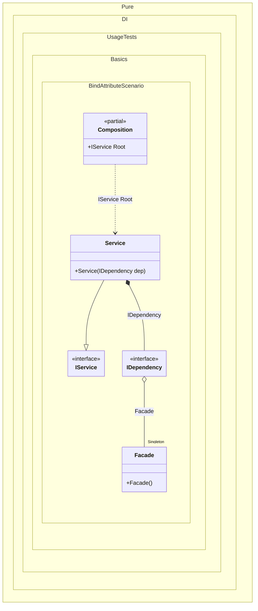

#### Bind attribute

[](../tests/Pure.DI.UsageTests/Attributes/BindAttributeScenario.cs)

`BindAttribute` allows you to perform automatic binding to properties, fields or methods that belong to the type of the binding involved.


```c#
using Pure.DI;

DI.Setup(nameof(Composition))
    .Bind().As(Lifetime.Singleton).To<Facade>()
    .Bind().To<Service>()

    // Composition root
    .Root<IService>("Root");

var composition = new Composition();
var service = composition.Root;
service.DoSomething();

interface IDependency
{
    public void DoSomething();
}

class Dependency : IDependency
{
    public void DoSomething()
    {
    }
}

class Facade
{
    [Bind]
    public IDependency Dependency { get; } = new Dependency();
}

interface IService
{
    public void DoSomething();
}

class Service(IDependency dep) : IService
{
    public void DoSomething() => dep.DoSomething();
}
```

<details>
<summary>Running this code sample locally</summary>

- Make sure you have the [.NET SDK 9.0](https://dotnet.microsoft.com/en-us/download/dotnet/9.0) or later is installed
- Create a net9.0 (or later) console application
- Add reference to NuGet package
  - [Pure.DI](https://www.nuget.org/packages/Pure.DI)
- Copy the example code into the _Program.cs_ file

You are ready to run the example!

</details>

This attribute `BindAttribute` applies to field properties and methods, to regular, static, and even returning generalized types.

The following partial class will be generated:

```c#
partial class Composition
{
  private readonly Composition _root;
  private readonly Lock _lock;

  private Facade? _singletonFacade43;

  [OrdinalAttribute(256)]
  public Composition()
  {
    _root = this;
    _lock = new Lock();
  }

  internal Composition(Composition parentScope)
  {
    _root = (parentScope ?? throw new ArgumentNullException(nameof(parentScope)))._root;
    _lock = _root._lock;
  }

  public IService Root
  {
    [MethodImpl(MethodImplOptions.AggressiveInlining)]
    get
    {
      if (_root._singletonFacade43 is null)
      {
        using (_lock.EnterScope())
        {
          if (_root._singletonFacade43 is null)
          {
            _root._singletonFacade43 = new Facade();
          }
        }
      }

      IDependency transientIDependency1;
      Facade localInstance_1182D12745 = _root._singletonFacade43;
      transientIDependency1 = localInstance_1182D12745.Dependency;
      return new Service(transientIDependency1);
    }
  }
}
```

Class diagram:



