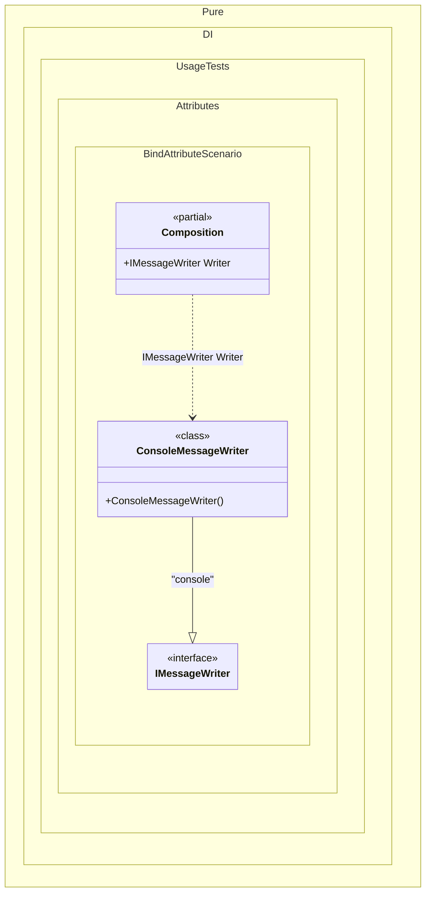

#### Bind attribute

Shows how to declare a binding directly on an implementation type with the built-in `BindAttribute`.


```c#
using Shouldly;
using Pure.DI;

DI.Setup(nameof(Composition))

    // Composition root
    .Root<IMessageWriter>("Writer", "console");

var composition = new Composition();
var writer = composition.Writer;
writer.Write("Pure.DI");

writer.ShouldBeOfType<ConsoleMessageWriter>();
writer.ShouldBeSameAs(composition.Writer);

interface IMessageWriter
{
    void Write(string message);
}

[Bind(typeof(IMessageWriter), Lifetime.Singleton, "console")]
class ConsoleMessageWriter : IMessageWriter
{
    public void Write(string message) => Console.WriteLine(message);
}
```

<details>
<summary>Running this code sample locally</summary>

- Make sure you have the [.NET SDK 10.0](https://dotnet.microsoft.com/en-us/download/dotnet/10.0) or later installed
```bash
dotnet --list-sdk
```
- Create a net10.0 (or later) console application
```bash
dotnet new console -n Sample
```
- Add references to the NuGet packages
  - [Pure.DI](https://www.nuget.org/packages/Pure.DI)
  - [Shouldly](https://www.nuget.org/packages/Shouldly)
```bash
dotnet add package Pure.DI
dotnet add package Shouldly
```
- Copy the example code into the _Program.cs_ file

You are ready to run the example 🚀
```bash
dotnet run
```

</details>

>[!NOTE]
>`BindAttribute` is registered by default and can provide the contract type, lifetime, and tag. Attributes inside the same square-bracket group form one binding; separate `Bind` groups create separate bindings.

<details>
<summary>The following partial class will be generated</summary>

```c#
partial class Composition
{
#if NET9_0_OR_GREATER
  private readonly Lock _lock = new Lock();
#else
  private readonly Object _lock = new Object();
#endif

  private ConsoleMessageWriter? _singletonConsoleMessageWriter2147482626;

  public IMessageWriter Writer
  {
    [MethodImpl(MethodImplOptions.AggressiveInlining)]
    get
    {
      if (_singletonConsoleMessageWriter2147482626 is null)
        lock (_lock)
          if (_singletonConsoleMessageWriter2147482626 is null)
          {
            _singletonConsoleMessageWriter2147482626 = new ConsoleMessageWriter();
          }

      return _singletonConsoleMessageWriter2147482626;
    }
  }
}
```

</details>

Class diagram:


```mermaid
---
 config:
  class:
   hideEmptyMembersBox: true
---
classDiagram
	ConsoleMessageWriter --|> IMessageWriter : "console"
	Composition ..> ConsoleMessageWriter : IMessageWriter Writer
	namespace Pure.DI.UsageTests.Attributes.BindAttributeScenario {
		class Composition {
		<<partial>>
		+IMessageWriter Writer
		}
		class ConsoleMessageWriter {
				<<class>>
			+ConsoleMessageWriter()
		}
		class IMessageWriter {
			<<interface>>
		}
	}
```

See also:

- [Bind type attribute](bind-type-attribute.md)
- [Bind lifetime attribute](bind-lifetime-attribute.md)
- [Bind tag attribute](bind-tag-attribute.md)

