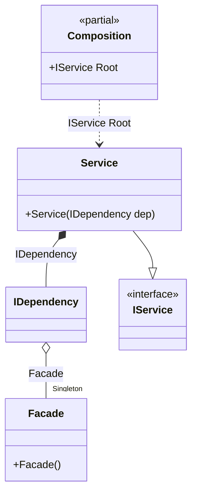

#### Bind attribute

[](../tests/Pure.DI.UsageTests/Attributes/BindAttributeScenario.cs)

`BindAttribute` allows you to perform automatic binding to properties, fields or methods that belong to the type of the binding involved.


```c#
interface IDependency
{
    public void DoSomething();
}

class Dependency : IDependency
{
    public void DoSomething()
    {
    }
}

class Facade
{
    [Bind]
    public IDependency Dependency { get; } = new Dependency();
}

interface IService
{
    public void DoSomething();
}

class Service(IDependency dep) : IService
{
    public void DoSomething() => dep.DoSomething();
}

DI.Setup(nameof(Composition))
    .Bind().As(Lifetime.Singleton).To<Facade>()
    .Bind().To<Service>()

    // Composition root
    .Root<IService>("Root");

var composition = new Composition();
var service = composition.Root;
service.DoSomething();
```

This attribute `BindAttribute` applies to field properties and methods, to regular, static, and even returning generalized types.

The following partial class will be generated:

```c#
partial class Composition
{
  private readonly Composition _root;
  private readonly object _lock;

  private Facade? _singletonFacade39;

  [OrdinalAttribute(20)]
  public Composition()
  {
    _root = this;
    _lock = new object();
  }

  internal Composition(Composition parentScope)
  {
    _root = (parentScope ?? throw new ArgumentNullException(nameof(parentScope)))._root;
    _lock = _root._lock;
  }

  public IService Root
  {
    [MethodImpl(MethodImplOptions.AggressiveInlining)]
    get
    {
      if (_root._singletonFacade39 == null)
      {
        lock (_lock)
        {
          if (_root._singletonFacade39 == null)
          {
            _root._singletonFacade39 = new Facade();
          }
        }
      }

      IDependency transientIDependency1;
      Facade localInstance_1182D12725 = _root._singletonFacade39!;
      transientIDependency1 = localInstance_1182D12725.Dependency;
      return new Service(transientIDependency1);
    }
  }
}
```

Class diagram:



