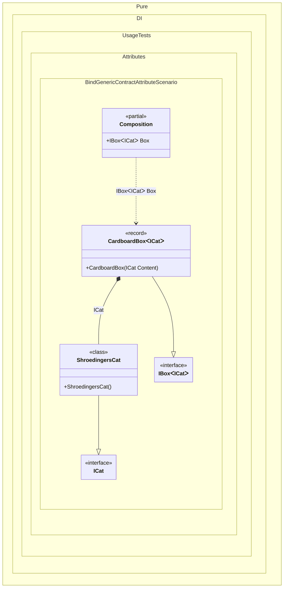

#### Bind generic contract attribute

Shows how the built-in `BindAttribute` can declare a generic contract with the `TT` marker on a generic implementation.


```c#
using Shouldly;
using Pure.DI;

DI.Setup(nameof(Composition))
    .Bind<ICat>().To<ShroedingersCat>()

    // Composition root
    .Root<IBox<ICat>>("Box");

var composition = new Composition();
var box = composition.Box;

box.ShouldBeOfType<CardboardBox<ICat>>();
box.Content.ShouldBeOfType<ShroedingersCat>();

interface IBox<out T>
{
    T Content { get; }
}

interface ICat;

[Bind(typeof(IBox<TT>))]
record CardboardBox<T>(T Content) : IBox<T>;

class ShroedingersCat : ICat;
```

<details>
<summary>Running this code sample locally</summary>

- Make sure you have the [.NET SDK 10.0](https://dotnet.microsoft.com/en-us/download/dotnet/10.0) or later installed
```bash
dotnet --list-sdk
```
- Create a net10.0 (or later) console application
```bash
dotnet new console -n Sample
```
- Add references to the NuGet packages
  - [Pure.DI](https://www.nuget.org/packages/Pure.DI)
  - [Shouldly](https://www.nuget.org/packages/Shouldly)
```bash
dotnet add package Pure.DI
dotnet add package Shouldly
```
- Copy the example code into the _Program.cs_ file

You are ready to run the example 🚀
```bash
dotnet run
```

</details>

>[!NOTE]
>`typeof(IBox<TT>)` is a marker-based generic contract. It is different from the open generic `typeof(IBox<>)`: Pure.DI uses `TT` to construct the matching implementation type, such as `CardboardBox<TT>`.

<details>
<summary>The following partial class will be generated</summary>

```c#
partial class Composition
{
  public IBox<ICat> Box
  {
    [MethodImpl(MethodImplOptions.AggressiveInlining)]
    get
    {
      return new CardboardBox<ICat>(new ShroedingersCat());
    }
  }
}
```

</details>

Class diagram:



See also:

- [Generic bind type attribute](generic-bind-type-attribute.md)

