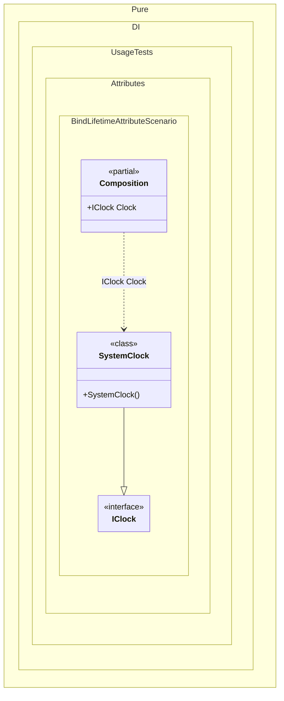

#### Bind lifetime attribute

Shows how the `Lifetime` attribute can declare the lifetime of an implementation binding.


```c#
using Shouldly;
using Pure.DI;

DI.Setup(nameof(Composition))

    // Composition root
    .Root<IClock>("Clock");

var composition = new Composition();

composition.Clock.ShouldBeSameAs(composition.Clock);

interface IClock;

[Type(typeof(IClock))]
[Lifetime(Lifetime.Singleton)]
class SystemClock : IClock;
```

<details>
<summary>Running this code sample locally</summary>

- Make sure you have the [.NET SDK 10.0](https://dotnet.microsoft.com/en-us/download/dotnet/10.0) or later installed
```bash
dotnet --list-sdk
```
- Create a net10.0 (or later) console application
```bash
dotnet new console -n Sample
```
- Add references to the NuGet packages
  - [Pure.DI](https://www.nuget.org/packages/Pure.DI)
  - [Shouldly](https://www.nuget.org/packages/Shouldly)
```bash
dotnet add package Pure.DI
dotnet add package Shouldly
```
- Copy the example code into the _Program.cs_ file

You are ready to run the example 🚀
```bash
dotnet run
```

</details>

>[!NOTE]
>A lifetime attribute on an implementation type is equivalent to applying `.As(...)` to the generated binding. Lifetime metadata can be specified only once inside one square-bracket binding group; repeated lifetime metadata in the same group is a compilation error.

<details>
<summary>The following partial class will be generated</summary>

```c#
partial class Composition
{
#if NET9_0_OR_GREATER
  private readonly Lock _lock = new Lock();
#else
  private readonly Object _lock = new Object();
#endif

  private SystemClock? _singletonSystemClock2147482602;

  public IClock Clock
  {
    [MethodImpl(MethodImplOptions.AggressiveInlining)]
    get
    {
      if (_singletonSystemClock2147482602 is null)
        lock (_lock)
          if (_singletonSystemClock2147482602 is null)
          {
            _singletonSystemClock2147482602 = new SystemClock();
          }

      return _singletonSystemClock2147482602;
    }
  }
}
```

</details>

Class diagram:



See also:

- [Bind attribute](bind-attribute.md)

