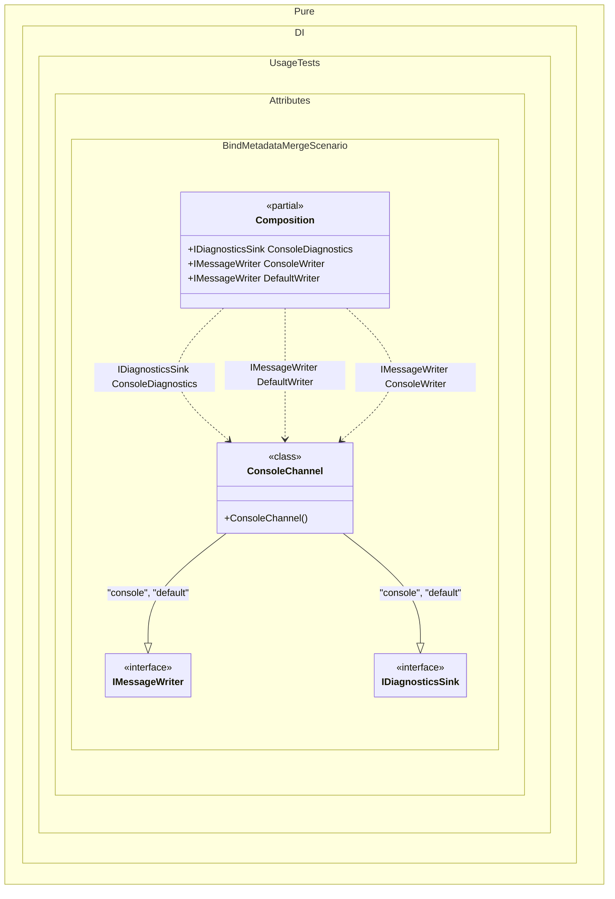

#### Bind metadata merge

Shows how binding metadata attributes on one implementation type are combined into one binding.


```c#
using Shouldly;
using Pure.DI;

DI.Setup(nameof(Composition))

    // Composition roots
    .Root<IMessageWriter>("ConsoleWriter", "console")
    .Root<IMessageWriter>("DefaultWriter", "default")
    .Root<IDiagnosticsSink>("ConsoleDiagnostics", "console");

var composition = new Composition();

composition.ConsoleWriter.ShouldBeOfType<ConsoleChannel>();
composition.DefaultWriter.ShouldBeSameAs(composition.ConsoleWriter);
composition.ConsoleDiagnostics.ShouldBeSameAs(composition.ConsoleWriter);

interface IMessageWriter;

interface IDiagnosticsSink;

[Bind(typeof(IMessageWriter)), Bind(typeof(IDiagnosticsSink)), Tag("console"), Tag("default"), Lifetime(Lifetime.Singleton)]
class ConsoleChannel : IMessageWriter, IDiagnosticsSink;
```

<details>
<summary>Running this code sample locally</summary>

- Make sure you have the [.NET SDK 10.0](https://dotnet.microsoft.com/en-us/download/dotnet/10.0) or later installed
```bash
dotnet --list-sdk
```
- Create a net10.0 (or later) console application
```bash
dotnet new console -n Sample
```
- Add references to the NuGet packages
  - [Pure.DI](https://www.nuget.org/packages/Pure.DI)
  - [Shouldly](https://www.nuget.org/packages/Shouldly)
```bash
dotnet add package Pure.DI
dotnet add package Shouldly
```
- Copy the example code into the _Program.cs_ file

You are ready to run the example 🚀
```bash
dotnet run
```

</details>

>[!NOTE]
>Attributes inside the same square-bracket group form one binding. Contracts and tags are merged, but lifetime must be specified at most once in the group. Separate `Bind` attribute groups create separate bindings.

<details>
<summary>The following partial class will be generated</summary>

```c#
partial class Composition
{
#if NET9_0_OR_GREATER
  private readonly Lock _lock = new Lock();
#else
  private readonly Object _lock = new Object();
#endif

  private ConsoleChannel? _singletonConsoleChannel;

  public IDiagnosticsSink ConsoleDiagnostics
  {
    [MethodImpl(MethodImplOptions.AggressiveInlining)]
    get
    {
      if (_singletonConsoleChannel is null)
        lock (_lock)
          if (_singletonConsoleChannel is null)
          {
            _singletonConsoleChannel = new ConsoleChannel();
          }

      return _singletonConsoleChannel;
    }
  }

  public IMessageWriter ConsoleWriter
  {
    [MethodImpl(MethodImplOptions.AggressiveInlining)]
    get
    {
      if (_singletonConsoleChannel is null)
        lock (_lock)
          if (_singletonConsoleChannel is null)
          {
            _singletonConsoleChannel = new ConsoleChannel();
          }

      return _singletonConsoleChannel;
    }
  }

  public IMessageWriter DefaultWriter
  {
    [MethodImpl(MethodImplOptions.AggressiveInlining)]
    get
    {
      if (_singletonConsoleChannel is null)
        lock (_lock)
          if (_singletonConsoleChannel is null)
          {
            _singletonConsoleChannel = new ConsoleChannel();
          }

      return _singletonConsoleChannel;
    }
  }
}
```

</details>

Class diagram:



See also:

- [Bind attribute groups](bind-attribute-groups.md)

