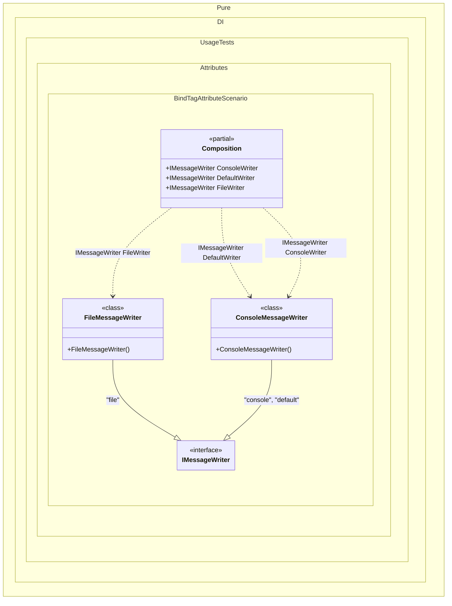

#### Bind tag attribute

Shows how tags can be declared directly on implementation types, including several tags for one implementation.


```c#
using Shouldly;
using Pure.DI;

DI.Setup(nameof(Composition))

    // Composition roots
    .Root<IMessageWriter>("ConsoleWriter", "console")
    .Root<IMessageWriter>("DefaultWriter", "default")
    .Root<IMessageWriter>("FileWriter", "file");

var composition = new Composition();

composition.ConsoleWriter.ShouldBeOfType<ConsoleMessageWriter>();
composition.DefaultWriter.ShouldBeOfType<ConsoleMessageWriter>();
composition.FileWriter.ShouldBeOfType<FileMessageWriter>();

interface IMessageWriter;

[Tag("console")]
[Tag("default")]
class ConsoleMessageWriter : IMessageWriter;

[Tag("file")]
class FileMessageWriter : IMessageWriter;
```

<details>
<summary>Running this code sample locally</summary>

- Make sure you have the [.NET SDK 10.0](https://dotnet.microsoft.com/en-us/download/dotnet/10.0) or later installed
```bash
dotnet --list-sdk
```
- Create a net10.0 (or later) console application
```bash
dotnet new console -n Sample
```
- Add references to the NuGet packages
  - [Pure.DI](https://www.nuget.org/packages/Pure.DI)
  - [Shouldly](https://www.nuget.org/packages/Shouldly)
```bash
dotnet add package Pure.DI
dotnet add package Shouldly
```
- Copy the example code into the _Program.cs_ file

You are ready to run the example 🚀
```bash
dotnet run
```

</details>

>[!NOTE]
>A tag attribute on an implementation type becomes a binding tag. Several tag attributes in the same square-bracket binding group are merged into one binding, so the same implementation can be resolved by any of those tags.

<details>
<summary>The following partial class will be generated</summary>

```c#
partial class Composition
{
  public IMessageWriter FileWriter
  {
    [MethodImpl(MethodImplOptions.AggressiveInlining)]
    get
    {
      return new FileMessageWriter();
    }
  }

  public IMessageWriter ConsoleWriter
  {
    [MethodImpl(MethodImplOptions.AggressiveInlining)]
    get
    {
      return new ConsoleMessageWriter();
    }
  }

  public IMessageWriter DefaultWriter
  {
    [MethodImpl(MethodImplOptions.AggressiveInlining)]
    get
    {
      return new ConsoleMessageWriter();
    }
  }
}
```

</details>

Class diagram:



See also:

- [Bind attribute](bind-attribute.md)

