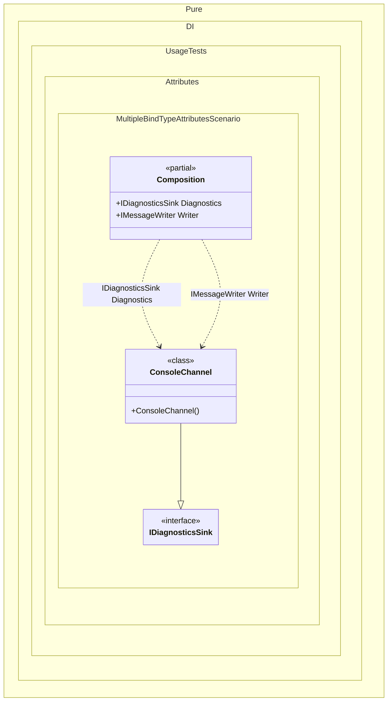

#### Bind type attributes

Shows how several `Type` attributes can expose one implementation through several contracts.


```c#
using Shouldly;
using Pure.DI;

DI.Setup(nameof(Composition))

    // Composition roots
    .Root<IMessageWriter>("Writer")
    .Root<IDiagnosticsSink>("Diagnostics");

var composition = new Composition();

composition.Writer.ShouldBeOfType<ConsoleChannel>();
composition.Diagnostics.ShouldBeOfType<ConsoleChannel>();

interface IMessageWriter;

interface IDiagnosticsSink;

[Type(typeof(IMessageWriter))]
[Type(typeof(IDiagnosticsSink))]
class ConsoleChannel : IMessageWriter, IDiagnosticsSink;
```

<details>
<summary>Running this code sample locally</summary>

- Make sure you have the [.NET SDK 10.0](https://dotnet.microsoft.com/en-us/download/dotnet/10.0) or later installed
```bash
dotnet --list-sdk
```
- Create a net10.0 (or later) console application
```bash
dotnet new console -n Sample
```
- Add references to the NuGet packages
  - [Pure.DI](https://www.nuget.org/packages/Pure.DI)
  - [Shouldly](https://www.nuget.org/packages/Shouldly)
```bash
dotnet add package Pure.DI
dotnet add package Shouldly
```
- Copy the example code into the _Program.cs_ file

You are ready to run the example 🚀
```bash
dotnet run
```

</details>

>[!NOTE]
>Multiple type attributes in the same square-bracket binding group are merged into one binding with several contracts.

<details>
<summary>The following partial class will be generated</summary>

```c#
partial class Composition
{
  public IDiagnosticsSink Diagnostics
  {
    [MethodImpl(MethodImplOptions.AggressiveInlining)]
    get
    {
      return new ConsoleChannel();
    }
  }

  public IMessageWriter Writer
  {
    [MethodImpl(MethodImplOptions.AggressiveInlining)]
    get
    {
      return new ConsoleChannel();
    }
  }
}
```

</details>

Class diagram:



See also:

- [Bind type attribute](bind-type-attribute.md)

