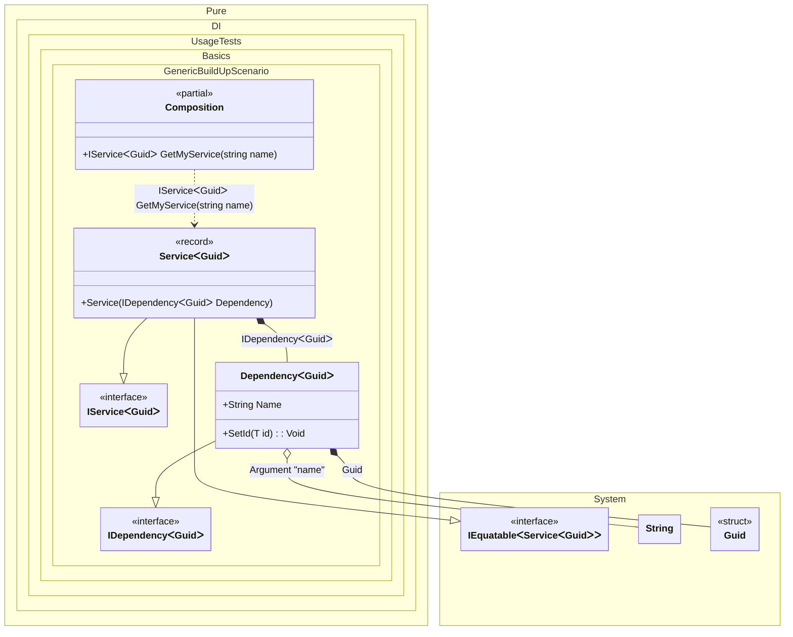

#### Build up of an existing generic object

[](../tests/Pure.DI.UsageTests/Generics/GenericBuildUpScenario.cs)

In other words, injecting the necessary dependencies via methods, properties, or fields into an existing object.


```c#
using Pure.DI;
using Shouldly;

DI.Setup(nameof(Composition))
    .RootArg<string>("name")
    .Bind().To(_ => Guid.NewGuid())
    .Bind().To(ctx =>
    {
        var dependency = new Dependency<TTS>();
        ctx.BuildUp(dependency);
        return dependency;
    })
    .Bind().To<Service<TTS>>()

    // Composition root
    .Root<IService<Guid>>("GetMyService");

var composition = new Composition();
var service = composition.GetMyService("Some name");
service.Dependency.Name.ShouldBe("Some name");
service.Dependency.Id.ShouldNotBe(Guid.Empty);

interface IDependency<out T>
    where T: struct
{
    string Name { get; }

    T Id { get; }
}

class Dependency<T> : IDependency<T>
    where T: struct
{
    // The Ordinal attribute specifies to perform an injection and its order
    [Ordinal(1)]
    public string Name { get; set; } = "";

    public T Id { get; private set; }

    // The Ordinal attribute specifies to perform an injection and its order
    [Ordinal(0)]
    public void SetId(T id) => Id = id;
}

interface IService<out T>
    where T: struct
{
    IDependency<T> Dependency { get; }
}

record Service<T>(IDependency<T> Dependency)
    : IService<T> where T: struct;
```


Class diagram:



