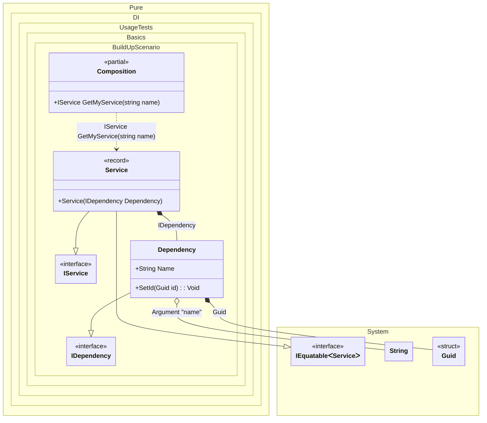

#### Build up of an existing object

[](../tests/Pure.DI.UsageTests/Basics/BuildUpScenario.cs)

In other words, injecting the necessary dependencies via methods, properties, or fields into an existing object.


```c#
using Shouldly;
using Pure.DI;

DI.Setup(nameof(Composition))
    .RootArg<string>("name")
    .Bind().To(_ => Guid.NewGuid())
    .Bind().To(ctx =>
    {
        var dependency = new Dependency();
        ctx.BuildUp(dependency);
        return dependency;
    })
    .Bind().To<Service>()

    // Composition root
    .Root<IService>("GetMyService");

var composition = new Composition();
var service = composition.GetMyService("Some name");
service.Dependency.Name.ShouldBe("Some name");
service.Dependency.Id.ShouldNotBe(Guid.Empty);

interface IDependency
{
    string Name { get; }

    Guid Id { get; }
}

class Dependency : IDependency
{
    // The Ordinal attribute specifies to perform an injection and its order
    [Ordinal(1)]
    public string Name { get; set; } = "";

    public Guid Id { get; private set; } = Guid.Empty;

    // The Ordinal attribute specifies to perform an injection and its order
    [Ordinal(0)]
    public void SetId(Guid id) => Id = id;
}

interface IService
{
    IDependency Dependency { get; }
}

record Service(IDependency Dependency) : IService;
```

<details>
<summary>Running this code sample locally</summary>

- Make sure you have the [.NET SDK 9.0](https://dotnet.microsoft.com/en-us/download/dotnet/9.0) or later is installed
```bash
dotnet --list-sdk
```
- Create a net9.0 (or later) console application
```bash
dotnet new console -n Sample
```
- Add references to NuGet packages
  - [Pure.DI](https://www.nuget.org/packages/Pure.DI)
  - [Shouldly](https://www.nuget.org/packages/Shouldly)
```bash
dotnet add package Pure.DI
dotnet add package Shouldly
```
- Copy the example code into the _Program.cs_ file

You are ready to run the example 🚀
```bash
dotnet run
```

</details>

The following partial class will be generated:

```c#
partial class Composition
{
  private readonly Composition _root;

  [OrdinalAttribute(128)]
  public Composition()
  {
    _root = this;
  }

  internal Composition(Composition parentScope)
  {
    _root = (parentScope ?? throw new ArgumentNullException(nameof(parentScope)))._root;
  }

  [MethodImpl(MethodImplOptions.AggressiveInlining)]
  public IService GetMyService(string name)
  {
    Guid transientGuid2 = Guid.NewGuid();
    Dependency transientDependency1;
    var localDependency47 = new Dependency();
    localDependency47.SetId(transientGuid2);
    localDependency47.Name = name;
    transientDependency1 = localDependency47;
    return new Service(transientDependency1);
  }
}
```

Class diagram:



