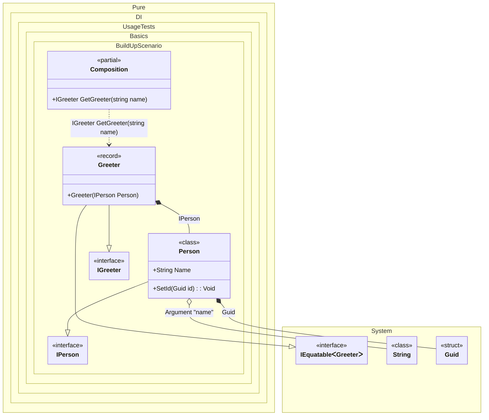

#### Build up of an existing object

This example demonstrates the Build-Up pattern in dependency injection, where an existing object is injected with necessary dependencies through its properties, methods, or fields.


```c#
using Shouldly;
using Pure.DI;

DI.Setup(nameof(Composition))
    .RootArg<string>("name")
    .Bind().To(_ => Guid.NewGuid())
    .Bind().To(ctx => {
        var person = new Person();
        // Injects dependencies into an existing object
        ctx.BuildUp(person);
        return person;
    })
    .Bind().To<Greeter>()

    // Composition root
    .Root<IGreeter>("GetGreeter");

var composition = new Composition();
var greeter = composition.GetGreeter("Nik");

greeter.Person.Name.ShouldBe("Nik");
greeter.Person.Id.ShouldNotBe(Guid.Empty);

interface IPerson
{
    string Name { get; }

    Guid Id { get; }
}

class Person : IPerson
{
    // The Dependency attribute specifies to perform an injection and its order
    [Dependency] public string Name { get; set; } = "";

    public Guid Id { get; private set; } = Guid.Empty;

    // The Dependency attribute specifies to perform an injection and its order
    [Dependency] public void SetId(Guid id) => Id = id;
}

interface IGreeter
{
    IPerson Person { get; }
}

record Greeter(IPerson Person) : IGreeter;
```

<details>
<summary>Running this code sample locally</summary>

- Make sure you have the [.NET SDK 10.0](https://dotnet.microsoft.com/en-us/download/dotnet/10.0) or later is installed
```bash
dotnet --list-sdk
```
- Create a net10.0 (or later) console application
```bash
dotnet new console -n Sample
```
- Add references to NuGet packages
  - [Pure.DI](https://www.nuget.org/packages/Pure.DI)
  - [Shouldly](https://www.nuget.org/packages/Shouldly)
```bash
dotnet add package Pure.DI
dotnet add package Shouldly
```
- Copy the example code into the _Program.cs_ file

You are ready to run the example 🚀
```bash
dotnet run
```

</details>

Key Concepts:
**Build-Up** - injecting dependencies into an already created object
**Dependency Attribute** - marker for identifying injectable members

The following partial class will be generated:

```c#
partial class Composition
{
#if NET9_0_OR_GREATER
  private readonly Lock _lock = new Lock();
#else
  private readonly Object _lock = new Object();
#endif

  [MethodImpl(MethodImplOptions.AggressiveInlining)]
  public IGreeter GetGreeter(string name)
  {
    if (name is null) throw new ArgumentNullException(nameof(name));
    Person transientPerson1;
    var localPerson = new Person();
    // Injects dependencies into an existing object
    Guid transientGuid3 = Guid.NewGuid();
    localPerson.Name = name;
    localPerson.SetId(transientGuid3);
    transientPerson1 = localPerson;
    return new Greeter(transientPerson1);
  }
}
```

Class diagram:



