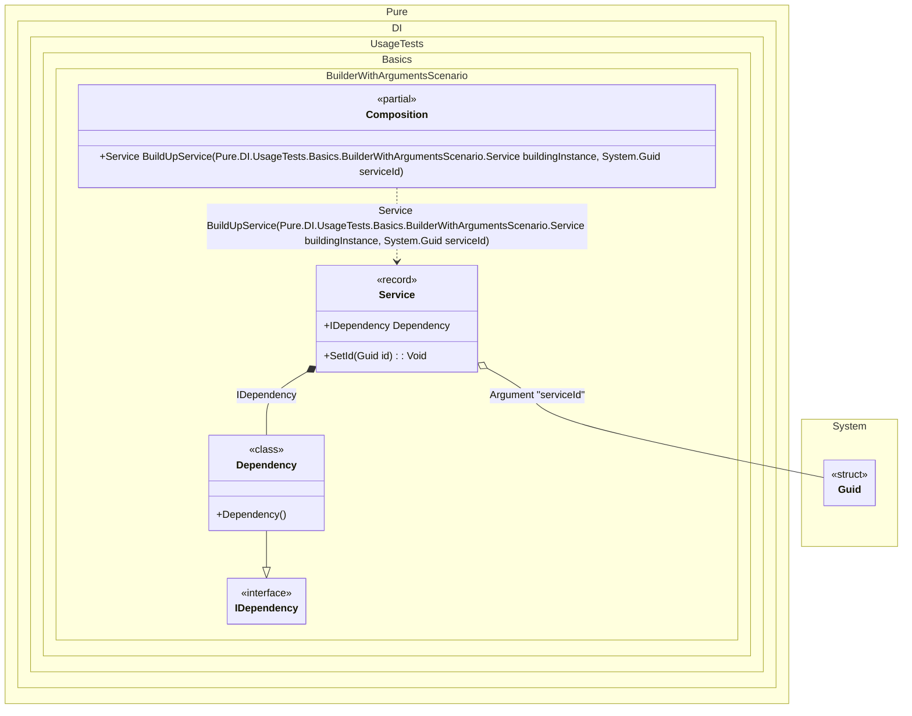

#### Builder with arguments

This example demonstrates how to use builders with custom arguments in dependency injection. It shows how to pass additional parameters during the build-up process.


```c#
using Shouldly;
using Pure.DI;

DI.Setup(nameof(Composition))
    .RootArg<Guid>("serviceId")
    .Bind().To<Dependency>()
    .Builder<Service>("BuildUpService");

var composition = new Composition();

var id = Guid.NewGuid();
var service = composition.BuildUpService(new Service(), id);
service.Id.ShouldBe(id);
service.Dependency.ShouldBeOfType<Dependency>();

interface IDependency;

class Dependency : IDependency;

interface IService
{
    Guid Id { get; }

    IDependency? Dependency { get; }
}

record Service: IService
{
    public Guid Id { get; private set; } = Guid.Empty;

    // The Dependency attribute specifies to perform an injection
    [Dependency]
    public IDependency? Dependency { get; set; }

    [Dependency]
    public void SetId(Guid id) => Id = id;
}
```

<details>
<summary>Running this code sample locally</summary>

- Make sure you have the [.NET SDK 9.0](https://dotnet.microsoft.com/en-us/download/dotnet/9.0) or later is installed
```bash
dotnet --list-sdk
```
- Create a net9.0 (or later) console application
```bash
dotnet new console -n Sample
```
- Add references to NuGet packages
  - [Pure.DI](https://www.nuget.org/packages/Pure.DI)
  - [Shouldly](https://www.nuget.org/packages/Shouldly)
```bash
dotnet add package Pure.DI
dotnet add package Shouldly
```
- Copy the example code into the _Program.cs_ file

You are ready to run the example 🚀
```bash
dotnet run
```

</details>

Important Notes:
- The default builder method name is `BuildUp`
- The first argument to the builder method is always the instance to be built
- Additional arguments are passed in the order they are defined in the setup
- Root arguments can be used to provide custom values during build-up

Use Cases:
- When additional parameters are required during object construction
- For scenarios where dependencies depend on runtime values
- When specific initialization data is needed
- For conditional injection based on provided arguments

Best Practices
- Keep the number of builder arguments minimal
- Use meaningful names for root arguments

The following partial class will be generated:

```c#
partial class Composition
{
  private readonly Composition _root;

  [OrdinalAttribute(128)]
  public Composition()
  {
    _root = this;
  }

  internal Composition(Composition parentScope)
  {
    _root = (parentScope ?? throw new ArgumentNullException(nameof(parentScope)))._root;
  }

  [MethodImpl(MethodImplOptions.AggressiveInlining)]
  public Service BuildUpService(Service buildingInstance, Guid serviceId)
  {
    if (buildingInstance is null) throw new ArgumentNullException(nameof(buildingInstance));
    Service transientService0;
    Service localBuildingInstance91 = buildingInstance;
    localBuildingInstance91.Dependency = new Dependency();
    localBuildingInstance91.SetId(serviceId);
    transientService0 = localBuildingInstance91;
    return transientService0;
  }
}
```

Class diagram:



