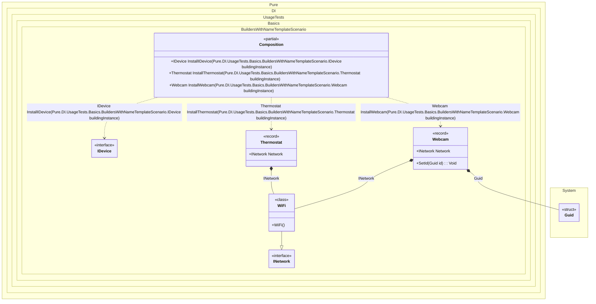

#### Builders with a name template

Sometimes you need to build up an existing composition root and inject all of its dependencies, in which case the `Builder` method will be useful, as in the example below:


```c#
using Shouldly;
using Pure.DI;

DI.Setup(nameof(Composition))
    .Bind().To(_ => Guid.NewGuid())
    .Bind().To<WiFi>()
    // Creates a builder based on the name template
    // for each type inherited from IDevice.
    // These types must be available at this point in the code.
    .Builders<IDevice>("Install{type}");

var composition = new Composition();

var webcam = composition.InstallWebcam(new Webcam());
webcam.Id.ShouldNotBe(Guid.Empty);
webcam.Network.ShouldBeOfType<WiFi>();

var thermostat = composition.InstallThermostat(new Thermostat());
thermostat.Id.ShouldBe(Guid.Empty);
thermostat.Network.ShouldBeOfType<WiFi>();

// Uses a common method to build an instance
IDevice device = new Webcam();
device = composition.InstallIDevice(device);
device.ShouldBeOfType<Webcam>();
device.Id.ShouldNotBe(Guid.Empty);
device.Network.ShouldBeOfType<WiFi>();

interface INetwork;

class WiFi : INetwork;

interface IDevice
{
    Guid Id { get; }

    INetwork? Network { get; }
}

record Webcam : IDevice
{
    public Guid Id { get; private set; } = Guid.Empty;

    // The Dependency attribute specifies to perform an injection
    [Dependency]
    public INetwork? Network { get; set; }

    [Dependency]
    public void SetId(Guid id) => Id = id;
}

record Thermostat : IDevice
{
    public Guid Id => Guid.Empty;

    // The Dependency attribute specifies to perform an injection
    [Dependency]
    public INetwork? Network { get; set; }
}
```

<details>
<summary>Running this code sample locally</summary>

- Make sure you have the [.NET SDK 10.0](https://dotnet.microsoft.com/en-us/download/dotnet/10.0) or later is installed
```bash
dotnet --list-sdk
```
- Create a net10.0 (or later) console application
```bash
dotnet new console -n Sample
```
- Add references to NuGet packages
  - [Pure.DI](https://www.nuget.org/packages/Pure.DI)
  - [Shouldly](https://www.nuget.org/packages/Shouldly)
```bash
dotnet add package Pure.DI
dotnet add package Shouldly
```
- Copy the example code into the _Program.cs_ file

You are ready to run the example 🚀
```bash
dotnet run
```

</details>

The default builder method name is `BuildUp`. The first argument to this method will always be the instance to be built.

The following partial class will be generated:

```c#
partial class Composition
{
#if NET9_0_OR_GREATER
  private readonly Lock _lock;
#else
  private readonly Object _lock;
#endif

  [OrdinalAttribute(256)]
  public Composition()
  {
#if NET9_0_OR_GREATER
    _lock = new Lock();
#else
    _lock = new Object();
#endif
  }

  internal Composition(Composition parentScope)
  {
    _lock = parentScope._lock;
  }

  [MethodImpl(MethodImplOptions.AggressiveInlining)]
  public Webcam InstallWebcam(Webcam buildingInstance)
  {
    if (buildingInstance is null) throw new ArgumentNullException(nameof(buildingInstance));
    Webcam transientWebcam5;
    Webcam localBuildingInstance6 = buildingInstance;
    Guid transientGuid8 = Guid.NewGuid();
    localBuildingInstance6.Network = new WiFi();
    localBuildingInstance6.SetId(transientGuid8);
    transientWebcam5 = localBuildingInstance6;
    return transientWebcam5;
  }

  [MethodImpl(MethodImplOptions.AggressiveInlining)]
  public Thermostat InstallThermostat(Thermostat buildingInstance)
  {
    if (buildingInstance is null) throw new ArgumentNullException(nameof(buildingInstance));
    Thermostat transientThermostat2;
    Thermostat localBuildingInstance5 = buildingInstance;
    localBuildingInstance5.Network = new WiFi();
    transientThermostat2 = localBuildingInstance5;
    return transientThermostat2;
  }

  #pragma warning disable CS0162
  [MethodImpl(MethodImplOptions.NoInlining)]
  public IDevice InstallIDevice(IDevice buildingInstance)
  {
    if (buildingInstance is null) throw new ArgumentNullException(nameof(buildingInstance));
    IDevice transientIDevice;
    IDevice localBuildingInstance4 = buildingInstance;
    switch (localBuildingInstance4)
    {
      case Webcam localWebcam:
      {
        transientIDevice = InstallWebcam(localWebcam);
        goto transientIDeviceFinish;
      }

      case Thermostat localThermostat:
      {
        transientIDevice = InstallThermostat(localThermostat);
        goto transientIDeviceFinish;
      }

      default:
        throw new ArgumentException($"Unable to build an instance of typeof type {localBuildingInstance4.GetType()}.", "buildingInstance");
    }

    transientIDevice = localBuildingInstance4;
    transientIDeviceFinish:
      ;
    return transientIDevice;
  }
  #pragma warning restore CS0162
}
```

Class diagram:



