#### Builders with a name template

Sometimes you need to build up an existing composition root and inject all of its dependencies, in which case the `Builder` method will be useful, as in the example below:


```c#
using Shouldly;
using Pure.DI;

DI.Setup(nameof(Composition))
    .Bind().To(_ => Guid.NewGuid())
    .Bind().To<Dependency>()
    // Creates a builder based on the name template
    // for each type inherited from IService.
    // These types must be available at this point in the code.
    .Builders<IService>("BuildUp{type}");

var composition = new Composition();
        
var service1 = composition.BuildUpService1(new Service1());
service1.Id.ShouldNotBe(Guid.Empty);
service1.Dependency.ShouldBeOfType<Dependency>();

var service2 = composition.BuildUpService2(new Service2());
service2.Id.ShouldBe(Guid.Empty);
service2.Dependency.ShouldBeOfType<Dependency>();

interface IDependency;

class Dependency : IDependency;

interface IService
{
    Guid Id { get; }

    IDependency? Dependency { get; }
}

record Service1: IService
{
    public Guid Id { get; private set; } = Guid.Empty;

    // The Dependency attribute specifies to perform an injection
    [Dependency]
    public IDependency? Dependency { get; set; }

    [Dependency]
    public void SetId(Guid id) => Id = id;
}

record Service2 : IService
{
    public Guid Id => Guid.Empty;

    // The Dependency attribute specifies to perform an injection
    [Dependency]
    public IDependency? Dependency { get; set; }
}
```

<details>
<summary>Running this code sample locally</summary>

- Make sure you have the [.NET SDK 9.0](https://dotnet.microsoft.com/en-us/download/dotnet/9.0) or later is installed
```bash
dotnet --list-sdk
```
- Create a net9.0 (or later) console application
```bash
dotnet new console -n Sample
```
- Add references to NuGet packages
  - [Pure.DI](https://www.nuget.org/packages/Pure.DI)
  - [Shouldly](https://www.nuget.org/packages/Shouldly)
```bash
dotnet add package Pure.DI
dotnet add package Shouldly
```
- Copy the example code into the _Program.cs_ file

You are ready to run the example 🚀
```bash
dotnet run
```

</details>

The default builder method name is `BuildUp`. The first argument to this method will always be the instance to be built.

The following partial class will be generated:

```c#
partial class Composition
{
  private readonly Composition _root;

  [OrdinalAttribute(128)]
  public Composition()
  {
    _root = this;
  }

  internal Composition(Composition parentScope)
  {
    _root = (parentScope ?? throw new ArgumentNullException(nameof(parentScope)))._root;
  }

  [MethodImpl(MethodImplOptions.AggressiveInlining)]
  public Service1 BuildUpService1(Service1 buildingInstance)
  {
    if (buildingInstance is null) throw new ArgumentNullException(nameof(buildingInstance));
    Guid transientGuid2 = Guid.NewGuid();
    Service1 transientService10;
    Service1 localBuildingInstance90 = buildingInstance;
    localBuildingInstance90.Dependency = new Dependency();
    localBuildingInstance90.SetId(transientGuid2);
    transientService10 = localBuildingInstance90;
    return transientService10;
  }

  [MethodImpl(MethodImplOptions.AggressiveInlining)]
  public Service2 BuildUpService2(Service2 buildingInstance)
  {
    if (buildingInstance is null) throw new ArgumentNullException(nameof(buildingInstance));
    Service2 transientService20;
    Service2 localBuildingInstance89 = buildingInstance;
    localBuildingInstance89.Dependency = new Dependency();
    transientService20 = localBuildingInstance89;
    return transientService20;
  }

  [MethodImpl(MethodImplOptions.AggressiveInlining)]
  public T Resolve<T>()
  {
    return Resolver<T>.Value.Resolve(this);
  }

  [MethodImpl(MethodImplOptions.AggressiveInlining)]
  public T Resolve<T>(object? tag)
  {
    return Resolver<T>.Value.ResolveByTag(this, tag);
  }

  [MethodImpl(MethodImplOptions.AggressiveInlining)]
  public object Resolve(Type type)
  {
    throw new InvalidOperationException($"{CannotResolveMessage} {OfTypeMessage} {type}.");
  }

  [MethodImpl(MethodImplOptions.AggressiveInlining)]
  public object Resolve(Type type, object? tag)
  {
    throw new InvalidOperationException($"{CannotResolveMessage} \"{tag}\" {OfTypeMessage} {type}.");
  }

  private const string CannotResolveMessage = "Cannot resolve composition root ";
  private const string OfTypeMessage = "of type ";

  private class Resolver<T>: IResolver<Composition, T>
  {
    public static IResolver<Composition, T> Value = new Resolver<T>();

    public virtual T Resolve(Composition composite)
    {
      throw new InvalidOperationException($"{CannotResolveMessage}{OfTypeMessage}{typeof(T)}.");
    }

    public virtual T ResolveByTag(Composition composite, object tag)
    {
      throw new InvalidOperationException($"{CannotResolveMessage}\"{tag}\" {OfTypeMessage}{typeof(T)}.");
    }
  }
}
```

Class diagram:

```mermaid
---
 config:
  class:
   hideEmptyMembersBox: true
---
classDiagram
	Dependency --|> IDependency
	Composition ..> Service2 : Service2 BuildUpService2(Pure.DI.UsageTests.Basics.BuildersWithNameTemplateScenario.Service2 buildingInstance)
	Composition ..> Service1 : Service1 BuildUpService1(Pure.DI.UsageTests.Basics.BuildersWithNameTemplateScenario.Service1 buildingInstance)
	Service2 *--  Dependency : IDependency
	Service1 *--  Dependency : IDependency
	Service1 *--  Guid : Guid
	namespace Pure.DI.UsageTests.Basics.BuildersWithNameTemplateScenario {
		class Composition {
		<<partial>>
		+Service1 BuildUpService1(Pure.DI.UsageTests.Basics.BuildersWithNameTemplateScenario.Service1 buildingInstance)
		+Service2 BuildUpService2(Pure.DI.UsageTests.Basics.BuildersWithNameTemplateScenario.Service2 buildingInstance)
		+ T ResolveᐸTᐳ()
		+ T ResolveᐸTᐳ(object? tag)
		+ object Resolve(Type type)
		+ object Resolve(Type type, object? tag)
		}
		class Dependency {
			+Dependency()
		}
		class IDependency {
			<<interface>>
		}
		class Service1 {
			<<record>>
		}
		class Service2 {
			<<record>>
		}
	}
	namespace System {
		class Guid {
				<<struct>>
		}
	}
```



