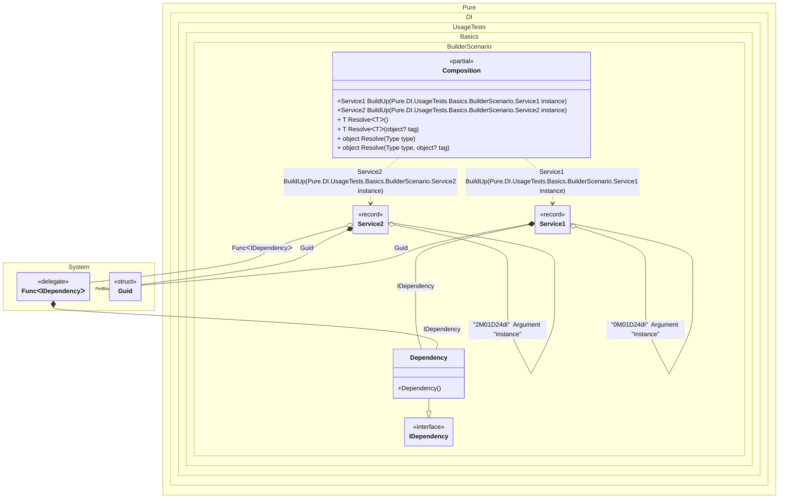

#### Builders

[](../tests/Pure.DI.UsageTests/Basics/BuilderScenario.cs)

Sometimes you need to complete an existing composition root and implement all of its dependencies, in which case the `Builder` method will be useful, as in the example below:


```c#
using Shouldly;
using Pure.DI;

DI.Setup(nameof(Composition))
    .Bind().To(_ => Guid.NewGuid())
    .Bind().To<Dependency>()
    // Service1 builder
    .Builder<Service1>("BuildUp")
    // Service2 builder
    .Builder<Service2>("BuildUp");

var composition = new Composition();
        
var service1 = composition.BuildUp(new Service1());
service1.Id.ShouldNotBe(Guid.Empty);
service1.Dependency.ShouldBeOfType<Dependency>();
service1.Dependency.ShouldBe(service1.Dependency);
        
var service2 = composition.BuildUp(new Service2());
service2.Id.ShouldNotBe(Guid.Empty);
service2.Dependency.ShouldBeOfType<Dependency>();
service2.Dependency.ShouldNotBe(service2.Dependency);

interface IDependency;

class Dependency : IDependency;

interface IService
{
    Guid Id { get; }

    IDependency? Dependency { get; }
}

record Service1: IService
{
    public Guid Id { get; private set; } = Guid.Empty;

    [Ordinal(1)]
    public IDependency? Dependency { get; set; }

    // The Ordinal attribute specifies to perform an injection and its order
    [Ordinal(2)]
    public void SetId(Guid id) => Id = id;
}

record Service2: IService
{
    public Guid Id { get; private set; } = Guid.Empty;

    [Ordinal(1)]
    public IDependency? Dependency => DependencyFactory?.Invoke();

    [Ordinal(2)]
    public Func<IDependency>? DependencyFactory { get; set; }

    // The Ordinal attribute specifies to perform an injection and its order
    [Ordinal(3)]
    public void SetId(Guid id) => Id = id;
}
```

<details>
<summary>Running this code sample locally</summary>

- Make sure you have the [.NET SDK 9.0](https://dotnet.microsoft.com/en-us/download/dotnet/9.0) or later is installed
```bash
dotnet --list-sdk
```
- Create a net9.0 (or later) console application
```bash
dotnet new console -n Sample
```
- Add references to NuGet packages
  - [Pure.DI](https://www.nuget.org/packages/Pure.DI)
  - [Shouldly](https://www.nuget.org/packages/Shouldly)
```bash
dotnet add package Pure.DI
dotnet add package Shouldly
```
- Copy the example code into the _Program.cs_ file

You are ready to run the example 🚀
```bash
dotnet run
```

</details>

The following partial class will be generated:

```c#
partial class Composition
{
  private readonly Composition _root;

  [OrdinalAttribute(128)]
  public Composition()
  {
    _root = this;
  }

  internal Composition(Composition parentScope)
  {
    _root = (parentScope ?? throw new ArgumentNullException(nameof(parentScope)))._root;
  }

  [MethodImpl(MethodImplOptions.AggressiveInlining)]
  public Service1 BuildUp(Service1 instance)
  {
    Guid transientGuid2 = Guid.NewGuid();
    Service1 transientService10;
    Service1 localInstance49 = instance;
    localInstance49.Dependency = new Dependency();
    localInstance49.SetId(transientGuid2);
    transientService10 = localInstance49;
    return transientService10;
  }

  [MethodImpl(MethodImplOptions.AggressiveInlining)]
  public Service2 BuildUp(Service2 instance)
  {
    Guid transientGuid2 = Guid.NewGuid();
    Func<IDependency> perBlockFunc1 = new Func<IDependency>(
    [MethodImpl(MethodImplOptions.AggressiveInlining)]
    () =>
    {
      IDependency localValue47 = new Dependency();
      return localValue47;
    });
    Service2 transientService20;
    Service2 localInstance48 = instance;
    localInstance48.DependencyFactory = perBlockFunc1;
    localInstance48.SetId(transientGuid2);
    transientService20 = localInstance48;
    return transientService20;
  }

  [MethodImpl(MethodImplOptions.AggressiveInlining)]
  public T Resolve<T>()
  {
    return Resolver<T>.Value.Resolve(this);
  }

  [MethodImpl(MethodImplOptions.AggressiveInlining)]
  public T Resolve<T>(object? tag)
  {
    return Resolver<T>.Value.ResolveByTag(this, tag);
  }

  [MethodImpl(MethodImplOptions.AggressiveInlining)]
  public object Resolve(Type type)
  {
    throw new InvalidOperationException($"{CannotResolveMessage} {OfTypeMessage} {type}.");
  }

  [MethodImpl(MethodImplOptions.AggressiveInlining)]
  public object Resolve(Type type, object? tag)
  {
    throw new InvalidOperationException($"{CannotResolveMessage} \"{tag}\" {OfTypeMessage} {type}.");
  }

  private const string CannotResolveMessage = "Cannot resolve composition root ";
  private const string OfTypeMessage = "of type ";

  private class Resolver<T>: IResolver<Composition, T>
  {
    public static IResolver<Composition, T> Value = new Resolver<T>();

    public virtual T Resolve(Composition composite)
    {
      throw new InvalidOperationException($"{CannotResolveMessage}{OfTypeMessage}{typeof(T)}.");
    }

    public virtual T ResolveByTag(Composition composite, object tag)
    {
      throw new InvalidOperationException($"{CannotResolveMessage}\"{tag}\" {OfTypeMessage}{typeof(T)}.");
    }
  }
}
```

Class diagram:



