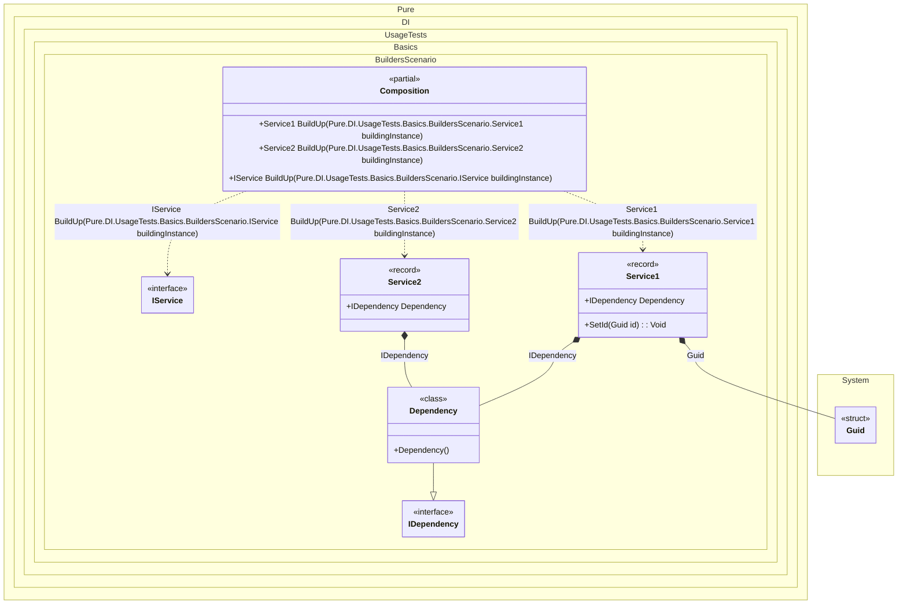

#### Builders

Sometimes you need builders for all types inherited from <see cref=“T”/> available at compile time at the point where the method is called.


```c#
using Shouldly;
using Pure.DI;

DI.Setup(nameof(Composition))
    .Bind().To(_ => Guid.NewGuid())
    .Bind().To<Dependency>()
    // Creates a builder for each type inherited from IService.
    // These types must be available at this point in the code.
    .Builders<IService>("BuildUp");

var composition = new Composition();
        
var service1 = composition.BuildUp(new Service1());
service1.Id.ShouldNotBe(Guid.Empty);
service1.Dependency.ShouldBeOfType<Dependency>();

var service2 = composition.BuildUp(new Service2());
service2.Id.ShouldBe(Guid.Empty);
service2.Dependency.ShouldBeOfType<Dependency>();

// Uses a common method to build an instance
IService abstractService = new Service1();
abstractService = composition.BuildUp(abstractService);
abstractService.ShouldBeOfType<Service1>();
abstractService.Id.ShouldNotBe(Guid.Empty);
abstractService.Dependency.ShouldBeOfType<Dependency>();

interface IDependency;

class Dependency : IDependency;

interface IService
{
    Guid Id { get; }

    IDependency? Dependency { get; }
}

record Service1: IService
{
    public Guid Id { get; private set; } = Guid.Empty;

    // The Dependency attribute specifies to perform an injection
    [Dependency]
    public IDependency? Dependency { get; set; }

    [Dependency]
    public void SetId(Guid id) => Id = id;
}

record Service2 : IService
{
    public Guid Id => Guid.Empty;

    [Dependency]
    public IDependency? Dependency { get; set; }
}
```

<details>
<summary>Running this code sample locally</summary>

- Make sure you have the [.NET SDK 9.0](https://dotnet.microsoft.com/en-us/download/dotnet/9.0) or later is installed
```bash
dotnet --list-sdk
```
- Create a net9.0 (or later) console application
```bash
dotnet new console -n Sample
```
- Add references to NuGet packages
  - [Pure.DI](https://www.nuget.org/packages/Pure.DI)
  - [Shouldly](https://www.nuget.org/packages/Shouldly)
```bash
dotnet add package Pure.DI
dotnet add package Shouldly
```
- Copy the example code into the _Program.cs_ file

You are ready to run the example 🚀
```bash
dotnet run
```

</details>

Important Notes:
- The default builder method name is `BuildUp`
- The first argument to the builder method is always the instance to be built

The following partial class will be generated:

```c#
partial class Composition
{
#if NET9_0_OR_GREATER
  private readonly Lock _lock;
#else
  private readonly Object _lock;
#endif

  [OrdinalAttribute(256)]
  public Composition()
  {
#if NET9_0_OR_GREATER
    _lock = new Lock();
#else
    _lock = new Object();
#endif
  }

  internal Composition(Composition parentScope)
  {
  }

  [MethodImpl(MethodImplOptions.AggressiveInlining)]
  public Service1 BuildUp(Service1 buildingInstance)
  {
    if (buildingInstance is null) throw new ArgumentNullException(nameof(buildingInstance));
    Service1 transService15;
    Service1 localBuildingInstance97 = buildingInstance;
    Guid transGuid8 = Guid.NewGuid();
    localBuildingInstance97.Dependency = new Dependency();
    localBuildingInstance97.SetId(transGuid8);
    transService15 = localBuildingInstance97;
    return transService15;
  }

  [MethodImpl(MethodImplOptions.AggressiveInlining)]
  public Service2 BuildUp(Service2 buildingInstance)
  {
    if (buildingInstance is null) throw new ArgumentNullException(nameof(buildingInstance));
    Service2 transService22;
    Service2 localBuildingInstance96 = buildingInstance;
    localBuildingInstance96.Dependency = new Dependency();
    transService22 = localBuildingInstance96;
    return transService22;
  }

  #pragma warning disable CS0162
  [MethodImpl(MethodImplOptions.AggressiveInlining)]
  public IService BuildUp(IService buildingInstance)
  {
    if (buildingInstance is null) throw new ArgumentNullException(nameof(buildingInstance));
    IService transIService;
    IService localBuildingInstance93 = buildingInstance;
    switch (localBuildingInstance93)
    {
      case Service1 localService194:
      {
        transIService = BuildUp(localService194);
        goto transIServiceFinish;
      }

      case Service2 localService295:
      {
        transIService = BuildUp(localService295);
        goto transIServiceFinish;
      }

      default:
        throw new ArgumentException($"Unable to build an instance of typeof type {localBuildingInstance93.GetType()}.", "buildingInstance");
    }

    transIService = localBuildingInstance93;
    transIServiceFinish:
      ;
    return transIService;
  }
  #pragma warning restore CS0162
}
```

Class diagram:



